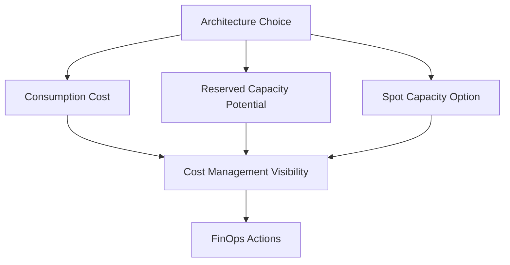

---
content_sources:
  diagrams:
    - id: platform-cost-model-basics-diagram-1
      type: flowchart
      source: self-generated
      justification: "Synthesized from Azure Cost Management and pricing model guidance."
      based_on:
        - https://learn.microsoft.com/en-us/azure/cost-management-billing/costs/overview-cost-management
        - https://learn.microsoft.com/en-us/azure/cost-management-billing/reservations/save-compute-costs-reservations
        - https://learn.microsoft.com/en-us/azure/virtual-machines/spot-vms
---
# Cost Model Basics

Azure cost architecture is the practice of understanding which design choices create variable spend, fixed commitments, and surprise bills.

## Core pricing modes

[Documented] Azure commonly exposes consumption-based pricing, reservation-based discounts for eligible services, and spot pricing for interruptible capacity scenarios.

Each mode changes architecture behavior:

- consumption pricing rewards elasticity but can magnify waste at scale
- reservations reward steady-state commitments but reduce flexibility
- spot capacity can lower cost significantly for tolerant workloads but increases interruption risk

## Cost model map

<!-- diagram-id: platform-cost-model-basics-diagram-1 -->

## FinOps fundamentals for architects

[Documented] Azure Cost Management provides visibility, budgeting, and analysis capabilities.

[Inferred] FinOps in architecture starts earlier than monthly reporting.

Architects influence cost by deciding:

- topology and redundancy level
- degree of managed service adoption
- scaling model and idle-capacity exposure
- retention periods for data and telemetry
- environment count and isolation strategy

## Common cost traps

- [Observed] overprovisioned always-on compute for intermittent demand
- [Observed] collecting high-volume logs without retention or filtering strategy
- [Observed] unused or forgotten non-production environments kept running continuously
- [Observed] data egress and cross-region replication overlooked during design review
- [Correlated] premium SKUs adopted by default because failure budgets were never quantified

## Decision heuristics

| Situation | Likely direction |
|---|---|
| Predictable steady-state demand | Consider reservation options where operationally justified |
| Interruptible batch or fault-tolerant workloads | Evaluate spot capacity cautiously |
| Highly variable event-driven demand | Consumption-oriented PaaS or serverless often fits better |
| Strict reliability and low-latency requirements | Expect to pay for redundancy and warm capacity |

## Cost versus architecture quality

[Inferred] Lower cost is not automatically better architecture.

The right question is whether spend is aligned to business value, risk posture, and measurable targets.

[Validated] Some costs are intentional architecture investments, such as:

- zonal redundancy for critical paths
- richer observability for hard-to-debug systems
- managed services that reduce scarce operations labor

## Validation questions

1. Which components are scale-to-zero, elastic, reserved, or always-on?
2. Which costs grow with users, with data, or with operational mistakes?
3. Which SKUs were selected for a measured reason versus inherited default?
4. What is the plan for budget visibility and anomaly detection?

## Microsoft Learn anchors

- [Cost Management and Billing overview](https://learn.microsoft.com/en-us/azure/cost-management-billing/costs/overview-cost-management)
- [Save costs with reservations](https://learn.microsoft.com/en-us/azure/cost-management-billing/reservations/save-compute-costs-reservations)
- [Azure Spot Virtual Machines](https://learn.microsoft.com/en-us/azure/virtual-machines/spot-vms)

## Takeaway

[Inferred] Cost is a first-order architecture property because topology, scaling, redundancy, and telemetry choices all become billable behavior.

Design for cost transparency, not just cost minimization.
