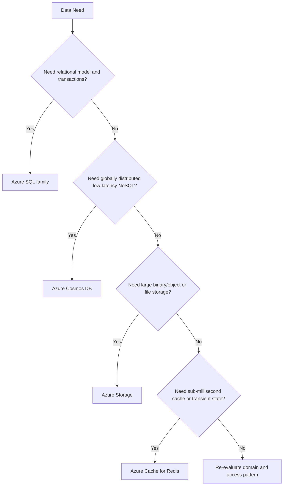

---
content_sources:
  diagrams:
    - id: platform-data-selection-basics-diagram-1
      type: flowchart
      source: self-generated
      justification: "Synthesized from Azure data store technology choice guidance."
      based_on:
        - https://learn.microsoft.com/en-us/azure/architecture/guide/technology-choices/data-store-overview
        - https://learn.microsoft.com/en-us/azure/architecture/guide/technology-choices/data-store-decision-tree
---
# Data Selection Basics

Data-store choice should begin with access pattern and consistency needs, not with team preference or vendor familiarity.

## Decision tree

<!-- diagram-id: platform-data-selection-basics-diagram-1 -->

## Main categories

| Option | Best for | Primary risk if misused |
|---|---|---|
| Azure SQL | Relational data, transactional workloads, reporting-friendly schemas | Forcing global-scale or schema-flexible use cases into rigid relational patterns |
| Cosmos DB | Distributed NoSQL with low-latency and multiple data models | Underestimating partitioning and cost implications |
| Azure Storage | Objects, files, queues, archival, durable simple storage | Using it as if it were a transactional application database |
| Redis | Caching, session state, low-latency transient access | Treating cache as source of truth |

## Selection criteria

- consistency requirements
- latency expectations
- write and read scale pattern
- data model flexibility
- retention and lifecycle needs
- cost sensitivity to throughput and replication model

## Relational versus NoSQL versus object storage

[Documented] Relational stores optimize for structured schema and transactional consistency.

[Documented] NoSQL platforms often optimize for distribution, flexible models, and scale-out patterns.

[Documented] Object storage is designed for durable blob and file scenarios, not general relational query semantics.

[Inferred] Architects should decide whether the domain needs transactional correctness, elastic partitioning, or cheap durable storage before comparing products.

## Trade-offs

- [Inferred] stronger consistency and relational capability often reduce partitioning flexibility
- [Inferred] globally distributed NoSQL can improve latency posture but requires more explicit model design
- [Correlated] cache layers improve perceived performance only when invalidation and source-of-truth rules are clear

## Common failure modes

- [Observed] using Redis as primary data store without recovery discipline
- [Observed] moving to NoSQL before understanding access patterns or partition keys
- [Observed] choosing object storage because it is cheap, then rebuilding database behavior on top of it
- [Unknown] assuming all workloads need global distribution from day one

## Validation questions

1. What is the source-of-truth system for each data set?
2. Which operations require strong transactional guarantees?
3. What is the expected partition key or data distribution strategy?
4. How do latency and cost change when replication or retention grows?

## Microsoft Learn anchors

- [Choose a data store](https://learn.microsoft.com/en-us/azure/architecture/guide/technology-choices/data-store-overview)
- [Data store decision tree](https://learn.microsoft.com/en-us/azure/architecture/guide/technology-choices/data-store-decision-tree)
- [Azure Cosmos DB documentation](https://learn.microsoft.com/en-us/azure/cosmos-db/)
- [Azure Storage documentation](https://learn.microsoft.com/en-us/azure/storage/)

## Takeaway

[Inferred] Pick the data store that matches the truth model of the workload.

The cheapest or most familiar service is rarely the right answer if consistency, partitioning, and lifecycle are poorly matched.
