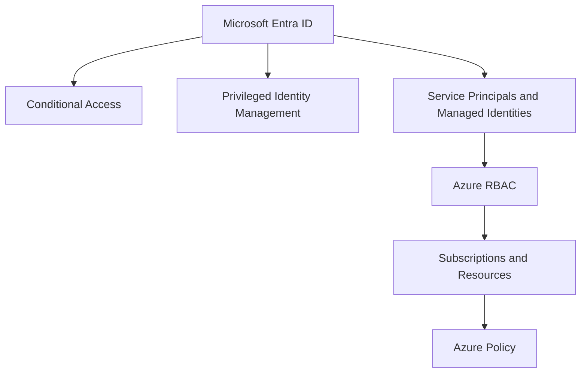

---
content_sources:
  diagrams:
    - id: platform-identity-and-governance-foundations-diagram-1
      type: flowchart
      source: self-generated
      justification: "Synthesized from Microsoft Entra, Azure RBAC, PIM, Conditional Access, and Azure Policy overview guidance."
      based_on:
        - https://learn.microsoft.com/en-us/azure/role-based-access-control/overview
        - https://learn.microsoft.com/en-us/entra/fundamentals/whatis
        - https://learn.microsoft.com/en-us/azure/governance/policy/overview
        - https://learn.microsoft.com/en-us/entra/id-governance/privileged-identity-management/pim-configure
---
# Identity and Governance Foundations

Identity and governance are the main mechanisms that turn architecture intent into enforceable access and policy boundaries.

## Microsoft Entra ID for architects

[Documented] Microsoft Entra ID is Azure's core identity service for users, groups, applications, and many control mechanisms that shape access decisions.

Architects should care because identity determines:

- who can act in the control plane
- how workloads authenticate to other services
- where conditional access and privileged workflows apply
- how shared services and app teams are separated operationally

## Access control stack

<!-- diagram-id: platform-identity-and-governance-foundations-diagram-1 -->

## Azure RBAC

[Documented] Azure RBAC authorizes actions on management-plane resources using role assignments scoped to management groups, subscriptions, resource groups, or resources.

Architectural implications:

- [Validated] broad RBAC scopes are faster to assign but harder to review safely
- [Inferred] least privilege is easier to sustain when scopes align to real ownership boundaries
- [Observed] custom roles become brittle when used to compensate for weak hierarchy design

## Conditional Access and PIM

[Documented] Conditional Access helps control sign-in conditions and risk-based access.

[Documented] Privileged Identity Management helps make elevated access time-bound and reviewable.

[Inferred] Together, they reduce the probability that standing admin access becomes the silent default.

## Azure Policy and Blueprints context

[Documented] Azure Policy evaluates resources against rules and can deny, audit, append, or deploy configuration-related effects.

[Documented] Azure Blueprints is deprecated. Microsoft recommends using Azure Policy combined with Bicep modules, Template Specs, or Deployment Stacks for governance packaging. See [Azure Blueprints deprecation](https://learn.microsoft.com/en-us/azure/governance/blueprints/overview).

[Documented] Azure Blueprints historically provided packaged governance artifacts, but current platform baselines should favor Azure Policy, Infrastructure as Code, and management-group design for ongoing control. See [Transition from Azure Blueprints](https://learn.microsoft.com/en-us/azure/governance/blueprints/overview).

[Inferred] The architecture principle is more important than the packaging mechanism: guardrails should be inheritable, reviewable, and automatable.

## What to centralize versus delegate

| Capability | Usually centralize | Usually delegate |
|---|---|---|
| Identity source and privileged workflows | Yes | No |
| Management group policy baseline | Yes | Rarely |
| Subscription-level workload RBAC | Shared model | Often yes |
| App-to-service identity design | Guardrails only | Yes |
| Exception handling | Yes | Request-based |

## Trade-offs

- [Inferred] more central policy enforcement reduces drift but can slow product teams if exception paths are weak
- [Correlated] more delegated RBAC improves local autonomy but can increase inconsistency and audit complexity
- [Observed] standing privilege usually grows where PIM adoption is low or ownership is unclear

## Common failure modes

- [Observed] using shared human admin accounts instead of identity-aware privilege workflows
- [Observed] over-scoped contributor access at subscription level
- [Observed] policy assignment without operational support to remediate violations
- [Unknown] confusion between application authorization design and Azure control-plane authorization

## Validation questions

1. Which roles require just-in-time elevation rather than permanent assignment?
2. Which policies are mandatory at management-group scope?
3. How do workloads authenticate to Azure services without embedding secrets broadly?
4. Who approves and revisits governance exceptions?

## Microsoft Learn anchors

- [Azure RBAC overview](https://learn.microsoft.com/en-us/azure/role-based-access-control/overview)
- [What is Microsoft Entra ID?](https://learn.microsoft.com/en-us/entra/fundamentals/whatis)
- [Azure Policy overview](https://learn.microsoft.com/en-us/azure/governance/policy/overview)
- [Privileged Identity Management](https://learn.microsoft.com/en-us/entra/id-governance/privileged-identity-management/pim-configure)
- [Azure Blueprints overview and deprecation](https://learn.microsoft.com/en-us/azure/governance/blueprints/overview)

## Takeaway

[Inferred] Identity and governance foundations are architecture, not administration.

If access boundaries, privilege flow, and policy inheritance are unclear, the rest of the platform remains unstable.
