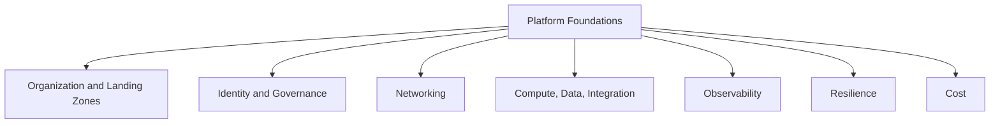

---
content_sources:
  diagrams:
    - id: platform-index-diagram-1
      type: flowchart
      source: self-generated
      justification: "Synthesized platform fundamentals map from Azure Architecture Guide and Cloud Adoption Framework landing zone guidance."
      based_on:
        - https://learn.microsoft.com/en-us/azure/architecture/guide/
        - https://learn.microsoft.com/en-us/azure/cloud-adoption-framework/ready/landing-zone/
---
# Platform

The Platform section explains the Azure foundations that shape nearly every workload decision: resource hierarchy, landing zones, identity, networking, compute, data, integration, observability, resilience, and cost.

## Why platform decisions come first

[Documented] Azure architectures are constrained by management hierarchy, control boundaries, regional placement, and governance mechanisms long before application code matters.

[Inferred] Teams that skip platform fundamentals usually rediscover them later through incidents, policy drift, and expensive redesigns.

## Topics covered

| Topic | Primary question |
|---|---|
| [Azure Architecture on Azure](azure-architecture-on-azure.md) | How Azure organizes global infrastructure and resource control |
| [Resource Organization](resource-organization.md) | How to shape management groups, subscriptions, resource groups, naming, and tags |
| [Landing Zones Basics](landing-zones-basics.md) | What shared platform baselines should exist before workloads scale |
| [Identity and Governance Foundations](identity-and-governance-foundations.md) | How access, policy, and privilege boundaries are enforced |
| [Network Topology Basics](network-topology-basics.md) | Which connectivity model best fits the estate |
| [Compute Selection Basics](compute-selection-basics.md) | Which compute family matches the workload and team |
| [Data Selection Basics](data-selection-basics.md) | Which data store family fits consistency, scale, and latency needs |
| [Integration Selection Basics](integration-selection-basics.md) | Which messaging or eventing mechanism fits the interaction pattern |
| [Observability Foundations](observability-foundations.md) | How to make workloads measurable and supportable |
| [Resilience and Region Strategy](resilience-and-region-strategy.md) | How region design should align to RTO and RPO targets |
| [Cost Model Basics](cost-model-basics.md) | How Azure pricing mechanics influence architecture decisions |

## Concept map

<!-- diagram-id: platform-index-diagram-1 -->

## How to read this section

Recommended order for most readers:

1. Azure structure and control plane basics
2. Resource hierarchy and landing zones
3. Identity and governance
4. Network topology
5. Compute, data, and integration selection
6. Observability, resilience, and cost

## What this section optimizes for

- [Documented] Microsoft Learn aligned terminology and architecture fundamentals
- [Inferred] platform choices that remain stable across many workload types
- [Validated] early identification of ownership and guardrail requirements
- [Correlated] awareness that cost, security, reliability, and operability interact from the start

## What this section avoids

This section is intentionally not a deep service tutorial.

It does not try to cover:

- portal setup sequences
- full deployment examples for each service
- runtime tuning detail for specific SKUs
- feature matrices better maintained in product documentation

## Microsoft Learn anchors

- [Azure Architecture Guide](https://learn.microsoft.com/en-us/azure/architecture/guide/)
- [Cloud Adoption Framework landing zones](https://learn.microsoft.com/en-us/azure/cloud-adoption-framework/ready/landing-zone/)
- [Azure Well-Architected Framework](https://learn.microsoft.com/en-us/azure/well-architected/)

## Takeaway

[Inferred] Strong workload architecture usually starts with boring platform clarity.

Use this section to establish the shared Azure decisions that every later pattern and workload baseline will inherit.
