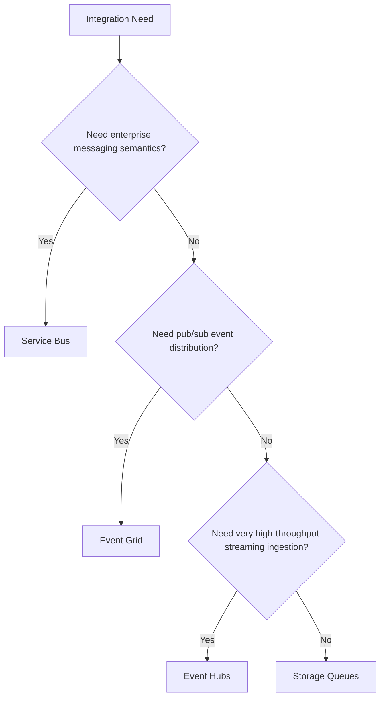

---
content_sources:
  diagrams:
    - id: platform-integration-selection-basics-diagram-1
      type: flowchart
      source: self-generated
      justification: "Synthesized from Azure messaging and eventing technology choice guidance."
      based_on:
        - https://learn.microsoft.com/en-us/azure/architecture/guide/technology-choices/messaging
        - https://learn.microsoft.com/en-us/azure/service-bus-messaging/service-bus-messaging-overview
        - https://learn.microsoft.com/en-us/azure/event-grid/overview
        - https://learn.microsoft.com/en-us/azure/event-hubs/event-hubs-about
---
# Integration Selection Basics

Integration architecture is mostly about delivery guarantees, coupling, and throughput shape.

## Decision tree

<!-- diagram-id: platform-integration-selection-basics-diagram-1 -->

## Service family summary

| Service | Best for | Key trade-off |
|---|---|---|
| Service Bus | Commands, queues, topics, ordered enterprise messaging, richer delivery semantics | More messaging discipline and operational design required |
| Event Grid | Reactive event routing and fan-out | Less suited to queue-style workflow coordination |
| Event Hubs | Telemetry and high-throughput stream ingestion | Consumer design and checkpointing become critical |
| Storage Queues | Simple queueing with minimal overhead | Fewer enterprise messaging features |

## Selection criteria

- ordering requirements
- throughput target
- fan-out model
- retry and dead-letter expectations
- need for sessions, transactions, or advanced queue semantics
- event notification versus work distribution versus stream analytics use case

## Messaging versus eventing versus streaming

[Documented] Messaging is usually about delivering work or commands reliably between components.

[Documented] Eventing is usually about announcing that something happened so subscribers can react.

[Documented] Streaming is usually about continuous ingestion of large event volumes for downstream processing.

[Inferred] Confusing these categories is one of the fastest ways to build the wrong integration backbone.

## Trade-offs

- [Inferred] richer guarantees and routing features often increase design complexity
- [Inferred] lighter-weight queueing lowers friction but may push complexity into the application
- [Correlated] very high throughput often reduces per-message coordination semantics

## Common failure modes

- [Observed] using Event Grid as if it were a workflow queue
- [Observed] using Storage Queues where ordering, sessions, or dead-letter design are core requirements
- [Observed] pushing business events into Event Hubs without clear consumer contracts
- [Unknown] assuming one messaging platform should serve every integration style equally well

## Validation questions

1. Is the producer sending a command, an event, or a telemetry stream?
2. What delivery guarantee is actually required by the business process?
3. Is ordering required globally, per entity, or not at all?
4. Who owns replay, poison-message handling, and consumer lag visibility?

## Microsoft Learn anchors

- [Choose a messaging service](https://learn.microsoft.com/en-us/azure/architecture/guide/technology-choices/messaging)
- [Service Bus overview](https://learn.microsoft.com/en-us/azure/service-bus-messaging/service-bus-messaging-overview)
- [Event Grid overview](https://learn.microsoft.com/en-us/azure/event-grid/overview)
- [Event Hubs overview](https://learn.microsoft.com/en-us/azure/event-hubs/event-hubs-about)

## Takeaway

[Inferred] Pick the integration service that matches the interaction contract, not the service your team used last time.

Messaging, eventing, and streaming are adjacent patterns, not interchangeable ones.
