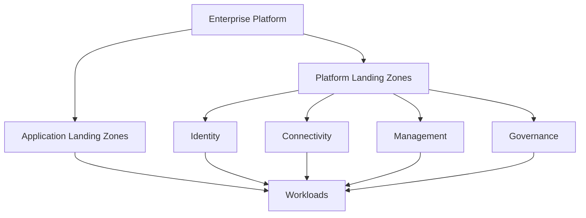

---
content_sources:
  diagrams:
    - id: platform-landing-zones-basics-diagram-1
      type: flowchart
      source: self-generated
      justification: "Synthesized from Azure Landing Zone conceptual architecture and Cloud Adoption Framework guidance."
      based_on:
        - https://learn.microsoft.com/en-us/azure/cloud-adoption-framework/ready/landing-zone/
        - https://learn.microsoft.com/en-us/azure/cloud-adoption-framework/ready/landing-zone/design-area/
---
# Landing Zones Basics

A landing zone is the prebuilt Azure platform environment where workloads can be deployed with consistent governance, identity, networking, and operations expectations.

## Why landing zones matter

[Documented] Azure Landing Zones in the Cloud Adoption Framework describe a modular approach for building governed platform foundations.

[Inferred] Architects should treat a landing zone as a productized platform baseline, not as a one-time deployment artifact.

## Conceptual shape

<!-- diagram-id: platform-landing-zones-basics-diagram-1 -->

## Platform versus application landing zones

| Type | Purpose | Typical ownership |
|---|---|---|
| Platform landing zone | Shared services, guardrails, connectivity, management, and policy baseline | Platform team |
| Application landing zone | Workload-specific deployment boundary within the approved platform model | App or product team with platform guardrails |

[Validated] The separation is useful because platform controls usually evolve more slowly than application deployments.

## What belongs in the platform layer

- [Documented] management hierarchy and policy inheritance
- [Documented] identity integration and privileged access model
- [Documented] network topology and shared connectivity services
- [Documented] logging, monitoring, and security baseline integration
- [Inferred] reusable deployment patterns and exception processes

## What belongs in the application layer

- workload-specific compute, data, and integration resources
- app-local secrets and configuration patterns aligned to the platform baseline
- workload observability and SLO instrumentation
- domain-specific resilience and release choices

## Trade-offs

- [Inferred] a stronger platform baseline improves consistency but may slow exceptions
- [Inferred] looser platform controls speed experimentation but increase review burden later
- [Observed] teams that copy a landing-zone reference without adapting ownership often inherit unnecessary complexity

## Failure modes

- [Observed] calling any subscription structure a landing zone without providing guardrails or operations model
- [Observed] embedding too many workload-specific assumptions into the shared platform baseline
- [Correlated] central teams owning everything, including app lifecycle, which creates queue-based delivery
- [Unknown] unclear exception handling causing shadow IT patterns

## Validation questions

1. Which controls are mandatory for every workload?
2. Which services are shared and therefore need platform ownership?
3. What is the approved path for justified exceptions?
4. How will a new workload team know what is inherited versus self-managed?

## Decision heuristic

!!! tip
    If a design choice affects many workloads, make it part of the landing zone. If it only affects one workload, keep it in the application boundary unless policy says otherwise.

## Microsoft Learn anchors

- [Cloud Adoption Framework landing zones](https://learn.microsoft.com/en-us/azure/cloud-adoption-framework/ready/landing-zone/)
- [Landing zone design areas](https://learn.microsoft.com/en-us/azure/cloud-adoption-framework/ready/landing-zone/design-area/)
- [Enterprise-scale landing zone architecture](https://learn.microsoft.com/en-us/azure/cloud-adoption-framework/ready/landing-zone/design-area/azure-landing-zone)

## Takeaway

[Inferred] A landing zone is valuable when it standardizes the hard parts of Azure ownership without smothering workload autonomy.

Design it as an operating model, not as a diagram alone.
