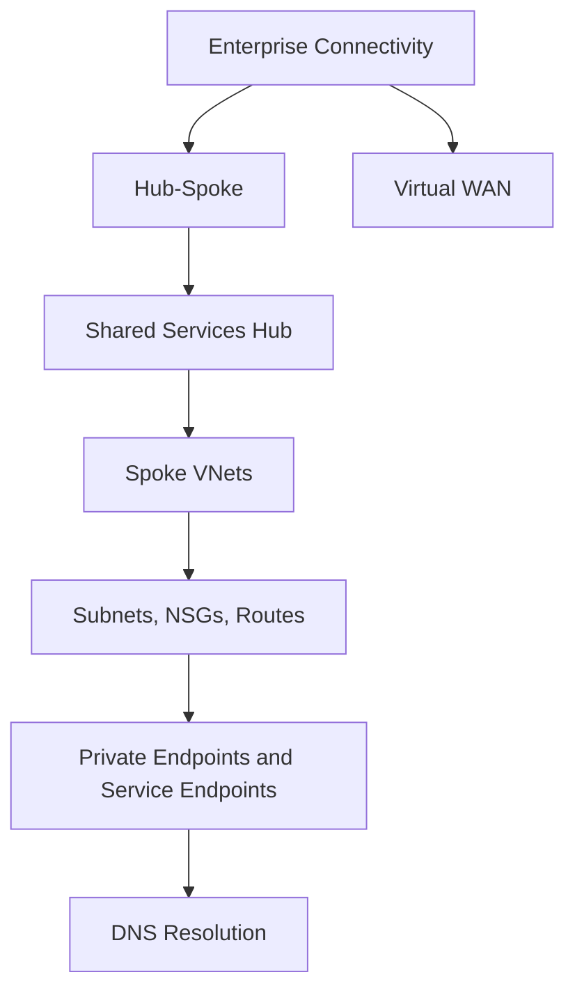

---
content_sources:
  diagrams:
    - id: platform-network-topology-basics-diagram-1
      type: flowchart
      source: self-generated
      justification: "Synthesized from Azure networking architecture guidance, hub-spoke patterns, Virtual WAN, private endpoint, service endpoint, and DNS guidance."
      based_on:
        - https://learn.microsoft.com/en-us/azure/architecture/networking/guide/private-link-hub-spoke-network
        - https://learn.microsoft.com/en-us/azure/architecture/reference-architectures/hybrid-networking/hub-spoke
        - https://learn.microsoft.com/en-us/azure/virtual-wan/virtual-wan-about
        - https://learn.microsoft.com/en-us/azure/private-link/private-endpoint-overview
---
# Network Topology Basics

Networking decisions define how workloads connect, isolate, resolve names, and fail under pressure.

## Core building blocks

[Documented] Virtual networks, subnets, network security groups, route tables, and DNS controls provide the basic fabric for Azure workload connectivity.

Architects should evaluate them as a system:

- VNets define the main address and trust boundaries
- subnets create segmentation and delegation boundaries
- NSGs control allowed traffic at subnet or NIC scope
- route tables shape path selection and forced routing patterns
- DNS determines whether private connectivity is usable in practice

## Topology overview

<!-- diagram-id: platform-network-topology-basics-diagram-1 -->

## Hub-spoke versus Virtual WAN

| Model | Best fit | Main trade-off |
|---|---|---|
| Hub-spoke | Teams needing high control over custom routing and shared services | More design and operational ownership |
| Virtual WAN | Large-scale branch, hybrid, or globally connected estates seeking managed transit | Less granular control in some scenarios |

[Documented] Both are valid Azure patterns.

[Inferred] The right choice depends less on topology aesthetics and more on operational model, routing complexity, and scale.

## Private endpoints versus service endpoints

[Documented] Private endpoints provide private IP-based connectivity to supported services through Azure Private Link.

[Documented] Service endpoints extend VNet identity to Azure services over the Azure backbone without giving the service a private IP in your VNet.

Architectural heuristic:

- choose private endpoints when private IP exposure, stronger isolation expectations, or private DNS integration are important
- consider service endpoints when the service supports them and the connectivity pattern is simpler

[Observed] DNS complexity often determines the real operational cost of private endpoints.

## DNS resolution patterns

DNS is not a side topic.

[Validated] Many private connectivity failures are ultimately name-resolution failures.

Design questions include:

- who owns private DNS zones?
- how are on-premises and Azure resolvers integrated?
- how is split-horizon behavior documented and tested?
- which shared services depend on central DNS forwarding?

## Trade-offs

- [Inferred] stronger isolation increases DNS and routing complexity
- [Inferred] centralized hubs simplify governance but can create shared bottlenecks and ownership queues
- [Correlated] distributed topology improves autonomy but often weakens consistency without standards

## Common failure modes

- [Observed] route design that accidentally hairpins traffic through unnecessary hops
- [Observed] NSG and route-table rules managed independently without clear intent
- [Observed] private endpoints deployed without end-to-end DNS validation
- [Unknown] assuming Virtual WAN and hub-spoke are interchangeable from an ops perspective

## Validation questions

1. What is the primary connectivity problem: segmentation, hybrid transit, global scale, or private service access?
2. Which team owns DNS design and test evidence?
3. Where are the forced-routing and inspection choke points?
4. What is the blast radius if the central networking layer fails or misroutes traffic?

## Microsoft Learn anchors

- [Azure networking architecture guides](https://learn.microsoft.com/en-us/azure/architecture/networking/guide/)
- [Hub-spoke reference architecture](https://learn.microsoft.com/en-us/azure/architecture/reference-architectures/hybrid-networking/hub-spoke)
- [About Azure Virtual WAN](https://learn.microsoft.com/en-us/azure/virtual-wan/virtual-wan-about)
- [Private endpoint overview](https://learn.microsoft.com/en-us/azure/private-link/private-endpoint-overview)

## Takeaway

[Inferred] Network topology should be selected for operational clarity and failure containment, not just for diagram elegance.

If DNS, routing, and ownership are unclear, the topology is not finished.
