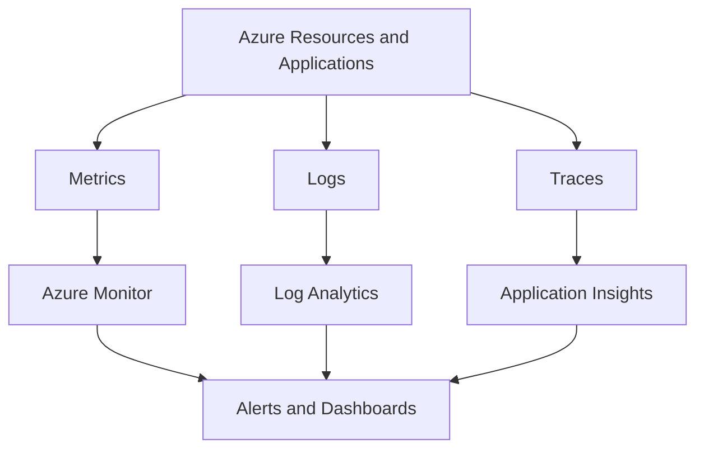

---
content_sources:
  diagrams:
    - id: platform-observability-foundations-diagram-1
      type: flowchart
      source: self-generated
      justification: "Synthesized from Azure Monitor, Log Analytics, and Application Insights overview guidance."
      based_on:
        - https://learn.microsoft.com/en-us/azure/azure-monitor/overview
        - https://learn.microsoft.com/en-us/azure/azure-monitor/app/app-insights-overview
        - https://learn.microsoft.com/en-us/azure/azure-monitor/essentials/diagnostic-settings
content_validation:
  status: pending_review
  last_reviewed: '2026-04-22'
  reviewer: agent
  core_claims:
  - claim: Document covers Observability Foundations aligned with Azure architecture
      guidance
    source: https://learn.microsoft.com/en-us/azure/azure-monitor/overview
    verified: false
  - claim: Document includes Microsoft Learn-traceable guidance for Observability
      Foundations
    source: https://learn.microsoft.com/en-us/azure/azure-monitor/app/app-insights-overview
    verified: false
  - claim: Document addresses Core services for Observability Foundations
    source: https://learn.microsoft.com/en-us/azure/azure-monitor/essentials/diagnostic-settings
    verified: false
  - claim: Document addresses Signal model for Observability Foundations
    source: https://learn.microsoft.com/en-us/azure/azure-monitor/overview
    verified: false
  - claim: Document addresses Metrics versus logs versus traces for Observability
      Foundations
    source: https://learn.microsoft.com/en-us/azure/azure-monitor/app/app-insights-overview
    verified: false
---
# Observability Foundations

Observability is the architecture capability that turns unknown behavior into measurable signals.

## Core services

[Documented] Azure Monitor provides the umbrella platform for metrics, logs, alerts, and analysis.

[Documented] Log Analytics workspaces store and query log data.

[Documented] Application Insights provides application performance monitoring and distributed tracing capabilities for supported workloads.

## Signal model

<!-- diagram-id: platform-observability-foundations-diagram-1 -->

## Metrics versus logs versus traces

| Signal | Best use | Common mistake |
|---|---|---|
| Metrics | Fast health and threshold monitoring | Expecting them to explain complex causality |
| Logs | Rich event records and investigation | Collecting everything without retention and ownership strategy |
| Traces | Request and dependency flow analysis | Adding tracing without correlating to business-critical paths |

## Diagnostic settings pattern

[Documented] Diagnostic settings are the standard Azure pattern for routing platform logs and metrics to supported destinations such as Log Analytics, storage, and event streaming targets.

[Inferred] Architects should treat diagnostic settings as baseline plumbing that must be standardized across resource types.

## Design principles

- [Validated] define minimum platform telemetry per resource category
- [Validated] standardize workspace and retention strategy early
- [Inferred] align alert ownership to the team that can act on the signal
- [Correlated] business and technical telemetry are more useful when correlated by common identifiers

## Ownership model

| Layer | Typical owner |
|---|---|
| Shared monitor workspace strategy | Platform team |
| Application traces and business telemetry | Product or workload team |
| Alert routing and escalation policy | Shared between platform and workload operators |

## Common failure modes

- [Observed] logs collected without query patterns, retention decisions, or ownership
- [Observed] alerts configured on noisy symptoms rather than meaningful user impact signals
- [Observed] Application Insights added to one component but not across end-to-end request paths
- [Unknown] cost surprises caused by collecting high-volume telemetry without classification

## Validation questions

1. Which user journeys must be observable end to end?
2. Which signals are needed for fast detection versus deep diagnosis?
3. Which telemetry is mandatory across all subscriptions or landing zones?
4. Who owns alert quality and ongoing tuning?

## Microsoft Learn anchors

- [Azure Monitor overview](https://learn.microsoft.com/en-us/azure/azure-monitor/overview)
- [Application Insights overview](https://learn.microsoft.com/en-us/azure/azure-monitor/app/app-insights-overview)
- [Diagnostic settings](https://learn.microsoft.com/en-us/azure/azure-monitor/essentials/diagnostic-settings)

## Takeaway

[Inferred] Observability architecture is successful when it shortens diagnosis without overwhelming operators with unowned data.

Collect only what you can explain, route, retain, and act on.

## See Also

- [Guide home](../index.md)
- [Section index](index.md)
- [Start here](../start-here/overview.md)

## Sources

- [Microsoft Learn source 1](https://learn.microsoft.com/en-us/azure/azure-monitor/overview)
- [Microsoft Learn source 2](https://learn.microsoft.com/en-us/azure/azure-monitor/app/app-insights-overview)
- [Microsoft Learn source 3](https://learn.microsoft.com/en-us/azure/azure-monitor/essentials/diagnostic-settings)
