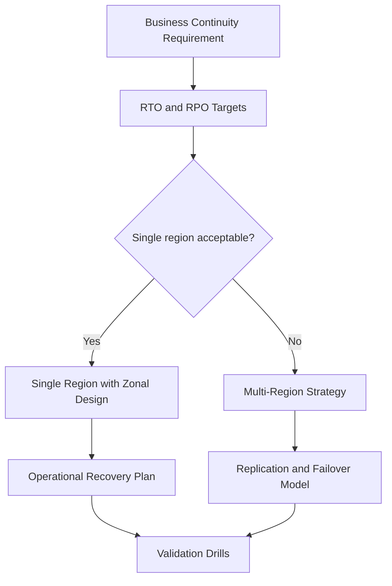

---
content_sources:
  diagrams:
    - id: platform-resilience-and-region-strategy-diagram-1
      type: flowchart
      source: self-generated
      justification: "Synthesized from Azure reliability guidance covering regions, availability zones, and disaster recovery concepts."
      based_on:
        - https://learn.microsoft.com/en-us/azure/reliability/overview
        - https://learn.microsoft.com/en-us/azure/reliability/regions-list
        - https://learn.microsoft.com/en-us/azure/availability-zones/az-overview
content_validation:
  status: pending_review
  last_reviewed: '2026-04-22'
  reviewer: agent
  core_claims:
  - claim: Document covers Resilience and Region Strategy aligned with Azure architecture
      guidance
    source: https://learn.microsoft.com/en-us/azure/reliability/overview
    verified: false
  - claim: Document includes Microsoft Learn-traceable guidance for Resilience and
      Region Strategy
    source: https://learn.microsoft.com/en-us/azure/reliability/regions-list
    verified: false
  - claim: Document addresses Core concepts for Resilience and Region Strategy
    source: https://learn.microsoft.com/en-us/azure/availability-zones/az-overview
    verified: false
  - claim: Document addresses Decision model for Resilience and Region Strategy
    source: https://learn.microsoft.com/en-us/azure/reliability/overview
    verified: false
  - claim: Document addresses Single-region versus multi-region for Resilience and
      Region Strategy
    source: https://learn.microsoft.com/en-us/azure/reliability/regions-list
    verified: false
---
# Resilience and Region Strategy

Resilience strategy is the discipline of matching business recovery expectations to realistic Azure failure domains and operating procedures.

## Core concepts

[Documented] Availability zones provide fault isolation within supported regions.

[Documented] Regions and paired-region concepts influence disaster recovery planning and data residency choices.

[Documented] RTO and RPO express time-to-recover and acceptable data-loss objectives.

## Decision model

<!-- diagram-id: platform-resilience-and-region-strategy-diagram-1 -->

## Single-region versus multi-region

| Choice | Best fit | Main risk |
|---|---|---|
| Single region | Moderate criticality, recoverable downtime, simpler ops model | Region-wide event exceeds tolerance |
| Single region with zones | Need stronger local fault isolation | Zonal support may not cover all dependencies |
| Multi-region active-passive | Higher resilience with controlled complexity | Failover readiness can decay if not rehearsed |
| Multi-region active-active | Very high availability and low-latency global patterns | Highest complexity in data, routing, and operations |

## Region strategy heuristics

- [Inferred] do not adopt multi-region because it sounds mature; adopt it because targets require it
- [Validated] zone-aware architecture usually delivers better value before cross-region architecture is needed
- [Observed] organizations underestimate the operational burden of testing failover and data consistency paths

## RTO and RPO as design inputs

[Inferred] Recovery targets should be explicit numbers, not adjectives such as "highly available."

Architectural consequences include:

- replication design
- deployment topology
- automation level for failover and recovery
- observability and drill frequency
- data consistency expectations during failover

## Common failure modes

- [Observed] calling a deployment resilient because it spans availability zones while critical dependencies remain single-zone or single-region
- [Observed] pairing regions in a design document without a tested failover sequence
- [Correlated] choosing active-active while application state and data ownership remain strongly coupled
- [Unknown] assuming Azure-managed redundancy removes the need for workload-level recovery design

## Validation questions

1. What are the explicit RTO and RPO targets for each critical business flow?
2. Which dependencies are zonal, regional, or global?
3. How will traffic, state, secrets, and operational access behave during failover?
4. When was the last recovery drill and what evidence proved the targets?

## Microsoft Learn anchors

- [Azure reliability overview](https://learn.microsoft.com/en-us/azure/reliability/overview)
- [Azure regions and availability zones](https://learn.microsoft.com/en-us/azure/reliability/regions-list)
- [Availability zones overview](https://learn.microsoft.com/en-us/azure/availability-zones/az-overview)

## Takeaway

[Inferred] Resilience architecture is credible only when recovery targets, topology, and drills agree with each other.

Design for the failure domain you can explain and validate.

## See Also

- [Guide home](../index.md)
- [Section index](index.md)
- [Start here](../start-here/overview.md)

## Sources

- [Microsoft Learn source 1](https://learn.microsoft.com/en-us/azure/reliability/overview)
- [Microsoft Learn source 2](https://learn.microsoft.com/en-us/azure/reliability/regions-list)
- [Microsoft Learn source 3](https://learn.microsoft.com/en-us/azure/availability-zones/az-overview)
