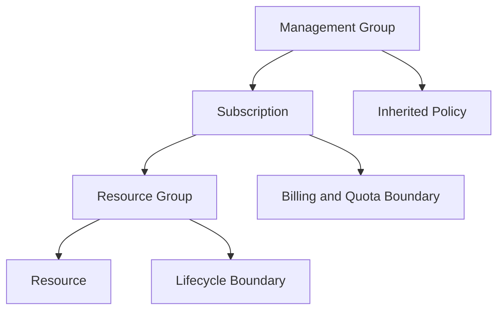

---
content_sources:
  diagrams:
    - id: platform-resource-organization-diagram-1
      type: flowchart
      source: self-generated
      justification: "Synthesized from Cloud Adoption Framework resource organization guidance and Azure management hierarchy documentation."
      based_on:
        - https://learn.microsoft.com/en-us/azure/cloud-adoption-framework/ready/azure-setup-guide/organize-resources
        - https://learn.microsoft.com/en-us/azure/governance/management-groups/overview
        - https://learn.microsoft.com/en-us/azure/azure-resource-manager/management/overview
---
# Resource Organization

Resource organization is where architecture intent becomes enforceable structure.

## Core hierarchy

[Documented] Azure organizes governance through management groups, subscriptions, resource groups, and resources.

Each level answers a different design question:

- management groups: how should policy and governance be inherited at scale?
- subscriptions: where do you need billing, quota, and blast-radius separation?
- resource groups: which resources should share lifecycle and deployment boundary?
- resources: what is the concrete platform object being controlled?

## Hierarchy map

<!-- diagram-id: platform-resource-organization-diagram-1 -->

## When to split subscriptions

[Documented] subscriptions provide billing and governance isolation.

[Inferred] split subscriptions when one or more of these are true:

- you need separate billing owners or chargeback models
- you need materially different policy baselines
- you need quota isolation for growth or experimentation
- you need stronger blast-radius reduction between environments or domains
- you need clearer delegated administration boundaries

Avoid splitting subscriptions only because teams prefer separate naming or because one deployment pipeline is poorly organized.

## When to keep workloads together

[Inferred] keep workloads in the same subscription when they share:

- the same governance baseline
- the same budget owner
- similar compliance requirements
- a tightly coupled operational model

[Observed] too many subscriptions without automation maturity can increase governance overhead and reduce visibility.

## Resource group design

[Documented] resource groups are primarily management and lifecycle containers.

Use them to group resources that:

- are deployed together
- are retired together
- should share RBAC or lock boundaries
- are logically owned by the same team

[Observed] using one resource group for an entire estate usually obscures lifecycle and ownership boundaries.

## Naming conventions

Good naming should support searchability, supportability, and automation.

Recommended naming elements:

- workload or platform domain
- environment designation
- region or geography hint where useful
- resource purpose
- bounded uniqueness suffix only where required

[Inferred] Names should encode stable identity, not transient project management labels.

## Tagging strategy

[Documented] tags are commonly used for cost allocation, automation, ownership, and reporting.

Minimum useful tag set for most estates:

| Tag | Why it matters |
|---|---|
| `owner` | Support routing and accountability |
| `environment` | Filter views and policy scope |
| `business-unit` | Chargeback and reporting |
| `criticality` | Review priority and control expectations |
| `data-classification` | Security and governance context |

## Trade-offs

- [Inferred] more subscriptions improve isolation but increase management overhead
- [Inferred] fewer subscriptions simplify governance but can increase blast radius
- [Correlated] richer tagging improves reporting only if tags are mandatory and audited
- [Observed] naming standards that try to encode every attribute become hard to maintain

## Common failure modes

- [Observed] environment splits that do not align to ownership or billing
- [Observed] resource groups used as application folders instead of lifecycle boundaries
- [Observed] optional tags that become unusable for reporting
- [Unknown] inconsistent naming causing automation exceptions and operator confusion

## Validation questions

1. What is the reason for every subscription boundary?
2. Which tags drive policy, reporting, or routing decisions?
3. Which resources are expected to share lifecycle and RBAC boundaries?
4. Can an operator infer owner, environment, and purpose from the naming standard?

## Microsoft Learn anchors

- [Organize your Azure resources](https://learn.microsoft.com/en-us/azure/cloud-adoption-framework/ready/azure-setup-guide/organize-resources)
- [What are Azure management groups?](https://learn.microsoft.com/en-us/azure/governance/management-groups/overview)
- [Azure Resource Manager overview](https://learn.microsoft.com/en-us/azure/azure-resource-manager/management/overview)

## Takeaway

[Inferred] Resource hierarchy is an architecture decision because it sets the future cost of governance, delegation, and recovery from mistakes.

Choose boundaries for control and lifecycle, not for aesthetics.
