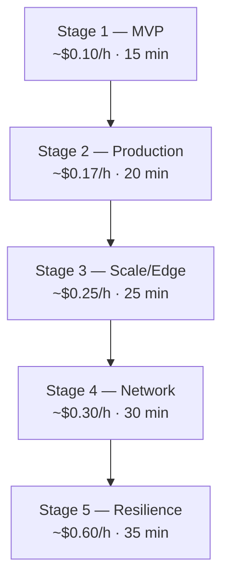

---
content_sources:
  diagrams:
    - id: cost-per-stage
      type: flowchart
      source: self-generated
      justification: "Shows cost progression across stages."
content_validation:
  status: pending_review
  last_reviewed: '2026-04-25'
  reviewer: agent
  core_claims:
    - claim: App Service Basic B1 costs approximately $0.075/hour in most regions.
      source: https://learn.microsoft.com/en-us/azure/app-service/overview-hosting-plans
      verified: false
    - claim: Azure SQL Database Basic tier costs approximately $0.0068/hour.
      source: https://learn.microsoft.com/en-us/azure/azure-sql/database/service-tiers-dtu
      verified: false
    - claim: Azure Front Door Standard has a base fee plus per-request and data transfer charges.
      source: https://learn.microsoft.com/en-us/azure/frontdoor/understanding-pricing
      verified: false
---
# Cost and Time Model

Every stage is designed for **deploy → verify → destroy** in under an hour. Costs shown are approximate hourly rates for the Korea Central region.

<!-- diagram-id: cost-per-stage -->

## Stage Cost Summary

| Stage | Key Resources | Approx. Cost/h | Deploy Time |
|---|---|---|---|
| 1 — MVP | App Service B1, SQL Basic, App Insights, Log Analytics | ~$0.10 | 15 min |
| 2 — Production Baseline | + Key Vault, Staging Slot, Alerts (upgrade to S1) | ~$0.17 | 20 min |
| 3 — Scale / Edge | + Front Door Standard, WAF, Autoscale | ~$0.25 | 25 min |
| 4 — Network Isolation | + VNet, Private Endpoint, Private DNS Zone | ~$0.30 | 30 min |
| 5 — Resilience | + Secondary Region, SQL Failover Group (SQL S0) | ~$0.60 | 35 min |

## Cost Breakdown by Resource

### Compute

| Resource | Tier | Stages | Approx. Cost/h |
|---|---|---|---|
| App Service Plan | B1 (Basic) | 1 | $0.075 |
| App Service Plan | S1 (Standard) | 2–5 | $0.10 |
| App Service Plan (secondary) | S1 (Standard) | 5 | $0.10 |

### Data

| Resource | Tier | Stages | Approx. Cost/h |
|---|---|---|---|
| Azure SQL Database | Basic (5 DTU) | 1–3 | $0.0068 |
| Azure SQL Database | S0 (10 DTU) | 4–5 | $0.0202 |
| SQL Failover Group | — | 5 | Included with replicas |

### Networking

| Resource | Tier | Stages | Approx. Cost/h |
|---|---|---|---|
| Front Door Standard | Base + per-request | 3–5 | ~$0.05 |
| WAF Policy | Included with Front Door | 3–5 | Included |
| VNet | Free | 4–5 | $0.00 |
| Private Endpoint | Per endpoint | 4–5 | ~$0.01 |
| Private DNS Zone | Per zone | 4–5 | ~$0.001 |

### Monitoring

| Resource | Tier | Stages | Approx. Cost/h |
|---|---|---|---|
| Log Analytics | Free tier (5 GB/month) | 1–5 | $0.00 |
| Application Insights | Pay-as-you-go | 1–5 | ~$0.00 |
| Action Group + Alert | Free tier | 2–5 | $0.00 |

### Secrets

| Resource | Tier | Stages | Approx. Cost/h |
|---|---|---|---|
| Key Vault | Standard | 2–5 | ~$0.001 |

## Cost Optimization Tips

1. **Destroy immediately after verification** — `az group delete --name $RG --yes --no-wait`
2. **Use the provided .env files** — they set Free/Basic tiers by default
3. **Deploy during off-peak hours** — some regions have lower spot pricing
4. **One stage at a time** — do not leave multiple stages running simultaneously
5. **Check remaining credits** — `az consumption usage list --query "[].{cost:pretaxCost}" --output table`

## See Also

- [Getting Started](getting-started.md)
- [Verify and Destroy](verify-and-destroy.md)

## Sources

- [App Service Pricing](https://learn.microsoft.com/en-us/azure/app-service/overview-hosting-plans)
- [Azure SQL Database Pricing](https://learn.microsoft.com/en-us/azure/azure-sql/database/service-tiers-dtu)
- [Azure Front Door Pricing](https://learn.microsoft.com/en-us/azure/frontdoor/understanding-pricing)
- [Azure Pricing Calculator](https://azure.microsoft.com/pricing/calculator/)
