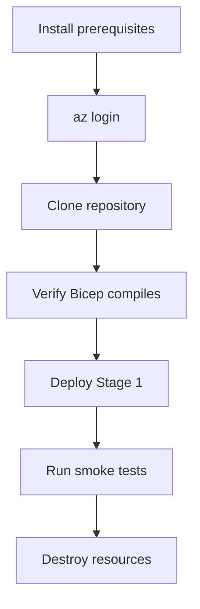

---
content_sources:
  diagrams:
    - id: getting-started-flow
      type: flowchart
      source: self-generated
      justification: "Shows the setup and first deployment flow."
content_validation:
  status: verified
  last_reviewed: '2026-04-25'
  reviewer: agent
  core_claims:
    - claim: Azure CLI is the primary command-line tool for managing Azure resources.
      source: https://learn.microsoft.com/en-us/cli/azure/install-azure-cli
      verified: true
    - claim: Bicep CLI is required to compile and deploy Bicep templates.
      source: https://learn.microsoft.com/en-us/azure/azure-resource-manager/bicep/install
      verified: true
---
# Getting Started

Everything you need before deploying your first stage.

<!-- diagram-id: getting-started-flow -->


## Prerequisites

| Tool | Minimum Version | Install |
|---|---|---|
| Azure CLI | 2.60+ | [Install Azure CLI](https://learn.microsoft.com/en-us/cli/azure/install-azure-cli) |
| Bicep CLI | 0.25+ | Bundled with Azure CLI or `az bicep install` |
| .NET SDK | 8.0+ | [Install .NET](https://dotnet.microsoft.com/download) |
| Bash | 4.0+ | macOS/Linux built-in, or Git Bash / WSL on Windows |
| curl | any | Pre-installed on most systems |

## Azure Account Setup

```bash
# Login to Azure
az login

# Verify your subscription
az account show --query '{name:name, id:id, state:state}' --output table

# Set your preferred subscription (if you have multiple)
az account set --subscription "<subscription-id>"
```

## Clone and Verify

```bash
git clone https://github.com/yeongseon/azure-architecture-practical-guide.git
cd azure-architecture-practical-guide

# Verify Bicep compiles
az bicep build --file infra/bicep/stages/stage-01-mvp/main.bicep --stdout > /dev/null && echo "Bicep OK"

# Verify the sample app builds
dotnet build src/practical-storefront/src/Practical.Storefront.Web/Practical.Storefront.Web.csproj
dotnet test src/practical-storefront/tests/Practical.Storefront.Web.Tests/Practical.Storefront.Web.Tests.csproj
```

## Deploy Your First Stage

```bash
# Source the stage environment
source scripts/practical/stages/stage-01.env

# Create the resource group
az group create --name "$RG" --location "$LOCATION"

# Deploy
az deployment group create \
    --resource-group "$RG" \
    --template-file infra/bicep/stages/stage-01-mvp/main.bicep \
    --parameters infra/bicep/stages/stage-01-mvp/main.bicepparam \
    --parameters appName="$APP_NAME" \
    --parameters sqlAdminLogin="$SQL_ADMIN_LOGIN" \
    --parameters sqlAdminPassword="$SQL_ADMIN_PASSWORD"

# Verify
bash scripts/practical/verify/http-smoke.sh

# Destroy when done
az group delete --name "$RG" --yes --no-wait
```

## Directory Layout

```text
infra/bicep/modules/   ← 18 reusable Bicep capability modules
infra/bicep/stages/    ← One main.bicep per stage (independent deployments)
scripts/practical/     ← Deploy, verify, destroy scripts + per-stage .env
src/practical-storefront/ ← The sample ASP.NET Core 8 MVC app
labs/trunk/            ← Checklists and expected results per stage
docs/practical-journey/ ← This documentation
```

## Next Steps

Deploy [Stage 1 — MVP](stage-01-mvp.md) to get your first Azure web app running.

## See Also

- [Cost and Time Model](cost-and-time-model.md)
- [Module Map](module-map.md)
- [Verify and Destroy](verify-and-destroy.md)

## Sources

- [Install Azure CLI](https://learn.microsoft.com/en-us/cli/azure/install-azure-cli)
- [Install Bicep](https://learn.microsoft.com/en-us/azure/azure-resource-manager/bicep/install)
- [.NET 8 Download](https://dotnet.microsoft.com/download/dotnet/8.0)
