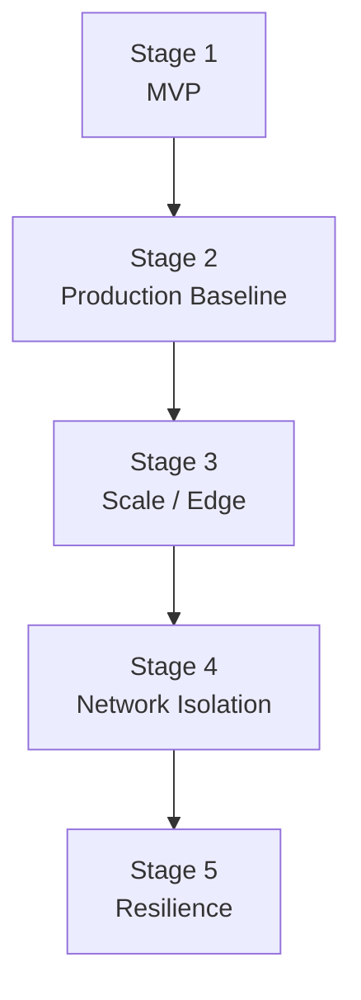

---
content_sources:
  diagrams:
    - id: practical-journey-overview
      type: flowchart
      source: self-generated
      justification: "Shows the five-stage progression of the practical architecture journey."
content_validation:
  status: verified
  last_reviewed: '2026-04-25'
  reviewer: agent
  core_claims:
    - claim: Progressive architecture journeys help teams learn by expanding a single baseline rather than studying isolated examples.
      source: https://learn.microsoft.com/en-us/azure/architecture/guide/
      verified: true
---
# Practical Architecture Journey

One sample app. Five stages. A real Azure architecture that grows from MVP to multi-region resilience.

<!-- diagram-id: practical-journey-overview -->

## Why This Exists

Most architecture guides show finished diagrams. This guide lets you **deploy each stage**, verify it works, then tear it down before cost accrues. Every stage reuses the same Bicep modules so you see exactly what changes between stages.

## Stages

| Stage | What You Add | Estimated Cost/h | Time |
|---|---|---|---|
| [Stage 1 — MVP](stage-01-mvp.md) | App Service B1 + SQL Basic + App Insights + Log Analytics | ~$0.10 | 15 min |
| [Stage 2 — Production Baseline](stage-02-production-baseline.md) | Key Vault + Managed Identity + Staging Slot + Alerts (S1) | ~$0.17 | 20 min |
| [Stage 3 — Scale / Edge](stage-03-scale-edge.md) | Front Door Standard + WAF + Autoscale | ~$0.25 | 25 min |
| [Stage 4 — Network Isolation](stage-04-network-isolation.md) | VNet + Private Endpoint + Private DNS | ~$0.30 | 30 min |
| [Stage 5 — Resilience](stage-05-resilience.md) | Secondary Region + SQL Failover Group | ~$0.60 | 35 min |

## Before You Start

- [Getting Started](getting-started.md) — prerequisites and first-time setup
- [Cost and Time Model](cost-and-time-model.md) — what each stage costs and how long it takes
- [Module Map](module-map.md) — how the 18 Bicep modules compose into each stage
- [Verify and Destroy](verify-and-destroy.md) — the deploy → verify → destroy workflow

## The Sample App

**Practical Storefront** is an ASP.NET Core 8 MVC application with health, info, and version endpoints. It connects to Azure SQL Database and is instrumented with Application Insights. The same app binary deploys to every stage — only the infrastructure changes.

Source: [`src/practical-storefront/`](https://github.com/yeongseon/azure-architecture-practical-guide/tree/main/src/practical-storefront)

## See Also

- [Architecture Patterns](../patterns/index.md)
- [Well-Architected Framework](../waf/index.md)
- [Operations](../operations/index.md)

## Sources

- [Azure Architecture Center](https://learn.microsoft.com/en-us/azure/architecture/)
- [Azure Well-Architected Framework](https://learn.microsoft.com/en-us/azure/well-architected/)
