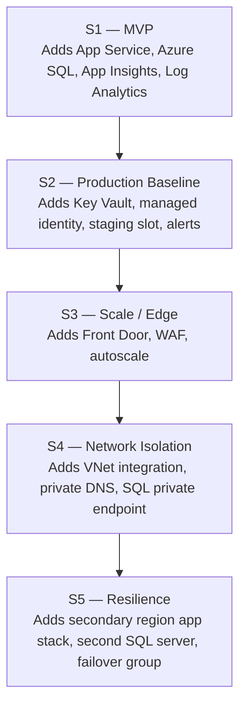

# Practical Journey

The Practical Journey turns the architecture guidance in this repository into a staged deployment path. Each stage is independently deployable, teaches one production concern at a time, and uses the same Practical Storefront sample so you can focus on architecture changes instead of app rewrites.

Use the journey when you want a hands-on progression from a public MVP to a resilient multi-region baseline, with a clear trigger for when each stage becomes worth the extra cost and complexity.

## Journey progression

<!-- diagram-id: practical-journey-stage-progression -->

## Stage guide

| Stage | When to use it | Trigger | Cost | Time |
|---|---|---|---|---|
| [Stage 1 — MVP](stage-01-mvp.md) | Get a real public app online fast | "We need a real public web app online this week." | ~$0.09–$0.13/hour | 20–30 min |
| [Stage 2 — Production Baseline](stage-02-production-baseline.md) | Add release safety, secret custody, and alerts | "The app now matters to the business." | ~$0.14–$0.20/hour | 25–40 min |
| [Stage 3 — Scale / Edge](stage-03-scale-edge.md) | Add edge protection and autoscale | "Traffic is growing and internet exposure is a concern." | ~$0.20–$0.30/hour | 35–50 min |
| [Stage 4 — Network Isolation](stage-04-network-isolation.md) | Make the data path private | "Compliance requires private data access." | ~$0.24–$0.36/hour | 35–55 min |
| [Stage 5 — Resilience](stage-05-resilience.md) | Add active-passive regional resilience | "Business needs regional outage tolerance." | ~$0.45–$0.80/hour | 50–75 min |

## How to use the journey

1. Start with [Getting Started](getting-started.md) to prepare your Azure account, CLI tools, and required environment variables.
2. Use [Cost and Time Model](cost-and-time-model.md) to choose the stage that fits your budget and delivery window.
3. Deploy only the stage that matches your current production concern. The stages are designed to teach one concern at a time, not to be kept running together by default.
4. Use [Verify and Destroy](verify-and-destroy.md) after each deployment so the architecture is proven and the spend is cleaned up.
5. Use [Module Map](module-map.md) when you want to trace a stage back to the Bicep modules that compose it.

## What this section is not

- It is not a single linear lab that must leave all five stages deployed at once.
- It is not a replacement for the deeper reasoning in Platform, Patterns, and Workload Guides.
- It does not hide trade-offs: later stages cost more because they solve more production risks.

## See Also

- [Getting Started](getting-started.md)
- [Cost and Time Model](cost-and-time-model.md)
- [Module Map](module-map.md)
- [Verify and Destroy](verify-and-destroy.md)
- [Public web and API — baseline](../workload-guides/public-web-api/baseline.md)

## Sources

- [Azure App Service overview](https://learn.microsoft.com/en-us/azure/app-service/overview)
- [Azure Front Door overview](https://learn.microsoft.com/en-us/azure/frontdoor/front-door-overview)
- [What is Azure Private Endpoint?](https://learn.microsoft.com/en-us/azure/private-link/private-endpoint-overview)
- [Auto-failover groups overview and best practices](https://learn.microsoft.com/en-us/azure/azure-sql/database/auto-failover-group-sql-db)
