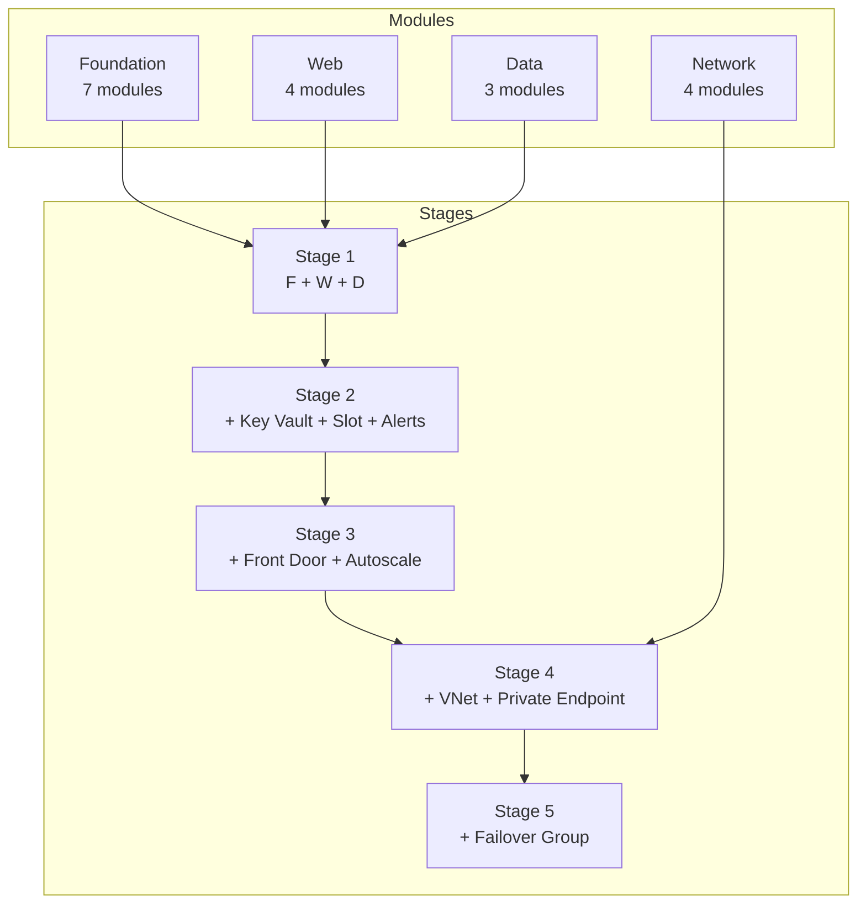

---
content_sources:
  diagrams:
    - id: module-composition
      type: flowchart
      source: self-generated
      justification: "Shows how modules compose into stages."
content_validation:
  status: verified
  last_reviewed: '2026-04-25'
  reviewer: agent
  core_claims:
    - claim: Bicep modules enable reusable, composable infrastructure definitions.
      source: https://learn.microsoft.com/en-us/azure/azure-resource-manager/bicep/modules
      verified: true
---
# Module Map

The practical journey uses **18 reusable Bicep modules** that compose differently in each stage. Every stage deploys independently — modules are referenced, not inherited.

<!-- diagram-id: module-composition -->

## Module Inventory

### Foundation (7 modules)

| Module | Path | Purpose |
|---|---|---|
| Log Analytics Workspace | `modules/foundation/log-analytics-workspace.bicep` | Central log store |
| Application Insights | `modules/foundation/application-insights.bicep` | APM telemetry |
| Key Vault | `modules/foundation/key-vault.bicep` | Secret management |
| Role Assignment | `modules/foundation/role-assignment.bicep` | RBAC binding |
| Action Group | `modules/foundation/action-group.bicep` | Alert notification target |
| Metric Alerts | `modules/foundation/metric-alerts.bicep` | Threshold-based alerts |
| Autoscale Settings | `modules/foundation/autoscale-settings.bicep` | CPU-based autoscale rules |

### Web (4 modules)

| Module | Path | Purpose |
|---|---|---|
| App Service Plan | `modules/web/app-service-plan.bicep` | Compute host |
| Web App | `modules/web/web-app.bicep` | Linux web application |
| Web App Slot | `modules/web/web-app-slot.bicep` | Staging deployment slot |
| Front Door Standard | `modules/web/front-door-standard.bicep` | Global edge + WAF |

### Data (3 modules)

| Module | Path | Purpose |
|---|---|---|
| SQL Logical Server | `modules/data/sql-logical-server.bicep` | SQL server with Entra auth |
| SQL Database | `modules/data/sql-database.bicep` | Single database |
| SQL Failover Group | `modules/data/sql-failover-group.bicep` | Geo-replication failover |

### Network (4 modules)

| Module | Path | Purpose |
|---|---|---|
| Virtual Network | `modules/network/virtual-network.bicep` | VNet with typed subnets |
| Private DNS Zone | `modules/network/private-dns-zone.bicep` | DNS for private endpoints |
| Private Endpoint SQL | `modules/network/private-endpoint-sql.bicep` | SQL private connectivity |
| Private Endpoint Web App | `modules/network/private-endpoint-webapp.bicep` | Web app private connectivity |

## Stage × Module Matrix

| Module | S1 | S2 | S3 | S4 | S5 |
|---|---|---|---|---|---|
| Log Analytics Workspace | ✅ | ✅ | ✅ | ✅ | ✅ |
| Application Insights | ✅ | ✅ | ✅ | ✅ | ✅ |
| App Service Plan | ✅ | ✅ | ✅ | ✅ | ✅ |
| Web App | ✅ | ✅ | ✅ | ✅ | ✅ |
| SQL Logical Server | ✅ | ✅ | ✅ | ✅ | ✅ |
| SQL Database | ✅ | ✅ | ✅ | ✅ | ✅ |
| Key Vault | | ✅ | ✅ | ✅ | ✅ |
| Role Assignment | | ✅ | ✅ | ✅ | ✅ |
| Web App Slot | | ✅ | ✅ | ✅ | ✅ |
| Action Group | | ✅ | ✅ | ✅ | ✅ |
| Metric Alerts | | ✅ | ✅ | ✅ | ✅ |
| Front Door Standard | | | ✅ | ✅ | ✅ |
| Autoscale Settings | | | ✅ | ✅ | ✅ |
| Virtual Network | | | | ✅ | ✅ |
| Private DNS Zone | | | | ✅ | ✅ |
| Private Endpoint SQL | | | | ✅ | ✅ |
| Private Endpoint Web App | | | | | |
| SQL Failover Group | | | | | ✅ |

!!! note "Stage 5 additions"
    Stage 5 deploys a **secondary** App Service Plan, Web App, and SQL Server in a second region. The SQL Failover Group module links the two SQL servers for automatic geo-failover.

!!! info "Private Endpoint Web App"
    The `private-endpoint-webapp.bicep` module is available for branch workloads (e.g., private internal apps) but is not used in the trunk stages.

## See Also

- [Getting Started](getting-started.md)
- [Cost and Time Model](cost-and-time-model.md)

## Sources

- [Bicep modules](https://learn.microsoft.com/en-us/azure/azure-resource-manager/bicep/modules)
- [Azure Architecture Center — Baseline web app](https://learn.microsoft.com/en-us/azure/architecture/web-apps/app-service/architectures/baseline-zone-redundant)
