# Module Map

The Practical Journey stages are composed from a shared Bicep module library. This page shows which modules are actually referenced by each stage so you can trace the architecture progression back to reusable infrastructure building blocks.

## Module-to-stage map

```mermaid
flowchart TD
    subgraph Foundation[Foundation modules]
        actionGroup[action-group]
        appInsights[application-insights]
        autoscale[autoscale-settings]
        keyVault[key-vault]
        keyVaultRole[key-vault-role-assignment]
        logAnalytics[log-analytics-workspace]
        metricAlerts[metric-alerts]
        roleAssignment[role-assignment]
    end

    subgraph Data[Data modules]
        sqlDatabase[sql-database]
        sqlFailoverGroup[sql-failover-group]
        sqlLogicalServer[sql-logical-server]
    end

    subgraph Network[Network modules]
        privateDnsZone[private-dns-zone]
        privateEndpointSql[private-endpoint-sql]
        privateEndpointWebApp[private-endpoint-webapp]
        virtualNetwork[virtual-network]
    end

    subgraph Web[Web modules]
        appServicePlan[app-service-plan]
        frontDoorStandard[front-door-standard]
        webApp[web-app]
        webAppSlot[web-app-slot]
    end

    subgraph Stages[Practical Journey stages]
        S1[S1]
        S2[S2]
        S3[S3]
        S4[S4]
        S5[S5]
    end

    logAnalytics --> S1
    logAnalytics --> S2
    logAnalytics --> S3
    logAnalytics --> S4
    logAnalytics --> S5
    appInsights --> S1
    appInsights --> S2
    appInsights --> S3
    appInsights --> S4
    appInsights --> S5
    appServicePlan --> S1
    appServicePlan --> S2
    appServicePlan --> S3
    appServicePlan --> S4
    appServicePlan --> S5
    webApp --> S1
    webApp --> S2
    webApp --> S3
    webApp --> S4
    webApp --> S5
    sqlLogicalServer --> S1
    sqlLogicalServer --> S2
    sqlLogicalServer --> S3
    sqlLogicalServer --> S4
    sqlLogicalServer --> S5
    sqlDatabase --> S1
    sqlDatabase --> S2
    sqlDatabase --> S3
    sqlDatabase --> S4
    sqlDatabase --> S5
    keyVault --> S2
    keyVault --> S3
    keyVault --> S4
    keyVault --> S5
    keyVaultRole --> S2
    keyVaultRole --> S3
    keyVaultRole --> S4
    keyVaultRole --> S5
    actionGroup --> S2
    actionGroup --> S3
    actionGroup --> S4
    actionGroup --> S5
    metricAlerts --> S2
    metricAlerts --> S3
    metricAlerts --> S4
    metricAlerts --> S5
    webAppSlot --> S2
    webAppSlot --> S3
    webAppSlot --> S4
    webAppSlot --> S5
    autoscale --> S3
    autoscale --> S4
    autoscale --> S5
    frontDoorStandard --> S3
    frontDoorStandard --> S4
    frontDoorStandard --> S5
    virtualNetwork --> S4
    privateDnsZone --> S4
    privateEndpointSql --> S4
    sqlFailoverGroup --> S5
```

<!-- diagram-id: practical-journey-module-stage-map -->

## Module usage table

| Module category | Module | Stages that reference it |
|---|---|---|
| data | `sql-database` | S1, S2, S3, S4, S5 |
| data | `sql-failover-group` | S5 |
| data | `sql-logical-server` | S1, S2, S3, S4, S5 |
| foundation | `action-group` | S2, S3, S4, S5 |
| foundation | `application-insights` | S1, S2, S3, S4, S5 |
| foundation | `autoscale-settings` | S3, S4, S5 |
| foundation | `key-vault` | S2, S3, S4, S5 |
| foundation | `key-vault-role-assignment` | S2, S3, S4, S5 |
| foundation | `log-analytics-workspace` | S1, S2, S3, S4, S5 |
| foundation | `metric-alerts` | S2, S3, S4, S5 |
| foundation | `role-assignment` | Not referenced by S1-S5 |
| network | `private-dns-zone` | S4 |
| network | `private-endpoint-sql` | S4 |
| network | `private-endpoint-webapp` | Not referenced by S1-S5 |
| network | `virtual-network` | S4 |
| web | `app-service-plan` | S1, S2, S3, S4, S5 |
| web | `front-door-standard` | S3, S4, S5 |
| web | `web-app` | S1, S2, S3, S4, S5 |
| web | `web-app-slot` | S2, S3, S4, S5 |

## Reading notes

- Stage 1 uses only the minimum data, foundation, and web modules required for a public baseline.
- Stage 2 adds the secret, identity, and alerting modules but still keeps SQL public.
- Stage 3 adds the first edge and scale modules.
- Stage 4 is the only published stage that references the current network-isolation modules.
- Stage 5 reuses the Stage 3 public baseline and adds resilience through `sql-failover-group`, not through the Stage 4 private-network modules.

## See Also

- [Practical Journey](index.md)
- [Verify and Destroy](verify-and-destroy.md)
- [Stage 4 — Network Isolation](stage-04-network-isolation.md)
- [Stage 5 — Resilience](stage-05-resilience.md)

## Sources

- [What is Bicep?](https://learn.microsoft.com/en-us/azure/azure-resource-manager/bicep/overview)
- [Modules in Bicep](https://learn.microsoft.com/en-us/azure/azure-resource-manager/bicep/modules)
