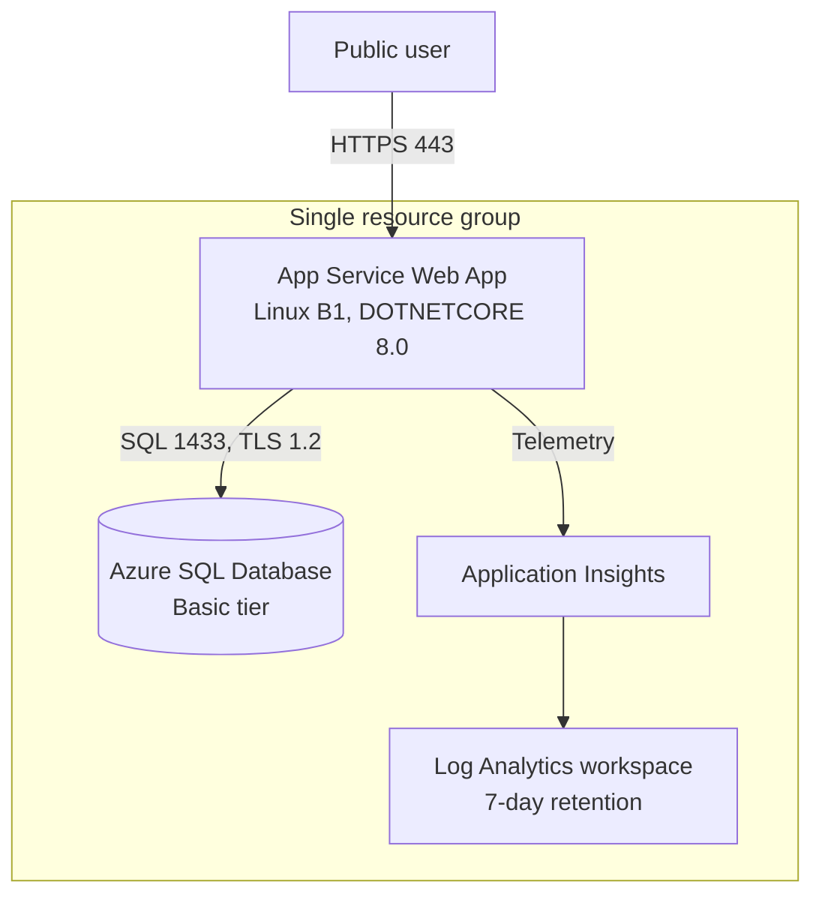

# Stage 1 — MVP

> **Trigger:** "We need a real public web app online this week."

Stage 1 stands up the smallest thing that is genuinely production-shaped: a public ASP.NET Core web app on Azure App Service, backed by Azure SQL Database, with Application Insights wired in from the first deploy. Everything lives in one resource group so the whole stage tears down with a single command.

This stage deploys the [Practical Storefront](https://github.com/yeongseon/azure-architecture-practical-guide/tree/main/src/practical-storefront) sample app using the [foundation Bicep modules](https://github.com/yeongseon/azure-architecture-practical-guide/tree/main/infra/bicep/modules) composed by [`stages/stage-01-mvp/main.bicep`](https://github.com/yeongseon/azure-architecture-practical-guide/tree/main/infra/bicep/stages/stage-01-mvp).

## Before you start

Read these foundations first — Stage 1 applies the decisions they describe:

- [Compute selection basics](../platform/compute-selection-basics.md) — why App Service (managed PaaS) over VMs.
- [Data selection basics](../platform/data-selection-basics.md) — why Azure SQL Database for a relational MVP.
- [Resource organization](../platform/resource-organization.md) — why a single resource group per stage.
- [Observability foundations](../platform/observability-foundations.md) — why telemetry ships on day one.
- [Service selection patterns](../patterns/service-selection-patterns.md) — the selection logic behind this baseline.

## What you'll build

<!-- diagram-id: stage-01-mvp-architecture -->


| Resource | SKU / Tier | Role |
|---|---|---|
| App Service plan | Linux **B1** (Basic) | Compute host |
| Web App | `DOTNETCORE\|8.0`, HTTPS-only | Runs the Storefront app |
| Azure SQL logical server | v12.0, TLS 1.2 | Database server |
| SQL Database | **Basic** (2 GB) | Catalog and order data |
| Application Insights | Workspace-based | Request and dependency telemetry |
| Log Analytics workspace | 7-day retention | Telemetry backend |

**Cost:** ~$0.09–$0.13/hour. **Time:** 20–30 minutes.

## Prerequisites

- Azure CLI logged in (`az login`) with rights to create resource groups.
- A strong SQL administrator password exported as `SQL_ADMIN_PASSWORD` (never commit it).

## Deploy

The generic driver scripts under `scripts/practical/` wrap the Bicep deployment with a repeatable deploy → verify → destroy flow:

```bash
export SQL_ADMIN_PASSWORD='<choose-a-strong-password>'

scripts/practical/deploy-stage.sh stage-01
```

The script creates the resource group, runs the deployment, and prints the web app name, URL, and Application Insights name.

To deploy the Bicep directly instead:

```bash
az group create --resource-group rg-practical-storefront-stage01 --location koreacentral

az deployment group create \
  --resource-group rg-practical-storefront-stage01 \
  --template-file infra/bicep/stages/stage-01-mvp/main.bicep \
  --parameters infra/bicep/stages/stage-01-mvp/main.bicepparam \
  --parameters sqlAdministratorLoginPassword="$SQL_ADMIN_PASSWORD"
```

## Verify

```bash
scripts/practical/verify-stage.sh stage-01
```

This runs two smoke tests:

1. **HTTP smoke** — `GET /` returns `200`, `GET /healthz` returns `{"status":"Healthy"}`, `GET /ops/info` returns JSON with a `version` field.
2. **SQL smoke** — confirms the database is reachable on TCP 1433.

Confirm telemetry is flowing after a few requests:

```bash
az monitor app-insights metrics show \
  --app <appInsightsName> \
  --resource-group rg-practical-storefront-stage01 \
  --metric requests/count \
  --interval PT5M
```

A `value` greater than `0` confirms Application Insights is capturing requests.

See [`labs/trunk/stage-01-mvp/`](https://github.com/yeongseon/azure-architecture-practical-guide/tree/main/labs/trunk/stage-01-mvp) for the full checklist, sample requests, and expected results.

## Best practices embedded in this stage

- **Managed PaaS over VMs** — no OS to patch; App Service and Azure SQL are fully managed.
- **Stateless app design** — all durable state is in SQL, so the app can scale out later without change.
- **Telemetry on day 1** — the Application Insights connection string is injected at deploy time, not bolted on later.
- **Single resource group** — the entire stage is created and destroyed as one unit.

> Stage 1 intentionally uses SQL authentication and a public SQL endpoint to keep the first deploy simple. This is **not** a production target. Later stages migrate to managed identity, Key Vault, and private endpoints.

## Clean up

```bash
scripts/practical/destroy-stage.sh stage-01
```

This deletes the resource group and everything in it.

## Go deeper

- [Public web and API — baseline](../workload-guides/public-web-api/baseline.md) — the workload blueprint this stage instantiates.
- [Compute selection cheatsheet](../reference/compute-selection-cheatsheet.md)
- [Data selection cheatsheet](../reference/data-selection-cheatsheet.md)
- [Design Lab 01 — public web baseline](../design-labs/lab-01-public-web-baseline.md)

## See Also

- [Compute selection basics](../platform/compute-selection-basics.md)
- [Data selection basics](../platform/data-selection-basics.md)
- [Observability foundations](../platform/observability-foundations.md)
- [Public web and API — baseline](../workload-guides/public-web-api/baseline.md)

## Sources

- [Azure App Service overview](https://learn.microsoft.com/en-us/azure/app-service/overview)
- [Azure SQL Database — PaaS overview](https://learn.microsoft.com/en-us/azure/azure-sql/database/sql-database-paas-overview)
- [Application Insights overview](https://learn.microsoft.com/en-us/azure/azure-monitor/app/app-insights-overview)
