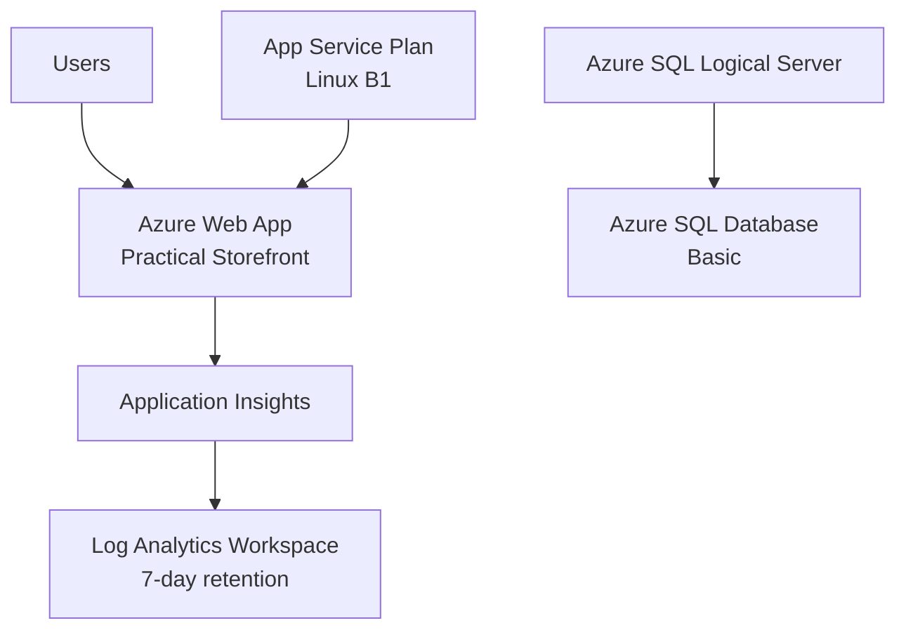

---
content_sources:
  diagrams:
    - id: stage-01-architecture
      type: flowchart
      source: self-generated
      justification: "Synthesized from Microsoft Learn service documentation to show the Stage 1 MVP resource relationships."
      based_on:
        - https://learn.microsoft.com/en-us/azure/app-service/overview
        - https://learn.microsoft.com/en-us/azure/azure-monitor/app/app-insights-overview
        - https://learn.microsoft.com/en-us/azure/azure-monitor/logs/log-analytics-workspace-overview
        - https://learn.microsoft.com/en-us/azure/azure-sql/database/sql-database-paas-overview
content_validation:
  status: pending_review
  last_reviewed: '2026-04-24'
  reviewer: agent
  core_claims:
    - claim: Azure App Service is an appropriate managed PaaS starting point for a public MVP web app.
      source: https://learn.microsoft.com/en-us/azure/app-service/overview
      verified: false
    - claim: Azure SQL Database provides a managed relational database option for transactional application data.
      source: https://learn.microsoft.com/en-us/azure/azure-sql/database/sql-database-paas-overview
      verified: false
    - claim: Application Insights integrates with Azure Monitor for application telemetry and diagnostics.
      source: https://learn.microsoft.com/en-us/azure/azure-monitor/app/app-insights-overview
      verified: false
    - claim: A Log Analytics workspace stores and queries operational log and monitoring data.
      source: https://learn.microsoft.com/en-us/azure/azure-monitor/logs/log-analytics-workspace-overview
      verified: false
---
# Stage 1 — MVP: Your First Azure Web App

> "We need a real public web app online this week."

Stage 1 gets a public Azure-hosted web app online fast with managed compute, managed relational data, and day-one telemetry so you can deploy, verify, and destroy a complete MVP baseline in one resource group.

## What You'll Build

- Azure Log Analytics workspace with 7-day retention
- Azure Application Insights connected to the workspace
- Linux App Service plan on the Basic B1 tier
- Azure Web App for the Practical Storefront sample
- Azure SQL logical server
- Azure SQL Database on the Basic tier

<!-- diagram-id: stage-01-architecture -->


## Read Before You Deploy

- [Compute Selection Basics](../platform/compute-selection-basics.md) — why App Service is the fastest managed starting point for a web MVP
- [Data Selection Basics](../platform/data-selection-basics.md) — why Azure SQL is the default relational choice for this stage
- [Resource Organization](../platform/resource-organization.md) — single resource group strategy, naming, and cleanup discipline
- [Observability Foundations](../platform/observability-foundations.md) — why telemetry belongs in the first deployment, not the second
- [Service Selection Patterns](../patterns/service-selection-patterns.md) — how to justify the managed-first architecture choice

## Prerequisites

- Azure subscription with permission to create resource groups and deploy App Service, Azure SQL, and Azure Monitor resources
- Azure CLI with Bicep support
- Bash shell for the practical journey scripts
- .NET 8 SDK if you want to run or inspect the Practical Storefront locally

## Deploy

1. Update the Stage 1 parameter file with a globally unique app name and a secure SQL password.

    ```bash
    code infra/bicep/stages/stage-01-mvp/main.bicepparam
    ```

2. Keep the stage environment file aligned with the same application name.

    ```bash
    code scripts/practical/stages/stage-01.env
    ```

3. Confirm that Azure CLI is authenticated.

    ```bash
    az account show
    ```

4. Deploy the stage with the shared script.

    ```bash
    bash scripts/practical/deploy-stage.sh scripts/practical/stages/stage-01.env
    ```

5. If you want the direct Azure CLI equivalent, use the same template and parameter files manually.

    ```bash
    az group create --name rg-practical-stage-01-mvp-koreacentral --location koreacentral
    az deployment group create --resource-group rg-practical-stage-01-mvp-koreacentral --template-file infra/bicep/stages/stage-01-mvp/main.bicep --parameters infra/bicep/stages/stage-01-mvp/main.bicepparam
    ```

## Verify

Run the shared smoke-test wrapper first:

```bash
bash scripts/practical/verify-stage.sh scripts/practical/stages/stage-01.env
```

Then run the Stage 1 QA checks from the blueprint against your deployed names:

```bash
export RG="rg-practical-stage-01-mvp-koreacentral"
export WEB_APP_NAME="app-yourappname"
export AI_NAME="ai-yourappname"

curl --silent --output /dev/null --write-out '%{http_code}' "https://${WEB_APP_NAME}.azurewebsites.net/"
curl --silent "https://${WEB_APP_NAME}.azurewebsites.net/healthz"
curl --silent "https://${WEB_APP_NAME}.azurewebsites.net/ops/info"
az monitor app-insights metrics show --app "$AI_NAME" --resource-group "$RG" --metric requests/count --interval PT5M
```

Expected results:

- Home page returns `200`
- `/healthz` returns JSON containing `Healthy`
- `/ops/info` returns JSON containing a `version` field
- Application Insights request metrics show activity after the HTTP checks

## Best Practices in This Stage

### 1. Start with managed PaaS, not self-managed infrastructure

App Service and Azure SQL reduce the amount of operating-system, patching, and platform work needed to put a real workload online quickly.

### 2. Keep the web tier stateless

The sample app uses application configuration and platform-managed hosting so the web tier can evolve toward safer scale-out in later stages.

### 3. Enable telemetry on day one

Application Insights and Log Analytics are deployed with the first release so the team can validate behavior with data instead of assumptions.

### 4. Use one resource group per practical stage

A single resource group keeps deployment, inspection, and teardown simple, which matters when the goal is fast learning with low cost overhead.

## Cost

Stage 1 is designed to stay around **~$0.09-$0.13/hour** when you keep the App Service plan on **B1** and the database on **Basic**.

Destroy the resource group as soon as you finish verification.

## Destroy

Use the shared cleanup script:

```bash
bash scripts/practical/destroy-stage.sh scripts/practical/stages/stage-01.env
```

Direct Azure CLI equivalent:

```bash
az group delete --name rg-practical-stage-01-mvp-koreacentral --yes --no-wait
```

## Read After You Verify

- [Public Web and API Baseline](../workload-guides/public-web-api/baseline.md) — the broader managed public web reference architecture
- [Compute Selection Cheatsheet](../reference/compute-selection-cheatsheet.md) — quick comparison of Azure compute options
- [Data Selection Cheatsheet](../reference/data-selection-cheatsheet.md) — quick comparison of Azure data-store options
- [Design Lab 01: Public Web Baseline](../design-labs/lab-01-public-web-baseline.md) — architecture exercise for the same workload shape

## What's Next

The next planned step is [Stage 2 — Production Baseline](https://github.com/yeongseon/azure-architecture-practical-guide/blob/main/.sisyphus/plans/progressive-architecture-blueprint.md#stage-2--production-baseline), where the journey adds secret custody, identity hygiene, deployment slots, and alerting.

## See Also

- [Architecture Assessment Checklist](../waf/architecture-assessment-checklist.md)
- [Using WAF in This Guide](../waf/using-waf-in-this-guide.md)
- [Cost Management and FinOps](../operations/cost-management-and-finops.md)
- [ADR Process](../operations/adr-process.md)
- [Architecture Decision Matrix](../reference/architecture-decision-matrix.md)

## Sources

- [Azure App Service overview](https://learn.microsoft.com/en-us/azure/app-service/overview)
- [Azure SQL Database PaaS overview](https://learn.microsoft.com/en-us/azure/azure-sql/database/sql-database-paas-overview)
- [Application Insights overview](https://learn.microsoft.com/en-us/azure/azure-monitor/app/app-insights-overview)
- [Log Analytics workspace overview](https://learn.microsoft.com/en-us/azure/azure-monitor/logs/log-analytics-workspace-overview)
