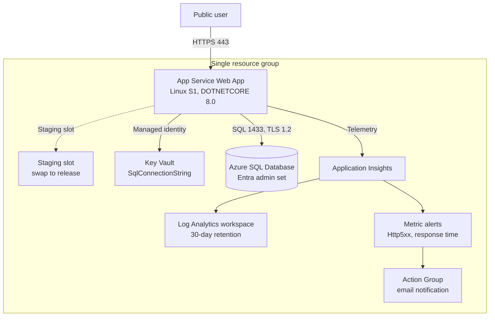

# Stage 2 — Production Baseline

> **Trigger:** "The app now matters to the business."

Stage 1 proved the app runs. Stage 2 makes it safe to operate: the app gets a managed identity, its connection string moves into Key Vault, a staging slot enables zero-downtime releases, the SQL server gets a Microsoft Entra administrator, and metric alerts notify the team when things go wrong.

This stage reuses the [Stage 1](stage-01-mvp.md) resources and composes additional [foundation Bicep modules](https://github.com/yeongseon/azure-architecture-practical-guide/tree/main/infra/bicep/modules) through [`stages/stage-02-production-baseline/main.bicep`](https://github.com/yeongseon/azure-architecture-practical-guide/tree/main/infra/bicep/stages/stage-02-production-baseline).

## Before you start

Read these foundations first — Stage 2 applies the decisions they describe:

- [Identity and governance foundations](../platform/identity-and-governance-foundations.md) — why managed identity comes before connection strings.
- [Identity-first and secrets flow](../patterns/security/identity-first-and-secrets-flow.md) — how the app reaches secrets without holding them.
- [Blue-green, canary, and stamp patterns](../patterns/deployment/blue-green-canary-and-stamp-patterns.md) — why a staging slot enables safe releases.
- [Observability and SLOs](../operations/observability-and-slos.md) — why alerts are tied to service signals.

## What you'll build

<!-- diagram-id: stage-02-production-baseline-architecture -->


| Resource | SKU / Tier | Role |
|---|---|---|
| App Service plan | Linux **S1** (Standard) | Compute host that supports slots |
| Web App | `DOTNETCORE\|8.0`, managed identity | Runs the Storefront app |
| Staging slot | Shares the S1 plan | Safe pre-production releases |
| Key Vault | Standard, RBAC | Custody of the SQL connection string |
| Azure SQL logical server | v12.0, Entra admin set | Database server |
| SQL Database | **Basic** (2 GB) | Catalog and order data |
| Application Insights | Workspace-based | Request and dependency telemetry |
| Log Analytics workspace | 30-day retention | Telemetry backend |
| Action Group | Email receiver | Alert notification target |
| Metric alerts | Http5xx, response time | Tied to the action group |

**Cost:** ~$0.14–$0.20/hour. **Time:** 25–40 minutes.

## Prerequisites

- Azure CLI logged in (`az login`) with rights to create resource groups and role assignments.
- A strong SQL administrator password exported as `SQL_ADMIN_PASSWORD` (never commit it).
- An Entra principal for the SQL admin, exported as `SQL_ENTRA_ADMIN_LOGIN` and `SQL_ENTRA_ADMIN_OBJECT_ID`.
- An operations notification email exported as `ALERT_EMAIL_ADDRESS`.

## Deploy

The generic driver scripts under `scripts/practical/` wrap the Bicep deployment:

```bash
export SQL_ADMIN_PASSWORD='<choose-a-strong-password>'
export SQL_ENTRA_ADMIN_LOGIN='<entra-user-or-group-display-name>'
export SQL_ENTRA_ADMIN_OBJECT_ID='<entra-object-id>'
export ALERT_EMAIL_ADDRESS='<ops-notification-email>'

scripts/practical/deploy-stage.sh stage-02
```

To deploy the Bicep directly instead:

```bash
az group create --resource-group rg-practical-storefront-stage02 --location koreacentral

az deployment group create \
  --resource-group rg-practical-storefront-stage02 \
  --template-file infra/bicep/stages/stage-02-production-baseline/main.bicep \
  --parameters infra/bicep/stages/stage-02-production-baseline/main.bicepparam \
  --parameters sqlAdministratorLoginPassword="$SQL_ADMIN_PASSWORD"
```

| Command | Purpose |
|---------|---------|
| `az group create --resource-group rg-practical-storefront-stage02 --location koreacentral` | Creates the resource group that holds every Stage 2 resource. |
| `--resource-group rg-practical-storefront-stage02` | Names the resource group to create. |
| `--location koreacentral` | Sets the Azure region for the resource group. |
| `az deployment group create` | Deploys the Bicep template into the resource group. |
| `--resource-group rg-practical-storefront-stage02` | Targets the resource group that receives the deployment. |
| `--template-file infra/bicep/stages/stage-02-production-baseline/main.bicep` | Points to the Bicep template to deploy. |
| `--parameters infra/bicep/stages/stage-02-production-baseline/main.bicepparam` | Supplies deployment parameters from the `.bicepparam` file. |
| `--parameters sqlAdministratorLoginPassword="$SQL_ADMIN_PASSWORD"` | Overrides the SQL administrator password inline from the exported variable. |

## Verify

```bash
scripts/practical/verify-stage.sh stage-02
```

This runs three smoke tests:

1. **HTTP smoke** — `GET /` returns `200`, `GET /healthz` returns `{"status":"Healthy"}`, `GET /ops/info` returns JSON with a `version` field.
2. **SQL smoke** — confirms the database is reachable on TCP 1433.
3. **Identity smoke** — confirms the web app has a managed identity, the Key Vault holds `SqlConnectionString`, the SQL server has an Entra administrator, the staging slot exists and previews a swap, and at least one metric alert is configured.

Spot-check individual controls:

```bash
az webapp identity show --name <webAppName> --resource-group rg-practical-storefront-stage02 --query principalId
az keyvault secret show --vault-name <keyVaultName> --name SqlConnectionString --query id
az sql server ad-admin list --server-name <sqlServer> --resource-group rg-practical-storefront-stage02
az webapp deployment slot list --name <webAppName> --resource-group rg-practical-storefront-stage02 --query "[].name"
az monitor metrics alert list --resource-group rg-practical-storefront-stage02 --query "[].name"
```

| Command | Purpose |
|---------|---------|
| `az webapp identity show --name <webAppName> --resource-group rg-practical-storefront-stage02 --query principalId` | Confirms the web app has a managed identity and returns its principal ID. |
| `az keyvault secret show --vault-name <keyVaultName> --name SqlConnectionString --query id` | Confirms the Key Vault holds the `SqlConnectionString` secret and returns its ID. |
| `az sql server ad-admin list --server-name <sqlServer> --resource-group rg-practical-storefront-stage02` | Lists the Microsoft Entra administrator configured on the SQL server. |
| `az webapp deployment slot list --name <webAppName> --resource-group rg-practical-storefront-stage02 --query "[].name"` | Lists the deployment slots, confirming the staging slot exists. |
| `az monitor metrics alert list --resource-group rg-practical-storefront-stage02 --query "[].name"` | Lists the configured metric alerts by name. |

See [`labs/trunk/stage-02-production-baseline/`](https://github.com/yeongseon/azure-architecture-practical-guide/tree/main/labs/trunk/stage-02-production-baseline) for the full checklist, sample requests, and expected results.

## Best practices embedded in this stage

- **Managed identity before connection strings** — the app authenticates to Key Vault with its identity and holds no secret in configuration.
- **Key Vault for secrets** — the SQL connection string lives in an RBAC-authorized vault, not in app settings.
- **Deployment slots for safe releases** — deploy to staging, validate, then swap into production.
- **Alerts tied to SLO signals** — 5xx errors and response-time regressions page the team through an action group.

> The SQL public endpoint and the Key Vault public endpoint remain enabled at this stage for operability. Locking both behind private endpoints — and completing passwordless app-to-SQL — happens in a later stage.

## Clean up

```bash
scripts/practical/destroy-stage.sh stage-02
```

This deletes the resource group and everything in it.

## Go deeper

- [Policy and governance guardrails](../operations/policy-and-governance-guardrails.md)
- [Infrastructure as code and environment promotion](../operations/infrastructure-as-code-and-environment-promotion.md)
- [Well-Architected — Security](../waf/security.md)
- [Well-Architected — Operational Excellence](../waf/operational-excellence.md)
- [Security control mapping](../reference/security-control-mapping.md)

## See Also

- [Stage 1 — MVP](stage-01-mvp.md)
- [Identity and governance foundations](../platform/identity-and-governance-foundations.md)
- [Identity-first and secrets flow](../patterns/security/identity-first-and-secrets-flow.md)
- [Observability and SLOs](../operations/observability-and-slos.md)

## Sources

- [Azure App Service — managed identities](https://learn.microsoft.com/en-us/azure/app-service/overview-managed-identity)
- [Key Vault references for App Service](https://learn.microsoft.com/en-us/azure/app-service/app-service-key-vault-references)
- [Set up an Azure Active Directory administrator for Azure SQL](https://learn.microsoft.com/en-us/azure/azure-sql/database/authentication-aad-configure)
- [Set up staging environments in Azure App Service](https://learn.microsoft.com/en-us/azure/app-service/deploy-staging-slots)
- [Azure Monitor metric alerts](https://learn.microsoft.com/en-us/azure/azure-monitor/alerts/alerts-metric-overview)
