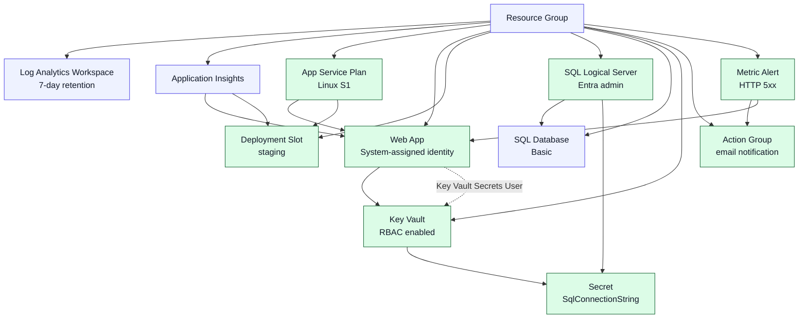

---
content_sources:
  diagrams:
    - id: stage-02-architecture
      type: flowchart
      source: self-generated
      justification: "Diagram combines the Stage 2 production baseline resources and operating relationships described in Microsoft Learn guidance for App Service, Azure SQL, Key Vault, and Azure Monitor."
      based_on:
        - https://learn.microsoft.com/en-us/entra/identity/managed-identities-azure-resources/overview
        - https://learn.microsoft.com/en-us/azure/key-vault/general/overview
        - https://learn.microsoft.com/en-us/azure/app-service/deploy-staging-slots
        - https://learn.microsoft.com/en-us/azure/azure-monitor/alerts/alerts-overview
content_validation:
  status: pending_review
  last_reviewed: '2026-04-24'
  reviewer: agent
  core_claims:
    - claim: App Service can use a system-assigned managed identity to access Azure resources without storing credentials in application code.
      source: https://learn.microsoft.com/en-us/entra/identity/managed-identities-azure-resources/overview
      verified: false
    - claim: Azure Key Vault supports centralized secret storage with Azure RBAC authorization.
      source: https://learn.microsoft.com/en-us/azure/key-vault/general/overview
      verified: false
    - claim: App Service deployment slots support safer release workflows such as swap preview before production promotion.
      source: https://learn.microsoft.com/en-us/azure/app-service/deploy-staging-slots
      verified: false
    - claim: Azure Monitor alerts can trigger action groups when metric thresholds are crossed.
      source: https://learn.microsoft.com/en-us/azure/azure-monitor/alerts/alerts-overview
      verified: false
---
# Stage 2 — Production Baseline: Identity, Secrets, and Release Safety

"The app now matters to the business." Stage 2 keeps the Stage 1 managed PaaS baseline, then adds the controls teams usually need before a workload is trusted for day-2 operations: identity, secret custody, safer releases, and first-response alerting.

## What Changes from Stage 1

Stage 2 still deploys the full app stack in one resource group, but it upgrades and extends the baseline:

- The App Service plan moves from Linux B1 to Linux S1 so deployment slots are available.
- The web app keeps Application Insights wiring and extends its system-assigned managed identity with Key Vault access.
- Azure SQL adds a Microsoft Entra administrator for identity-based administration.
- Azure Key Vault stores the SQL connection string, and the web app identity gets the Key Vault Secrets User role.
- A staging slot, action group, and metric alert add release safety and basic operational response.

<!-- diagram-id: stage-02-architecture -->


## Read Before You Deploy

- [Identity and Governance Foundations](../platform/identity-and-governance-foundations.md)
- [Identity-First and Secrets Flow](../patterns/security/identity-first-and-secrets-flow.md)
- [Blue-Green, Canary, and Stamp Patterns](../patterns/deployment/blue-green-canary-and-stamp-patterns.md)
- [Observability and SLOs](../operations/observability-and-slos.md)

## Prerequisites

You need the same baseline prerequisites as Stage 1, plus Microsoft Entra permissions that let the deployment configure the Azure SQL Entra administrator.

1. Install or update Azure CLI and ensure the `bicep` command is available.
2. Sign in to Azure with an identity that can create resource groups and deploy App Service, Azure SQL, Key Vault, and Azure Monitor resources.
3. Ensure the deployment identity can read its own Entra object details and assign the Azure SQL Entra administrator.
4. Prepare a strong SQL admin password for the bootstrap SQL login stored in the deployment parameters.

## Deploy

1. Create or reuse a resource group.

    ```bash
    export RESOURCE_GROUP_NAME="rg-stage02-production-baseline"

    az group create \
        --name "$RESOURCE_GROUP_NAME" \
        --location "koreacentral"
    ```

2. Review and update the stage parameter file placeholders.

    ```bash
    az bicep build \
        --file infra/bicep/stages/stage-02-production-baseline/main.bicep \
        --stdout
    ```

3. Deploy the stage.

    ```bash
    az deployment group create \
        --resource-group "$RESOURCE_GROUP_NAME" \
        --template-file infra/bicep/stages/stage-02-production-baseline/main.bicep \
        --parameters infra/bicep/stages/stage-02-production-baseline/main.bicepparam \
        --parameters appName="yourappname" \
        --parameters sqlAdminLogin="sqladminuser" \
        --parameters sqlAdminPassword="<sql-admin-password>" \
        --parameters alertEmail="alerts@example.com"
    ```

4. Capture the output values for the web app URL, Key Vault, staging slot URL, and SQL server FQDN.

## Verify

1. Confirm the web app managed identity exists.

    ```bash
    az webapp identity show \
        --name "yourappname-web" \
        --resource-group "$RESOURCE_GROUP_NAME"
    ```

2. Confirm Key Vault contains the SQL connection string secret.

    ```bash
    az keyvault secret show \
        --vault-name "<key-vault-name>" \
        --name "SqlConnectionString"
    ```

3. Confirm Azure SQL has a Microsoft Entra administrator.

    ```bash
    az sql server ad-admin list \
        --server-name "<sql-server-name>" \
        --resource-group "$RESOURCE_GROUP_NAME"
    ```

4. Confirm the staging deployment slot exists.

    ```bash
    az webapp deployment slot list \
        --name "yourappname-web" \
        --resource-group "$RESOURCE_GROUP_NAME"
    ```

5. Confirm swap preview starts successfully.

    ```bash
    az webapp deployment slot swap \
        --name "yourappname-web" \
        --resource-group "$RESOURCE_GROUP_NAME" \
        --slot "staging" \
        --action "preview"
    ```

6. Confirm at least one Azure Monitor metric alert exists.

    ```bash
    az monitor metrics alert list \
        --resource-group "$RESOURCE_GROUP_NAME"
    ```

## Best Practices in This Stage

### Managed identity before connection strings

Use the web app's managed identity first so workloads authenticate to platform services without embedding credentials in code or deployment scripts.

### Key Vault for secrets

Keep the SQL connection string in Key Vault so secret custody, rotation, and access review stay outside the application configuration surface.

### Deployment slots for safe releases

Use a staging slot so teams can validate configuration and warm up code before promoting a release into production traffic.

### Alerts tied to SLO signals

Use alert rules that map to user-impacting symptoms such as HTTP 5xx responses instead of alerting only on low-level infrastructure noise.

## Cost

Expect roughly **$0.14–$0.20/hour** for this stage. The S1 App Service plan is the key change from Stage 1 because deployment slots are a production-safety feature that requires a higher tier than B1.

## Destroy

```bash
az group delete \
    --name "$RESOURCE_GROUP_NAME" \
    --yes \
    --no-wait
```

## Read After You Verify

- [Policy and Governance Guardrails](../operations/policy-and-governance-guardrails.md)
- [Infrastructure as Code and Environment Promotion](../operations/infrastructure-as-code-and-environment-promotion.md)
- [Azure Well-Architected Framework — Security](../waf/security.md)
- [Azure Well-Architected Framework — Operational Excellence](../waf/operational-excellence.md)
- [Security Control Mapping](../reference/security-control-mapping.md)

## What's Next

Continue to [Stage 3 — Scale and Edge](https://github.com/yeongseon/azure-architecture-practical-guide/blob/main/.sisyphus/plans/progressive-architecture-blueprint.md#stage-3--scale--edge) when the workload needs managed edge protection and simple scale-out controls.

## Review Matrix

| Review area | Page-specific check |
|---|---|
| Scope | Confirm the guidance applies to Stage 2 — Production Baseline: Identity, Secrets, and Release Safety. |
| Source basis | Validate the recommendation against the Microsoft Learn sources in this page. |
| Evidence | Capture command output, portal state, metrics, logs, or screenshots before treating the result as proven. |

## See Also

- [Identity and Governance Foundations](../platform/identity-and-governance-foundations.md)
- [Identity-First and Secrets Flow](../patterns/security/identity-first-and-secrets-flow.md)
- [Blue-Green, Canary, and Stamp Patterns](../patterns/deployment/blue-green-canary-and-stamp-patterns.md)
- [Observability and SLOs](../operations/observability-and-slos.md)
- [Security Control Mapping](../reference/security-control-mapping.md)

## Sources

- [Managed identities for Azure resources overview](https://learn.microsoft.com/en-us/entra/identity/managed-identities-azure-resources/overview)
- [Azure Key Vault overview](https://learn.microsoft.com/en-us/azure/key-vault/general/overview)
- [Set up staging environments in Azure App Service](https://learn.microsoft.com/en-us/azure/app-service/deploy-staging-slots)
- [Azure Monitor alerts overview](https://learn.microsoft.com/en-us/azure/azure-monitor/alerts/alerts-overview)
