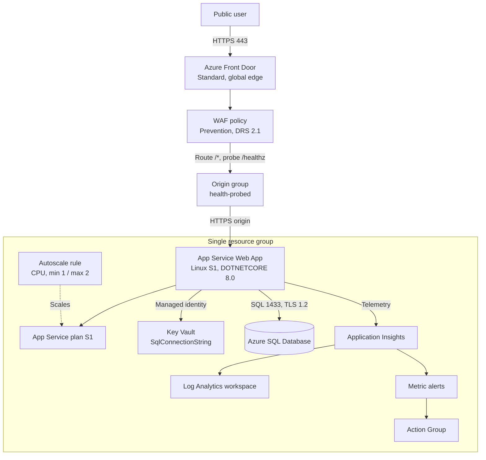

# Stage 3 — Scale / Edge

> **Trigger:** "Traffic is growing and internet exposure is a concern."

Stage 2 made the app safe to operate. Stage 3 makes it safe to expose and ready to grow: Azure Front Door becomes the global entry point, a Web Application Firewall blocks common attacks at the edge before they reach application code, and an autoscale rule adds and removes instances as CPU demand changes.

This stage carries forward the [Stage 2](stage-02-production-baseline.md) architecture and redeploys the full cumulative stack, then composes additional [foundation Bicep modules](https://github.com/yeongseon/azure-architecture-practical-guide/tree/main/infra/bicep/modules) through [`stages/stage-03-scale-edge/main.bicep`](https://github.com/yeongseon/azure-architecture-practical-guide/tree/main/infra/bicep/stages/stage-03-scale-edge).

## Before you start

Read these foundations first — Stage 3 applies the decisions they describe:

- [Network edge and identity](../workload-guides/public-web-api/network-edge-and-identity.md) — why edge protection belongs outside the app.
- [Zero trust at the workload level](../patterns/security/zero-trust-at-workload-level.md) — filtering requests before they reach code.
- [Well-Architected — Performance Efficiency](../waf/performance-efficiency.md) — why scaling out on a signal beats over-provisioning.

## What you'll build

<!-- diagram-id: stage-03-scale-edge-architecture -->


| Resource | SKU / Tier | Role |
|---|---|---|
| Azure Front Door | **Standard** | Global edge entry point for user traffic |
| WAF policy | Prevention, DRS 2.1 | Blocks common web attacks at the edge |
| Origin group + route | Health probe `/healthz` | Routes edge traffic to a healthy origin |
| Autoscale rule | CPU, min 1 / max 2 | Scales the App Service plan out and in |
| App Service plan | Linux **S1** (Standard) | Autoscale-capable compute host |
| Web App | `DOTNETCORE\|8.0`, managed identity | Runs the Storefront app |
| Staging slot | Shares the S1 plan | Safe pre-production releases |
| Key Vault | Standard, RBAC | Custody of the SQL connection string |
| Azure SQL Database | **Basic** (2 GB) | Catalog and order data |
| Application Insights + Log Analytics | Workspace-based | Telemetry and 30-day retention |
| Action Group + metric alerts | Http5xx, response time | Alerting tied to the action group |

**Cost:** ~$0.20–$0.30/hour. **Time:** 35–50 minutes.

## Prerequisites

- Azure CLI logged in (`az login`) with rights to create resource groups and role assignments.
- A strong SQL administrator password exported as `SQL_ADMIN_PASSWORD` (never commit it).
- An Entra principal for the SQL admin, exported as `SQL_ENTRA_ADMIN_LOGIN` and `SQL_ENTRA_ADMIN_OBJECT_ID`.
- An operations notification email exported as `ALERT_EMAIL_ADDRESS`.

## Deploy

The generic driver scripts under `scripts/practical/` wrap the Bicep deployment:

```bash
export SQL_ADMIN_PASSWORD='<choose-a-strong-password>'
export SQL_ENTRA_ADMIN_LOGIN='<entra-user-or-group-display-name>'
export SQL_ENTRA_ADMIN_OBJECT_ID='<entra-object-id>'
export ALERT_EMAIL_ADDRESS='<ops-notification-email>'

scripts/practical/deploy-stage.sh stage-03
```

To deploy the Bicep directly instead:

```bash
az group create --resource-group rg-practical-storefront-stage03 --location koreacentral

az deployment group create \
  --resource-group rg-practical-storefront-stage03 \
  --template-file infra/bicep/stages/stage-03-scale-edge/main.bicep \
  --parameters infra/bicep/stages/stage-03-scale-edge/main.bicepparam \
  --parameters sqlAdministratorLoginPassword="$SQL_ADMIN_PASSWORD"
```

## Verify

```bash
scripts/practical/verify-stage.sh stage-03
```

This runs four smoke tests:

1. **HTTP smoke** — `GET /` on the origin returns `200`, `GET /healthz` returns `{"status":"Healthy"}`, `GET /ops/info` returns JSON with a `version` field.
2. **SQL smoke** — confirms the database is reachable on TCP 1433.
3. **Identity smoke** — confirms managed identity, Key Vault custody, SQL Entra admin, staging slot, and metric alerts.
4. **Front Door smoke** — confirms the endpoint is enabled, a WAF policy is associated, the origin group probes `/healthz`, and the autoscale maximum is 2. A non-`200` edge response is reported as a warning because Front Door endpoints propagate globally over several minutes.

Spot-check individual controls:

```bash
az afd endpoint show --profile-name <afdProfile> --endpoint-name <afdEndpoint> --resource-group rg-practical-storefront-stage03 --query enabledState
az afd security-policy list --profile-name <afdProfile> --resource-group rg-practical-storefront-stage03 --query "length(@)"
az afd origin-group show --profile-name <afdProfile> --origin-group-name og-storefront --resource-group rg-practical-storefront-stage03 --query healthProbeSettings.probePath
az monitor autoscale show --name <autoscaleName> --resource-group rg-practical-storefront-stage03 --query "profiles[0].capacity.maximum"
```

See [`labs/trunk/stage-03-scale-edge/`](https://github.com/yeongseon/azure-architecture-practical-guide/tree/main/labs/trunk/stage-03-scale-edge) for the full checklist, sample requests, and expected results.

## Best practices embedded in this stage

- **Edge protection outside the app** — Front Door and its WAF filter traffic globally before it reaches the origin, so application code never sees the blocked requests.
- **Stateless for scale-out** — the app holds no session state locally, so adding a second instance is safe and requests can land on either one.
- **Health probes drive routing** — the origin group probes `/healthz`, so an unhealthy instance is taken out of rotation automatically.
- **WAF before custom code** — request inspection happens at the edge with the Microsoft Default Rule Set, not in hand-written application filters.

> Front Door reaches the web app over its public hostname at this stage. Locking the origin so it only accepts traffic from this Front Door instance (via the `X-Azure-FDID` header and the `AzureFrontDoor.Backend` service tag), and moving the origin behind a private endpoint, happen in a later stage.

## Clean up

```bash
scripts/practical/destroy-stage.sh stage-03
```

This deletes the resource group and everything in it.

## Go deeper

- [Health endpoints, graceful degradation, and backpressure](../patterns/resilience/health-endpoints-graceful-degradation-and-backpressure.md)
- [Operations and reliability for a public web API](../workload-guides/public-web-api/operations-and-reliability.md)
- [Well-Architected — Cost Optimization](../waf/cost-optimization.md)
- [Network topology cheatsheet](../reference/network-topology-cheatsheet.md)

## See Also

- [Stage 2 — Production Baseline](stage-02-production-baseline.md)
- [Network edge and identity](../workload-guides/public-web-api/network-edge-and-identity.md)
- [Zero trust at the workload level](../patterns/security/zero-trust-at-workload-level.md)
- [Well-Architected — Performance Efficiency](../waf/performance-efficiency.md)

## Sources

- [Azure Front Door overview](https://learn.microsoft.com/en-us/azure/frontdoor/front-door-overview)
- [Web Application Firewall on Azure Front Door](https://learn.microsoft.com/en-us/azure/web-application-firewall/afds/afds-overview)
- [Azure Front Door origins and origin groups](https://learn.microsoft.com/en-us/azure/frontdoor/origin)
- [Health probes in Azure Front Door](https://learn.microsoft.com/en-us/azure/frontdoor/health-probes)
- [Get started with autoscale in Azure](https://learn.microsoft.com/en-us/azure/azure-monitor/autoscale/autoscale-get-started)
