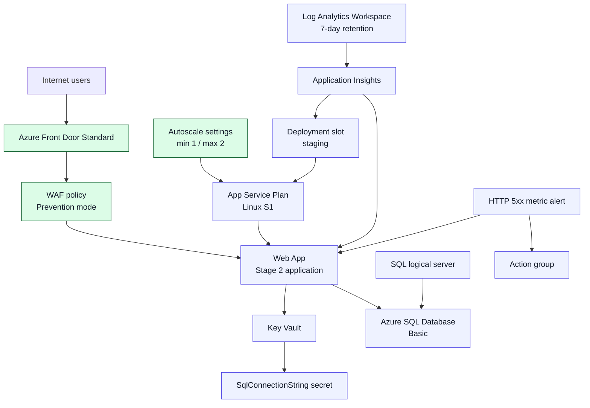

---
content_sources:
  diagrams:
    - id: stage-03-architecture
      type: flowchart
      source: self-generated
      justification: "Diagram combines the Stage 3 edge and scale resources described in Microsoft Learn guidance for Azure Front Door Standard, WAF, App Service, and Azure Monitor autoscale."
      based_on:
        - https://learn.microsoft.com/en-us/azure/frontdoor/standard-premium/overview
        - https://learn.microsoft.com/en-us/azure/web-application-firewall/afds/afds-overview
        - https://learn.microsoft.com/en-us/azure/frontdoor/health-probes
        - https://learn.microsoft.com/en-us/azure/azure-monitor/autoscale/autoscale-get-started
content_validation:
  status: pending_review
  last_reviewed: '2026-04-24'
  reviewer: agent
  core_claims:
    - claim: Azure Front Door Standard can provide a managed global entry point that routes traffic to application origins.
      source: https://learn.microsoft.com/en-us/azure/frontdoor/standard-premium/overview
      verified: false
    - claim: Azure Web Application Firewall on Azure Front Door can inspect and block malicious web requests before they reach the origin.
      source: https://learn.microsoft.com/en-us/azure/web-application-firewall/afds/afds-overview
      verified: false
    - claim: Azure Front Door health probes can help determine whether an origin should receive traffic.
      source: https://learn.microsoft.com/en-us/azure/frontdoor/health-probes
      verified: false
    - claim: Azure Monitor autoscale can increase or decrease App Service plan instances based on performance metrics such as CPU.
      source: https://learn.microsoft.com/en-us/azure/azure-monitor/autoscale/autoscale-get-started
      verified: false
---
# Stage 3 — Scale / Edge: Managed Edge and Autoscale

> "Traffic is growing and internet exposure is a concern."

Stage 3 keeps the full Stage 2 production baseline, then adds managed edge protection and simple horizontal scale controls so the app can absorb more traffic without pushing internet-facing defense logic into application code.

## What Changes from Stage 2

Stage 3 adds two new control points:

- Azure Front Door Standard becomes the public entry point.
- A Web Application Firewall policy is attached in Prevention mode.
- Front Door health probes use `/healthz` before traffic is routed to the origin.
- Azure Monitor autoscale can expand the App Service plan from 1 instance to 2 when CPU rises.

<!-- diagram-id: stage-03-architecture -->


## Trigger

Traffic is growing and internet exposure is a concern.

## Pre-reading

- [Network Edge and Identity](../workload-guides/public-web-api/network-edge-and-identity.md)
- [Zero Trust at Workload Level](../patterns/security/zero-trust-at-workload-level.md)
- [Azure Well-Architected Framework — Performance Efficiency](../waf/performance-efficiency.md)

## Prerequisites

1. Install Azure CLI and confirm Bicep support is available.
2. Sign in with an identity that can deploy App Service, Azure SQL, Azure Front Door, and Azure Monitor resources.
3. Review `infra/bicep/stages/stage-03-scale-edge/main.bicepparam` and replace placeholder values before deployment.
4. Ensure your app exposes `/healthz` and returns a healthy response before you depend on Front Door origin probing.

## Deploy

1. Create the resource group for this stage.

    ```bash
    export RESOURCE_GROUP_NAME="rg-practical-stage-03-scale-edge-koreacentral"

    az group create \
        --name "$RESOURCE_GROUP_NAME" \
        --location "koreacentral"
    ```

2. Confirm the orchestrator compiles cleanly.

    ```bash
    az bicep build \
        --file infra/bicep/stages/stage-03-scale-edge/main.bicep \
        --stdout
    ```

3. Deploy the full Stage 3 baseline.

    ```bash
    az deployment group create \
        --resource-group "$RESOURCE_GROUP_NAME" \
        --template-file infra/bicep/stages/stage-03-scale-edge/main.bicep \
        --parameters infra/bicep/stages/stage-03-scale-edge/main.bicepparam \
        --parameters appName="yourappname" \
        --parameters sqlAdminLogin="sqladminuser" \
        --parameters sqlAdminPassword="<sql-admin-password>" \
        --parameters alertEmail="alerts@example.com"
    ```

4. Record the deployment outputs for the Front Door endpoint, web app name, web app URL, and autoscale setting.

## Verify

1. Export the names you need for the QA checks.

    ```bash
    export RG="$RESOURCE_GROUP_NAME"
    export APP_NAME="yourappname"
    ```

2. Run the Stage 3 smoke script.

    ```bash
    bash scripts/practical/verify/frontdoor-smoke.sh
    ```

3. Run the Stage 3 QA commands from the blueprint.

    ```bash
    export FRONT_DOOR_PROFILE_NAME="yourappname-afd"
    export FRONT_DOOR_ENDPOINT_NAME="<front-door-endpoint-name>"
    export FRONT_DOOR_ENDPOINT_HOST="<front-door-endpoint-host>"
    export FRONT_DOOR_ORIGIN_GROUP_NAME="app-origin-group"
    export AUTOSCALE_SETTINGS_NAME="yourappname-autoscale"

    curl --silent --output /dev/null --write-out '%{http_code}' "https://${FRONT_DOOR_ENDPOINT_HOST}"
    az afd endpoint show --profile-name "$FRONT_DOOR_PROFILE_NAME" --endpoint-name "$FRONT_DOOR_ENDPOINT_NAME" --resource-group "$RG"
    az afd security-policy list --profile-name "$FRONT_DOOR_PROFILE_NAME" --resource-group "$RG"
    az monitor autoscale show --name "$AUTOSCALE_SETTINGS_NAME" --resource-group "$RG"
    az afd origin-group show --profile-name "$FRONT_DOOR_PROFILE_NAME" --origin-group-name "$FRONT_DOOR_ORIGIN_GROUP_NAME" --resource-group "$RG"
    ```

4. Confirm the Front Door endpoint returns `200`, the endpoint is enabled, at least one security policy exists, autoscale maximum capacity is `2`, and the origin group health probe path is `/healthz`.

## Best Practices in This Stage

### Edge protection outside the app

Put the public entry point, WAF inspection, and origin routing at the managed edge so the application focuses on business logic instead of request screening.

### Stay stateless for scale-out

Keep the web tier stateless so adding another App Service instance does not require session pinning or node-local state recovery.

### Treat health probes as production dependencies

Use a lightweight, accurate `/healthz` endpoint because Azure Front Door routing decisions now depend on that signal.

### Put WAF before custom code

Use managed WAF protections before adding bespoke filtering logic in the application, because platform controls reduce duplicated code paths and operational drift.

## Cost

Expect roughly **~$0.20–$0.30/hour** for this stage when you keep Azure Front Door on the Standard tier and cap autoscale at two App Service plan instances.

## Destroy

```bash
az group delete \
    --name "$RESOURCE_GROUP_NAME" \
    --yes \
    --no-wait
```

## Deep dive

- [Health Endpoints, Graceful Degradation, and Backpressure](../patterns/resilience/health-endpoints-graceful-degradation-and-backpressure.md)
- [Operations and Reliability for Public Web and API](../workload-guides/public-web-api/operations-and-reliability.md)
- [Azure Well-Architected Framework — Cost Optimization](../waf/cost-optimization.md)
- [Network Topology Cheatsheet](../reference/network-topology-cheatsheet.md)

## What's Next

Continue to the planned Stage 4 network isolation milestone in the [Progressive Architecture Guide Blueprint](https://github.com/yeongseon/azure-architecture-practical-guide/blob/main/.sisyphus/plans/progressive-architecture-blueprint.md#stage-4--network-isolation).

## See Also

- [Architecture Assessment Checklist](../waf/architecture-assessment-checklist.md)
- [Using WAF in This Guide](../waf/using-waf-in-this-guide.md)
- [Cost Management and FinOps](../operations/cost-management-and-finops.md)
- [ADR Process](../operations/adr-process.md)
- [Architecture Decision Matrix](../reference/architecture-decision-matrix.md)

## Sources

- [Azure Front Door Standard and Premium overview](https://learn.microsoft.com/en-us/azure/frontdoor/standard-premium/overview)
- [Web Application Firewall on Azure Front Door](https://learn.microsoft.com/en-us/azure/web-application-firewall/afds/afds-overview)
- [Health probes in Azure Front Door](https://learn.microsoft.com/en-us/azure/frontdoor/health-probes)
- [Get started with autoscale in Azure](https://learn.microsoft.com/en-us/azure/azure-monitor/autoscale/autoscale-get-started)
