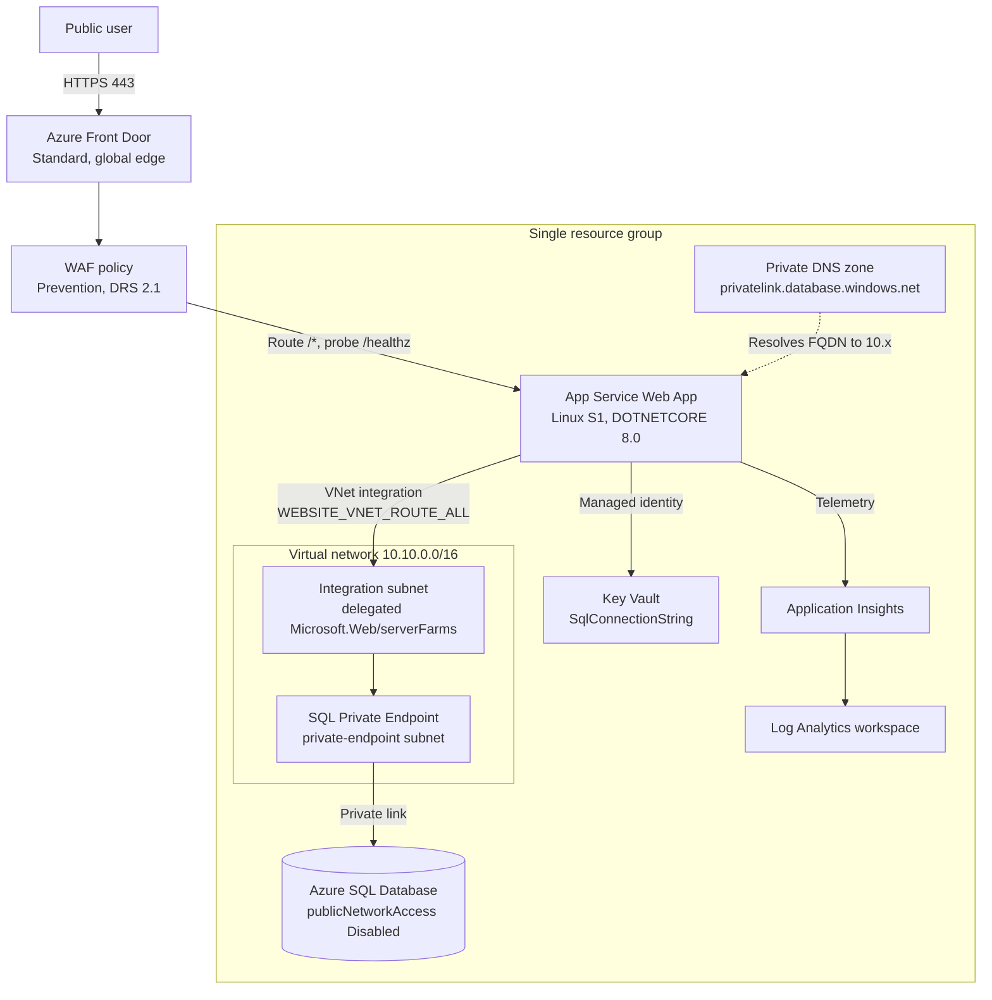

# Stage 4 — Network Isolation

> **Trigger:** "Compliance requires private data access."

Stage 3 made the app safe to expose and ready to grow. Stage 4 makes the **data tier private**: the Azure SQL logical server stops accepting public connections, a Private Endpoint gives it an address inside a virtual network, a private DNS zone makes the SQL FQDN resolve to that private address, and the web app reaches it over regional VNet integration.

## Before you start

Read these foundations first — Stage 4 applies the decisions they describe:

- [Network topology basics](../platform/network-topology-basics.md) — how VNets, subnets, and private endpoints fit together.
- [Private connectivity patterns](../patterns/networking/private-connectivity-patterns.md) — when a private endpoint is the right tool and how DNS makes it work.
- [Hub-spoke vs Virtual WAN](../patterns/networking/hub-spoke-vs-virtual-wan.md) — where a single-VNet stage sits on the topology spectrum.

## What you'll build

<!-- diagram-id: stage-04-network-isolation-architecture -->


| Resource | SKU / Tier | Role |
|---|---|---|
| Virtual network | `10.10.0.0/16`, two subnets | Private network fabric for the stage |
| Integration subnet | `10.10.1.0/24`, delegated | Hosts the App Service regional VNet integration |
| Private endpoint subnet | `10.10.2.0/24` | Hosts the SQL Private Endpoint |
| Private DNS zone | `privatelink.database.windows.net` | Resolves the SQL FQDN to the private IP |
| SQL Private Endpoint | `sqlServer` group | Private network path into the database |
| Azure SQL Database | **Basic** (2 GB), **public access Disabled** | Catalog and order data, private-only |
| App Service plan + Web App | Linux **S1**, `DOTNETCORE\|8.0` | Runs the Storefront app, egress via VNet |
| Front Door + WAF | **Standard**, Prevention | Global edge entry point (unchanged from Stage 3) |
| Key Vault | Standard, RBAC | Custody of the SQL connection string |
| Application Insights + Log Analytics | Workspace-based | Telemetry and 30-day retention |
| Autoscale + Action Group + alerts | CPU, Http5xx, response time | Scaling and alerting (unchanged from Stage 3) |

**Cost:** ~$0.24–$0.36/hour. **Time:** 35–55 minutes.

## Prerequisites

- Azure CLI logged in (`az login`) with rights to create resource groups, virtual networks, private endpoints, and role assignments.
- A strong SQL administrator password exported as `SQL_ADMIN_PASSWORD` (never commit it).
- An Entra principal for the SQL admin, exported as `SQL_ENTRA_ADMIN_LOGIN` and `SQL_ENTRA_ADMIN_OBJECT_ID`.
- An operations notification email exported as `ALERT_EMAIL_ADDRESS`.

## Deploy

The generic driver scripts under `scripts/practical/` wrap the Bicep deployment:

```bash
export SQL_ADMIN_PASSWORD='<choose-a-strong-password>'
export SQL_ENTRA_ADMIN_LOGIN='<entra-user-or-group-display-name>'
export SQL_ENTRA_ADMIN_OBJECT_ID='<entra-object-id>'
export ALERT_EMAIL_ADDRESS='<ops-notification-email>'

scripts/practical/deploy-stage.sh stage-04
```

To deploy the Bicep directly instead:

```bash
az group create --resource-group rg-practical-storefront-stage04 --location koreacentral

az deployment group create \
  --resource-group rg-practical-storefront-stage04 \
  --template-file infra/bicep/stages/stage-04-network-isolation/main.bicep \
  --parameters infra/bicep/stages/stage-04-network-isolation/main.bicepparam \
  --parameters sqlAdministratorLoginPassword="$SQL_ADMIN_PASSWORD"
```

| Command | Purpose |
|---------|---------|
| `az group create --resource-group rg-practical-storefront-stage04 --location koreacentral` | Creates the resource group that holds every Stage 4 resource. |
| `--resource-group rg-practical-storefront-stage04` | Names the resource group to create. |
| `--location koreacentral` | Sets the Azure region for the resource group. |
| `az deployment group create` | Deploys the Bicep template into the resource group. |
| `--resource-group rg-practical-storefront-stage04` | Targets the resource group that receives the deployment. |
| `--template-file infra/bicep/stages/stage-04-network-isolation/main.bicep` | Points to the Bicep template to deploy. |
| `--parameters infra/bicep/stages/stage-04-network-isolation/main.bicepparam` | Supplies deployment parameters from the `.bicepparam` file. |
| `--parameters sqlAdministratorLoginPassword="$SQL_ADMIN_PASSWORD"` | Overrides the SQL administrator password inline from the exported variable. |

## Verify

```bash
scripts/practical/verify-stage.sh stage-04
```

This runs three smoke tests:

1. **HTTP smoke** — `GET /` on the origin returns `200`, `GET /healthz` returns `{"status":"Healthy"}`, `GET /ops/info` returns JSON with a `version` field.
2. **Front Door smoke** — confirms the endpoint is enabled, a WAF policy is associated, the origin group probes `/healthz`, and the autoscale maximum is 2. A non-`200` edge response is reported as a warning because Front Door endpoints propagate globally over several minutes.
3. **Private connectivity smoke** — confirms SQL `publicNetworkAccess` is `Disabled`, the private endpoint connection is `Approved`, and the `privatelink.database.windows.net` DNS zone exists and is linked to the VNet.

The public-endpoint SQL smoke test from earlier stages is intentionally dropped here, because with public access disabled the deploy host can no longer reach the database over the internet — that is the point of this stage.

Spot-check individual controls:

```bash
az sql server show --name <sqlServer> --resource-group rg-practical-storefront-stage04 --query publicNetworkAccess
az network private-endpoint show --name <sqlPrivateEndpoint> --resource-group rg-practical-storefront-stage04 --query "privateLinkServiceConnections[0].privateLinkServiceConnectionState.status"
az network private-dns zone show --name privatelink.database.windows.net --resource-group rg-practical-storefront-stage04 --query name
```

| Command | Purpose |
|---------|---------|
| `az sql server show --name <sqlServer> --resource-group rg-practical-storefront-stage04 --query publicNetworkAccess` | Returns whether the SQL server's public network access is disabled. |
| `az network private-endpoint show --name <sqlPrivateEndpoint> --resource-group rg-practical-storefront-stage04 --query "privateLinkServiceConnections[0].privateLinkServiceConnectionState.status"` | Returns the approval status of the SQL private endpoint connection. |
| `az network private-dns zone show --name privatelink.database.windows.net --resource-group rg-practical-storefront-stage04 --query name` | Confirms the private DNS zone for SQL exists and returns its name. |

To confirm the app actually resolves SQL privately, open the App Service SSH/Kudu console and run `nslookup <sqlServer>.database.windows.net`; it should resolve to a `10.x.x.x` address in the private-endpoint subnet.

See [`labs/trunk/stage-04-network-isolation/`](https://github.com/yeongseon/azure-architecture-practical-guide/tree/main/labs/trunk/stage-04-network-isolation) for the full checklist, sample requests, and expected results.

## Best practices embedded in this stage

- **Separate public ingress from private data** — user traffic still enters through Front Door on the public edge, but the database has no public face. Reachability is a deliberate choice made per tier, not a default.
- **Private DNS is architecture, not an afterthought** — the `privatelink.database.windows.net` zone and its VNet link are provisioned in the same template. Without the zone link, the app would resolve the SQL FQDN to its public IP and the private endpoint would go unused.
- **Lock down the data tier first** — `publicNetworkAccess` is `Disabled` and the public firewall rules are removed, so the Private Endpoint is the only path into the database.

> The web app origin is still reached by Front Door over its public hostname at this stage. Fronting the origin privately and locking it down to this Front Door instance (via the `X-Azure-FDID` header and the `AzureFrontDoor.Backend` service tag) happen in a later stage. Stage 4 isolates the data tier, not the compute ingress.

## Clean up

```bash
scripts/practical/destroy-stage.sh stage-04
```

This deletes the resource group and everything in it.

## Go deeper

- [Private internal app — network and access](../workload-guides/private-internal-app/network-and-access.md)
- [Private internal app — baseline architecture](../workload-guides/private-internal-app/baseline.md)
- [Design Lab 02 — private internal app](../design-labs/lab-02-private-internal-app.md)
- [Network topology cheatsheet](../reference/network-topology-cheatsheet.md)

## See Also

- [Stage 3 — Scale / Edge](stage-03-scale-edge.md)
- [Network topology basics](../platform/network-topology-basics.md)
- [Private connectivity patterns](../patterns/networking/private-connectivity-patterns.md)
- [Hub-spoke vs Virtual WAN](../patterns/networking/hub-spoke-vs-virtual-wan.md)

## Sources

- [What is Azure Private Link?](https://learn.microsoft.com/en-us/azure/private-link/private-link-overview)
- [Azure Private Endpoint DNS configuration](https://learn.microsoft.com/en-us/azure/private-link/private-endpoint-dns)
- [Integrate your app with an Azure virtual network](https://learn.microsoft.com/en-us/azure/app-service/overview-vnet-integration)
- [Azure SQL Database and Azure Synapse Analytics network access controls](https://learn.microsoft.com/en-us/azure/azure-sql/database/network-access-controls-overview)
- [Use Private Link to connect to Azure SQL Database](https://learn.microsoft.com/en-us/azure/azure-sql/database/private-endpoint-overview)
