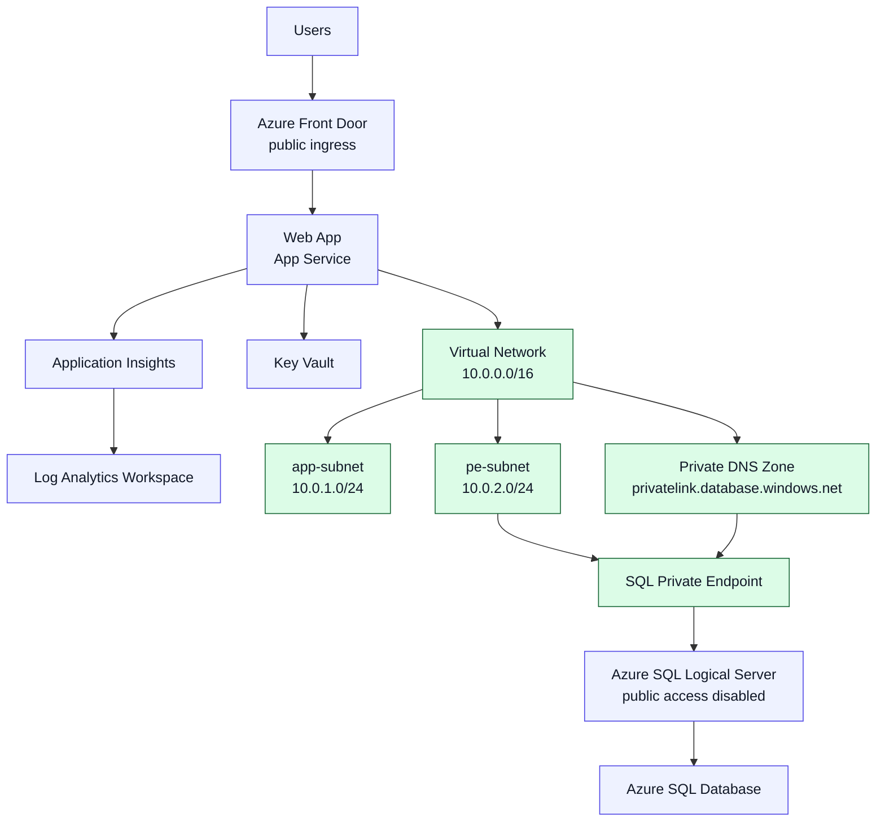

---
content_sources:
  diagrams:
    - id: stage-04-architecture
      type: flowchart
      source: self-generated
      justification: "Diagram shows the Stage 4 shift from public data access to a private SQL data path while keeping public ingress at Azure Front Door."
      based_on:
        - https://learn.microsoft.com/en-us/azure/app-service/overview-vnet-integration
        - https://learn.microsoft.com/en-us/azure/private-link/private-endpoint-overview
        - https://learn.microsoft.com/en-us/azure/dns/private-dns-privatednszone
content_validation:
  status: pending_review
  last_reviewed: '2026-04-24'
  reviewer: agent
  core_claims:
    - claim: App Service virtual network integration lets an app access resources inside a virtual network.
      source: https://learn.microsoft.com/en-us/azure/app-service/overview-vnet-integration
      verified: false
    - claim: Azure Private Endpoint exposes a private IP for a supported PaaS resource inside a virtual network.
      source: https://learn.microsoft.com/en-us/azure/private-link/private-endpoint-overview
      verified: false
    - claim: Private DNS zones provide name resolution for private endpoints within linked virtual networks.
      source: https://learn.microsoft.com/en-us/azure/dns/private-dns-privatednszone
      verified: false
---
# Stage 4 — Network Isolation: Private Data Path

> Compliance requires private data access.

Stage 4 keeps the Stage 3 public edge path through Azure Front Door, but moves the application-to-database path onto private networking so the data tier is no longer reachable over the public internet.

## What Changes from Stage 3

The architecture still serves users through Azure Front Door, but the new network boundary is inside the workload:

- A virtual network adds a delegated subnet for App Service integration and a separate subnet for private endpoints.
- The web app joins the application subnet for outbound access to private resources.
- Azure SQL gets a private endpoint in the private endpoint subnet.
- A private DNS zone resolves the Azure SQL FQDN to the private endpoint address inside the virtual network.
- Public network access is disabled on the Azure SQL logical server.

<!-- diagram-id: stage-04-architecture -->


## Read Before You Deploy

- [Network Topology Basics](../platform/network-topology-basics.md)
- [Private Connectivity Patterns](../patterns/networking/private-connectivity-patterns.md)
- [Hub-Spoke vs. Virtual WAN](../patterns/networking/hub-spoke-vs-virtual-wan.md)

## Prerequisites

1. Use the same Azure subscription prerequisites as Stages 2 and 3.
2. Ensure Azure CLI is installed and authenticated.
3. Prepare a globally unique `appName` and a strong SQL admin password.
4. Confirm your subscription can create Azure Front Door Standard, Private Endpoint, Private DNS, App Service, and Azure SQL resources in one resource group.

## Deploy

1. Review the Stage 4 parameter file placeholders.

    ```bash
    az bicep build \
        --file infra/bicep/stages/stage-04-network-isolation/main.bicep \
        --stdout
    ```

2. Create or reuse the target resource group.

    ```bash
    export RESOURCE_GROUP_NAME="rg-practical-stage-04-network-isolation-koreacentral"

    az group create \
        --name "$RESOURCE_GROUP_NAME" \
        --location "koreacentral"
    ```

3. Deploy the full stage.

    ```bash
    az deployment group create \
        --resource-group "$RESOURCE_GROUP_NAME" \
        --template-file infra/bicep/stages/stage-04-network-isolation/main.bicep \
        --parameters infra/bicep/stages/stage-04-network-isolation/main.bicepparam \
        --parameters appName="yourappname" \
        --parameters sqlAdminLogin="sqladminuser" \
        --parameters sqlAdminPassword="<sql-admin-password>" \
        --parameters alertEmail="alerts@example.com"
    ```

4. Capture the output values for the Front Door endpoint, web app name, virtual network, private endpoint, and SQL server FQDN.

## Verify

Run the Stage 4 smoke test first after exporting `RG`.

```bash
export RG="$RESOURCE_GROUP_NAME"
bash scripts/practical/verify/private-connectivity-smoke.sh
```

Then run the Stage 4 QA commands from the blueprint:

```bash
export FRONT_DOOR_ENDPOINT="<front-door-endpoint-hostname>"
export PRIVATE_ENDPOINT_NAME="<private-endpoint-name>"
export SQL_SERVER_NAME="<sql-server-name>"
export SQL_DATABASE_NAME="<app-name>-db"

curl --silent --output /dev/null --write-out '%{http_code}' "https://${FRONT_DOOR_ENDPOINT}"
az network private-endpoint show --name "$PRIVATE_ENDPOINT_NAME" --resource-group "$RESOURCE_GROUP_NAME"
az sql server show --name "$SQL_SERVER_NAME" --resource-group "$RESOURCE_GROUP_NAME" --query publicNetworkAccess
nslookup "${SQL_SERVER_NAME}.database.windows.net"
az sql db show --name "$SQL_DATABASE_NAME" --server "$SQL_SERVER_NAME" --resource-group "$RESOURCE_GROUP_NAME"
```

Expected results:

- Azure Front Door still returns HTTP `200`
- The private endpoint connection state is `Approved`
- Azure SQL `publicNetworkAccess` is `Disabled`
- Name resolution for the SQL FQDN returns a `10.x.x.x` address when executed from the app environment or another resolver in the linked virtual network
- The SQL database remains reachable for control-plane inspection

## Best Practices in This Stage

### Separate public ingress from private data

Keep internet-facing access at the managed edge, but move the application-to-data path onto private networking so compliance controls focus where sensitive data lives.

### Private DNS is architecture, not an afterthought

Private Endpoint without matching private DNS usually creates an unreliable operating model, because connectivity and name resolution drift apart.

### Lock down the data tier first

If you need network isolation incrementally, start by disabling public access on the database and proving the private path before you attempt wider inbound isolation changes.

## Cost

Expect roughly **~$0.24–$0.36/hour** for this stage. The added cost comes mainly from Azure Front Door Standard, the App Service S1 plan, and the SQL Private Endpoint plus private DNS plumbing.

## Destroy

```bash
az group delete \
    --name "$RESOURCE_GROUP_NAME" \
    --yes \
    --no-wait
```

## Read After You Verify

- [Private Internal App: Network and Access](../workload-guides/private-internal-app/network-and-access.md)
- [Private Internal App Baseline](../workload-guides/private-internal-app/baseline.md)
- [Design Lab 02: Private Internal App](../design-labs/lab-02-private-internal-app.md)
- [Private Internal App Review Playbook](../architecture-reviews/playbooks/private-internal-app-review.md)

## See Also

- [Architecture Assessment Checklist](../waf/architecture-assessment-checklist.md)
- [Cost Management and FinOps](../operations/cost-management-and-finops.md)
- [Reference: Network Topology Cheatsheet](../reference/network-topology-cheatsheet.md)

## Sources

- [App Service virtual network integration](https://learn.microsoft.com/en-us/azure/app-service/overview-vnet-integration)
- [What is Azure Private Endpoint?](https://learn.microsoft.com/en-us/azure/private-link/private-endpoint-overview)
- [Azure Private DNS zones overview](https://learn.microsoft.com/en-us/azure/dns/private-dns-privatednszone)
