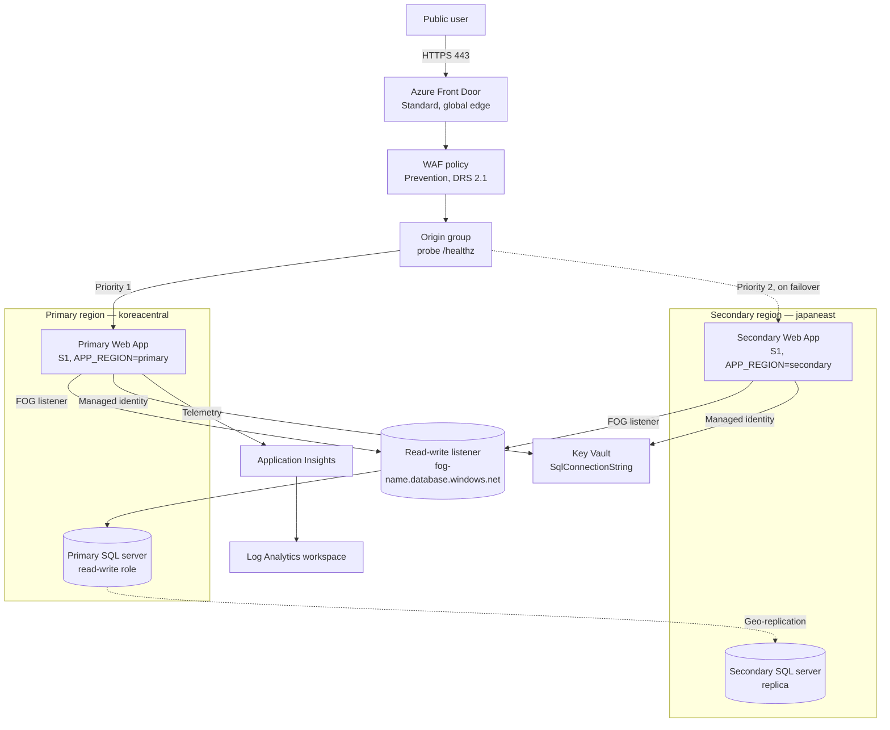

# Stage 5 — Resilience

> **Trigger:** "Business needs regional outage tolerance."

Stage 4 made the data tier private. Stage 5 answers a different question: **what happens when an entire Azure region goes down?** You add a second regional app stack, keep a synchronized database replica there with an Azure SQL failover group, and let Azure Front Door move user traffic to the standby region automatically when the primary stops answering.

This stage deliberately **resets to the Stage 3 public baseline** rather than building on Stage 4. Multi-region resilience and private networking are two separate production concerns; teaching them together (private endpoints per region, cross-region private DNS, region-aware routing) is a much harder design that belongs in the capstone. Here you learn failover on its own.

## Before you start

Read these foundations first — Stage 5 applies the decisions they describe:

- [Resilience and region strategy](../platform/resilience-and-region-strategy.md) — how many regions, and how they relate.
- [Multi-region active-passive vs active-active](../patterns/resilience/multi-region-active-passive-vs-active-active.md) — why active-passive is the right first step.
- [Retry, circuit breaker, and bulkhead](../patterns/resilience/retry-circuit-breaker-and-bulkhead.md) — the app-level patterns that complement infrastructure failover.
- [Well-Architected: Reliability](../waf/reliability.md) — the pillar this stage advances.

## What you'll build

<!-- diagram-id: stage-05-resilience-architecture -->


| Resource | SKU / Tier | Role |
|---|---|---|
| Front Door + WAF | **Standard**, Prevention | Global edge, priority-based failover |
| Origin group + two origins | Health probe `/healthz` | Priority 1 primary, priority 2 secondary |
| App Service plan + Web App (primary) | Linux **S1**, `DOTNETCORE\|8.0` | Active region, serves all traffic |
| Staging slot (primary) | Shares the S1 plan | Pre-production releases |
| App Service plan + Web App (secondary) | Linux **S1**, `DOTNETCORE\|8.0` | Passive standby in the second region |
| SQL logical server (primary) | v12.0, TLS 1.2 | Read-write role at deploy time |
| SQL logical server (secondary) | v12.0, TLS 1.2 | Failover partner |
| Azure SQL Database | **S0** (Standard) | Catalog and order data, geo-replicated |
| SQL Failover Group | Automatic, 60-min grace | Read-write listener + replication |
| Key Vault | Standard, RBAC | Custody of the failover-group connection string |
| Application Insights + Log Analytics | Workspace-based | Telemetry and 30-day retention |
| Autoscale + Action Group + alerts | CPU, Http5xx, response time | Scaling and alerting on the primary region |

**Cost:** ~$0.45–$0.80/hour. **Time:** 50–75 minutes.

## Prerequisites

- Azure CLI logged in (`az login`) with rights to create resource groups in two regions, SQL failover groups, and role assignments.
- A strong SQL administrator password exported as `SQL_ADMIN_PASSWORD` (never commit it). The same login and password are used on both servers — a failover group requires matching administrator credentials.
- An Entra principal for the SQL admin, exported as `SQL_ENTRA_ADMIN_LOGIN` and `SQL_ENTRA_ADMIN_OBJECT_ID`.
- An operations notification email exported as `ALERT_EMAIL_ADDRESS`.
- Secondary-region capacity for App Service S1 and Azure SQL (the default secondary is `japaneast`).

## Deploy

The generic driver scripts under `scripts/practical/` wrap the Bicep deployment:

```bash
export SQL_ADMIN_PASSWORD='<choose-a-strong-password>'
export SQL_ENTRA_ADMIN_LOGIN='<entra-user-or-group-display-name>'
export SQL_ENTRA_ADMIN_OBJECT_ID='<entra-object-id>'
export ALERT_EMAIL_ADDRESS='<ops-notification-email>'

scripts/practical/deploy-stage.sh stage-05
```

To deploy the Bicep directly instead:

```bash
az group create --resource-group rg-practical-storefront-stage05 --location koreacentral

az deployment group create \
  --resource-group rg-practical-storefront-stage05 \
  --template-file infra/bicep/stages/stage-05-resilience/main.bicep \
  --parameters infra/bicep/stages/stage-05-resilience/main.bicepparam \
  --parameters sqlAdministratorLoginPassword="$SQL_ADMIN_PASSWORD"
```

## Verify

```bash
scripts/practical/verify-stage.sh stage-05
```

This runs three smoke tests:

1. **HTTP smoke** — `GET /` on the primary origin returns `200`, `GET /healthz` returns `{"status":"Healthy"}`, `GET /ops/info` returns JSON with a `version` field.
2. **Front Door smoke** — confirms the endpoint is enabled, a WAF policy is associated, the origin group probes `/healthz`, and the autoscale maximum is 2. A non-`200` edge response is a warning because Front Door propagates globally over several minutes.
3. **Failover smoke** — read-only checks that prove the resilience topology: two web apps across two regions, two SQL servers, a failover group reporting the `Primary` read-write role, and a Front Door origin group with two priority-ranked origins.

The failover smoke test does **not** trigger a failover — that is a stateful operation, not an idempotent check. The full failover drill lives in the lab.

## Run the failover drill

Confirming the topology exists is not the same as proving it works. Run the drill in [`labs/trunk/stage-05-resilience/`](https://github.com/yeongseon/azure-architecture-practical-guide/tree/main/labs/trunk/stage-05-resilience) to actually exercise both failover paths:

```bash
export RG='rg-practical-storefront-stage05'
FRONTDOOR="$(az afd endpoint list --profile-name "$(az afd profile list --resource-group "$RG" --query '[0].name' --output tsv)" --resource-group "$RG" --query '[0].hostName' --output tsv)"

curl -s "https://${FRONTDOOR}/ops/info"

az webapp stop --name <primaryWebApp> --resource-group "$RG"

sleep 60
curl -s "https://${FRONTDOOR}/ops/info"
```

After the primary stops and Front Door's health probe fails it out of rotation, `/ops/info` reports `"region": "secondary"` — user traffic has failed over at the **app tier** while the database read-write role is still in the primary region. To fail the **data tier** over as well:

```bash
az sql failover-group set-primary --name <failoverGroup> --server <secondarySqlServer> --resource-group "$RG"

az sql failover-group show --name <failoverGroup> --server <secondarySqlServer> --resource-group "$RG" --query replicationRole
```

The role now reports `Primary` on the secondary server. Fail back by starting the primary app and running `set-primary` against the primary server again.

## Best practices embedded in this stage

- **Active-passive before active-active** — one serving region and one warm standby is the simplest topology that survives a regional outage, without the multi-writer data conflicts active-active introduces.
- **Test failover, don't just document it** — the lab performs a real failover and fail-back, so the recovery path is proven under controlled conditions rather than discovered during an incident.
- **Explicit RTO/RPO** — the failover group's automatic policy and 60-minute grace period are deliberate recovery-objective choices, not defaults left unexamined.
- **One listener, no app reconfiguration** — both regions read a connection string bound to the failover-group listener, so a data-tier failover changes nothing in the app.

> App-tier failover (Front Door) and data-tier failover (the SQL failover group) are independent operations. A real regional outage triggers both; a drill lets you exercise each one separately so you understand what each protects.

## Clean up

```bash
scripts/practical/destroy-stage.sh stage-05
```

This deletes the resource group and both regional stacks.

## Go deeper

- [Business continuity and drills](../operations/business-continuity-and-drills.md)
- [Resilience targets — RTO and RPO](../reference/resilience-targets-rto-rpo.md)
- [Well-Architected pillar trade-offs](../waf/pillar-trade-offs.md)

## See Also

- [Stage 4 — Network Isolation](stage-04-network-isolation.md)
- [Resilience and region strategy](../platform/resilience-and-region-strategy.md)
- [Multi-region active-passive vs active-active](../patterns/resilience/multi-region-active-passive-vs-active-active.md)
- [Well-Architected: Reliability](../waf/reliability.md)

## Sources

- [Highly available multi-region web application](https://learn.microsoft.com/en-us/azure/architecture/web-apps/app-service/architectures/multi-region)
- [Auto-failover groups overview and best practices (Azure SQL Database)](https://learn.microsoft.com/en-us/azure/azure-sql/database/auto-failover-group-sql-db)
- [Configure an auto-failover group](https://learn.microsoft.com/en-us/azure/azure-sql/database/failover-group-configure-sql-db)
- [Azure Front Door routing methods — priority-based traffic routing](https://learn.microsoft.com/en-us/azure/frontdoor/routing-methods)
- [Business continuity with Azure SQL Database](https://learn.microsoft.com/en-us/azure/azure-sql/database/business-continuity-high-availability-disaster-recover-hadr-overview)
