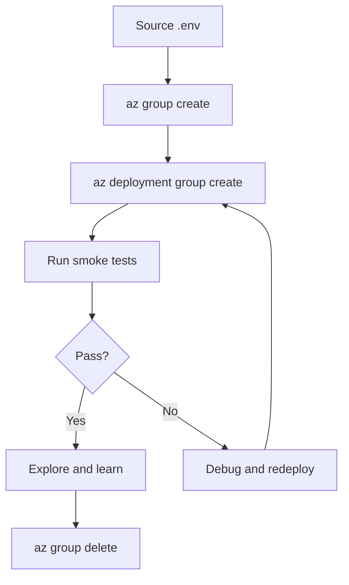

---
content_sources:
  diagrams:
    - id: deploy-verify-destroy
      type: flowchart
      source: self-generated
      justification: "Illustrates the deploy, verify, destroy lifecycle for each stage."
      based_on:
        - https://learn.microsoft.com/en-us/cli/azure/group
        - https://learn.microsoft.com/en-us/cli/azure/deployment/group
content_validation:
  status: verified
  last_reviewed: '2026-04-25'
  reviewer: agent
  core_claims:
    - claim: az group delete removes all resources in a resource group.
      source: https://learn.microsoft.com/en-us/cli/azure/group#az-group-delete
      verified: true
    - claim: az deployment group create deploys a Bicep template to a resource group.
      source: https://learn.microsoft.com/en-us/cli/azure/deployment/group#az-deployment-group-create
      verified: true
---
# Verify and Destroy

Every stage follows the same three-step lifecycle: **deploy → verify → destroy**. This page explains the workflow and the scripts that support it.

## The Lifecycle

<!-- diagram-id: deploy-verify-destroy -->


## Step 1 — Deploy

Each stage has a `.env` file that sets shell variables and a `main.bicepparam` file that pins Bicep parameters.

```bash
# Source the stage environment
source scripts/practical/stages/stage-01.env

# Create the resource group
az group create --name "$RG" --location "$LOCATION"

# Deploy
az deployment group create \
    --resource-group "$RG" \
    --template-file "infra/bicep/stages/stage-01-mvp/main.bicep" \
    --parameters "infra/bicep/stages/stage-01-mvp/main.bicepparam" \
    --parameters appName="$APP_NAME" \
    --parameters sqlAdminLogin="$SQL_ADMIN_LOGIN" \
    --parameters sqlAdminPassword="$SQL_ADMIN_PASSWORD"
```

## Step 2 — Verify

Smoke tests check that deployed resources respond correctly.

| Stage | Smoke Script | What It Checks |
|---|---|---|
| 1 | `verify/http-smoke.sh` | HTTP 200 from App Service endpoints |
| 1 | `verify/sql-smoke.sh` | SQL connectivity and database existence |
| 2 | (uses Stage 1 smoke scripts + manual Key Vault and slot checks) | Managed identity, Key Vault secret, staging slot |
| 3 | `verify/frontdoor-smoke.sh` | Front Door endpoint, WAF policy, autoscale |
| 4 | `verify/private-connectivity-smoke.sh` | VNet, private endpoint, DNS resolution |
| 5 | `verify/failover-smoke.sh` | SQL failover group, secondary region health |

```bash
# Example: Stage 3 verification
export RG="$RG"
export APP_NAME="$APP_NAME"
bash scripts/practical/verify/frontdoor-smoke.sh
```

## Step 3 — Destroy

A single command removes everything:

```bash
az group delete --name "$RG" --yes --no-wait
```

The `--no-wait` flag returns immediately while Azure deletes resources in the background.

!!! warning "Verify deletion"
    After a few minutes, confirm the resource group is gone:

    ```bash
    az group show --name "$RG" 2>&1 | grep --quiet "could not be found" && echo "Deleted" || echo "Still exists"
    ```

## Common Troubleshooting

| Problem | Solution |
|---|---|
| Deployment fails with name conflict | Change `APP_NAME` in the `.env` file — names must be globally unique |
| Private endpoint DNS not resolving | Wait 2–3 minutes for DNS propagation, then retry |
| Front Door returns 503 | Origin may still be warming up — wait 5 minutes and retry |
| `az group delete` hangs | Some resources (like Private DNS zones with links) take longer — add `--no-wait` |

## See Also

- [Getting Started](getting-started.md)
- [Cost and Time Model](cost-and-time-model.md)

## Sources

- [az group delete](https://learn.microsoft.com/en-us/cli/azure/group#az-group-delete)
- [az deployment group create](https://learn.microsoft.com/en-us/cli/azure/deployment/group#az-deployment-group-create)
