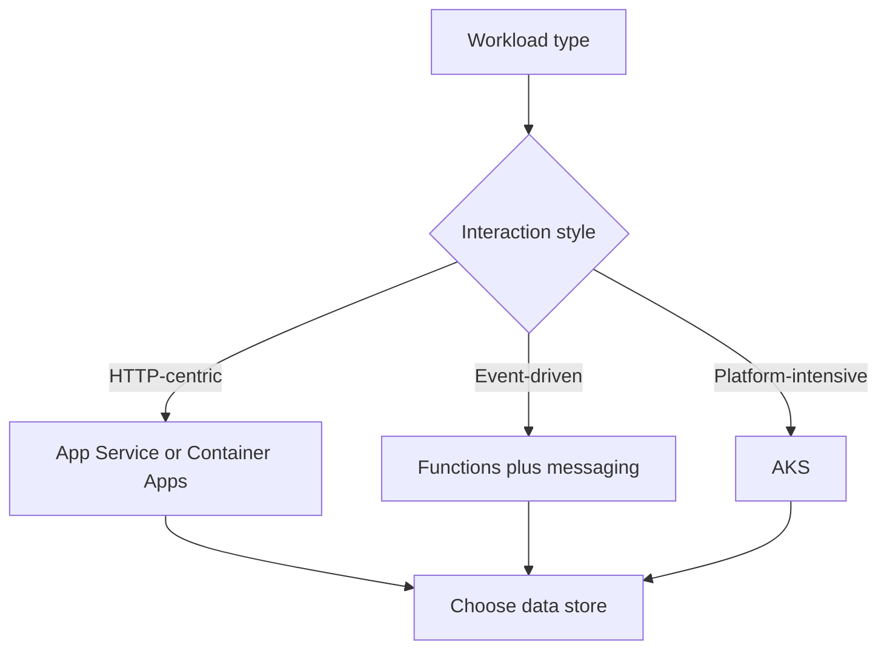

# Architecture Decision Matrix

This matrix helps architects move from workload type to a likely Azure service combination, then hands off to the sibling deep-guide for the chosen service. Use it as a first-pass filter, validate with the workload guides and design labs, then follow the **Deep guide** link to production-grade platform, best-practices, and troubleshooting depth.

For service-area routing when you already know the service, use the [Series Portal](series-portal.md). For deeper single-dimension comparisons, use the [compute](compute-selection-cheatsheet.md), [data](data-selection-cheatsheet.md), [messaging](messaging-selection-cheatsheet.md), and [network](network-topology-cheatsheet.md) cheatsheets.

## How to use this matrix

- Find the row whose **workload type** matches yours; the middle columns give a defensible first-pass service combination.
- Treat these as starting points, not verdicts — confirm against the linked cheatsheets and your workload's specific constraints. [Inferred]
- Once a service is chosen, follow its **Deep guide** entry point to the sibling practical guide for that service. Every sibling guide follows the same Start Here → Platform → Best Practices → Operations → Troubleshooting → Reference shape. [Documented]

## Workload-to-service matrix

| Workload type | Front-end and compute | Data and state | Integration | Deep guide |
|---|---|---|---|---|
| Public web application | Front Door + App Service | Azure SQL + Key Vault | Event Grid or Service Bus as needed | [App Service](https://yeongseon.github.io/azure-app-service-practical-guide/start-here/scenario-router/) |
| Private internal application | App Service Private Endpoint for inbound + App Service VNet integration for outbound | Azure SQL or PostgreSQL + Key Vault | Private Endpoints, optional Service Bus | [App Service](https://yeongseon.github.io/azure-app-service-practical-guide/start-here/scenario-router/) · [Networking](https://yeongseon.github.io/azure-networking-practical-guide/start-here/scenario-router/) |
| Event-driven business workflow | API + Functions or App Service | Cosmos DB or Azure SQL | Service Bus + Event Grid | [Functions](https://yeongseon.github.io/azure-functions-practical-guide/start-here/) |
| Serverless file or data processing | Functions or Container Apps jobs | Storage + optional Redis | Event Grid or queues | [Functions](https://yeongseon.github.io/azure-functions-practical-guide/start-here/) · [Container Apps](https://yeongseon.github.io/azure-container-apps-practical-guide/start-here/scenario-router/) |
| Microservices platform | AKS or Container Apps | Polyglot stores | Service Bus, Event Grid, API gateway | [Container Apps](https://yeongseon.github.io/azure-container-apps-practical-guide/start-here/scenario-router/) · [AKS](https://yeongseon.github.io/azure-kubernetes-service-practical-guide/start-here/scenario-router/) |
| Data analytics | Synapse, Databricks, or Fabric-adjacent patterns | Data Lake + analytical stores | Event Hubs or batch ingestion | [Storage](https://yeongseon.github.io/azure-storage-practical-guide/start-here/scenario-router/) |
| Enterprise landing zone shared services | Shared platform services | Central policy and logs | Hub-spoke or Virtual WAN | [Networking](https://yeongseon.github.io/azure-networking-practical-guide/start-here/scenario-router/) · [Monitoring](https://yeongseon.github.io/azure-monitoring-practical-guide/start-here/scenario-router/) |

## Selection notes

- App Service is favored when the team wants managed HTTP hosting with minimal platform operations. [Documented]
- Functions fits event-driven and bursty execution patterns. [Documented]
- Container Apps is useful when container packaging is needed without full Kubernetes ownership. [Correlated]
- AKS is justified when workload complexity, service mesh needs, or runtime control exceed simpler options. [Inferred]

<!-- diagram-id: architecture-decision-matrix-flow -->

## See Also

- [Series Portal](series-portal.md) — route to a sibling deep-guide when the service is already chosen
- [Compute Selection Cheatsheet](compute-selection-cheatsheet.md) — narrow compute options
- [Data Selection Cheatsheet](data-selection-cheatsheet.md) — narrow data platform options
- [Messaging Selection Cheatsheet](messaging-selection-cheatsheet.md) — narrow messaging primitives
- [Network Topology Cheatsheet](network-topology-cheatsheet.md) — narrow networking topology

## Sources

- https://learn.microsoft.com/en-us/azure/architecture/guide/technology-choices/
- https://learn.microsoft.com/en-us/azure/architecture/guide/technology-choices/compute-decision-tree
