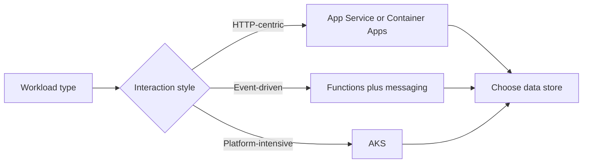

---
content_sources:
  diagrams:
    - id: architecture-decision-matrix-flow
      type: flowchart
      source: mslearn-adapted
      mslearn_url: https://learn.microsoft.com/en-us/azure/architecture/guide/technology-choices/
---
# Architecture Decision Matrix

This matrix helps architects move from workload type to likely Azure service combinations. Use it as a first-pass filter, then validate with workload guides and design labs.

| Workload type | Front-end and compute | Data and state | Integration | Notes |
|---|---|---|---|---|
| Public web application | Front Door + App Service | Azure SQL + Key Vault | Event Grid or Service Bus as needed | Strong baseline for managed HTTP workloads. [Documented] |
| Private internal application | Private ingress + App Service with VNet | Azure SQL or PostgreSQL + Key Vault | Private Endpoints, optional Service Bus | Prefer when no internet exposure is allowed. [Documented] |
| Event-driven business workflow | API + Functions or App Service | Cosmos DB or Azure SQL | Service Bus + Event Grid | Best for decoupled processing and notifications. [Correlated] |
| Serverless file or data processing | Functions or Container Apps jobs | Storage + optional Redis | Event Grid or queues | Strong elasticity for bursty pipelines. [Observed] |
| Microservices platform | AKS or Container Apps | Polyglot stores | Service Bus, Event Grid, API gateway | Choose only if service autonomy justifies the added ops load. [Inferred] |
| Data analytics | Synapse, Databricks, or Fabric-adjacent patterns | Data Lake + analytical stores | Event Hubs or batch ingestion | Optimized for large-scale data movement and analytics. [Documented] |
| Enterprise landing zone shared services | Shared platform services | Central policy and logs | Hub-spoke or Virtual WAN | Focus on governance and connectivity. [Validated] |

## Selection notes

- App Service is favored when the team wants managed HTTP hosting with minimal platform operations. [Documented]
- Functions fits event-driven and bursty execution patterns. [Documented]
- Container Apps is useful when container packaging is needed without full Kubernetes ownership. [Correlated]
- AKS is justified when workload complexity, service mesh needs, or runtime control exceed simpler options. [Inferred]

<!-- diagram-id: architecture-decision-matrix-flow -->

## Microsoft Learn references

- https://learn.microsoft.com/en-us/azure/architecture/guide/technology-choices/
- https://learn.microsoft.com/en-us/azure/architecture/guide/technology-choices/compute-decision-tree
