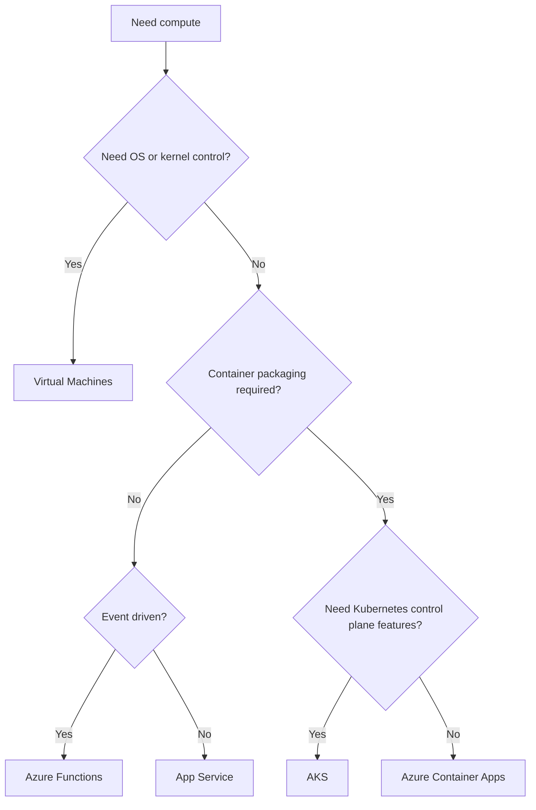

---
content_sources:
  diagrams:
    - id: compute-selection-map
      type: flowchart
      source: mslearn-adapted
      mslearn_url: https://learn.microsoft.com/en-us/azure/architecture/guide/technology-choices/compute-decision-tree
---
# Compute Selection Cheatsheet

Use this page to compare Azure compute services quickly during early architecture workshops.

| Service | Use Case | Scaling Model | Cost Model | Team Skill Required | Control Level |
|---|---|---|---|---|---|
| Virtual Machines | Legacy apps, custom OS dependencies, lift-and-shift | Manual or VMSS | Pay for provisioned instances | Medium to high | Highest |
| App Service | Web apps, APIs, standard background jobs | Plan scale-up and scale-out | Plan-based | Low to medium | Moderate |
| Azure Functions | Event-driven, bursty, timer, queue processing | Event-driven elastic scale | Consumption, premium, or dedicated | Low to medium | Low to moderate |
| Azure Container Apps | Containerized APIs, jobs, microservices without AKS | Revision and event-based scaling | Consumption and dedicated environment options | Medium | Medium |
| AKS | Complex microservices, platform teams, custom networking | Cluster and pod autoscaling | Cluster plus operations overhead | High | High |

## Decision guidance

- Choose **VMs** when OS-level control or legacy dependencies are non-negotiable. [Documented]
- Choose **App Service** for mainstream web workloads with minimal platform toil. [Documented]
- Choose **Functions** when triggers define execution and idle cost matters. [Observed]
- Choose **Container Apps** when the app is containerized but AKS would be excess operational weight. [Correlated]
- Choose **AKS** only when workload complexity benefits from Kubernetes control more than it suffers from platform overhead. [Inferred]

<!-- diagram-id: compute-selection-map -->

## Microsoft Learn references

- https://learn.microsoft.com/en-us/azure/architecture/guide/technology-choices/compute-decision-tree
- https://learn.microsoft.com/en-us/azure/architecture/guide/technology-choices/
