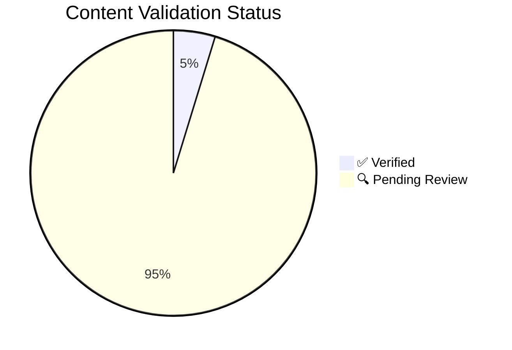

---
content_sources:
  diagrams:
  - id: content-validation-pie
    type: pie
    source: self-generated
    justification: Auto-generated pie chart from content_validation frontmatter across
      docs.
    based_on:
    - https://learn.microsoft.com/en-us/azure/architecture/
  - id: content-validation-status-pie
    type: pie
    source: self-generated
    justification: Auto-generated dashboard chart from repository validation metadata.
    based_on:
    - https://learn.microsoft.com/en-us/azure/well-architected/
  sources:
  - type: mslearn-adapted
    url: https://learn.microsoft.com/en-us/azure/well-architected/
content_validation:
  status: verified
  last_reviewed: '2026-05-23'
  reviewer: agent
  core_claims:
  - claim: This generated dashboard summarizes repository validation metadata and
      links back to Microsoft Learn as the source basis for Azure content checks.
    source: https://learn.microsoft.com/en-us/azure/well-architected/
    verified: true
---
# Content Validation Status

Auto-generated dashboard — do not edit manually.
Run `python3 scripts/generate_content_validation_status.py` to regenerate.

## Summary

<!-- diagram-id: content-validation-pie -->

| Status | Count |
|--------|-------|
| ✅ Verified | 6 |
| 🔍 Pending Review | 121 |
| ❓ Unverified | 0 |

**Total documents with content_validation**: 127

## Detail

| Document | Status | Claims | Last Reviewed |
|----------|--------|--------|---------------|
| `about.md` | 🔍 Pending Review | 5 | 2026-04-22 |
| `architecture-reviews/index.md` | 🔍 Pending Review | 5 | 2026-04-22 |
| `architecture-reviews/playbooks/data-platform-review.md` | 🔍 Pending Review | 3 | 2026-04-22 |
| `architecture-reviews/playbooks/event-driven-review.md` | 🔍 Pending Review | 3 | 2026-04-22 |
| `architecture-reviews/playbooks/index.md` | 🔍 Pending Review | 3 | 2026-04-22 |
| `architecture-reviews/playbooks/microservices-review.md` | 🔍 Pending Review | 3 | 2026-04-22 |
| `architecture-reviews/playbooks/private-internal-app-review.md` | 🔍 Pending Review | 3 | 2026-04-22 |
| `architecture-reviews/playbooks/public-web-api-review.md` | 🔍 Pending Review | 3 | 2026-04-22 |
| `contributing/index.md` | 🔍 Pending Review | 2 | 2026-04-23 |
| `design-labs/index.md` | 🔍 Pending Review | 5 | 2026-04-22 |
| `design-labs/lab-01-public-web-baseline.md` | 🔍 Pending Review | 5 | 2026-04-22 |
| `design-labs/lab-02-private-internal-app.md` | 🔍 Pending Review | 5 | 2026-04-22 |
| `design-labs/lab-03-event-driven-orders.md` | 🔍 Pending Review | 5 | 2026-04-22 |
| `design-labs/methodology.md` | 🔍 Pending Review | 5 | 2026-04-22 |
| `index.md` | 🔍 Pending Review | 5 | 2026-04-22 |
| `operations/adr-process.md` | 🔍 Pending Review | 5 | 2026-04-22 |
| `operations/architecture-lifecycle.md` | 🔍 Pending Review | 5 | 2026-04-22 |
| `operations/business-continuity-and-drills.md` | 🔍 Pending Review | 5 | 2026-04-22 |
| `operations/cost-management-and-finops.md` | 🔍 Pending Review | 5 | 2026-04-22 |
| `operations/index.md` | 🔍 Pending Review | 5 | 2026-04-22 |
| `operations/infrastructure-as-code-and-environment-promotion.md` | 🔍 Pending Review | 5 | 2026-04-22 |
| `operations/observability-and-slos.md` | 🔍 Pending Review | 5 | 2026-04-22 |
| `operations/platform-team-vs-app-team-responsibilities.md` | 🔍 Pending Review | 5 | 2026-04-22 |
| `operations/policy-and-governance-guardrails.md` | 🔍 Pending Review | 5 | 2026-04-22 |
| `patterns/data/cache-aside-cqrs-and-materialized-view.md` | 🔍 Pending Review | 5 | 2026-04-22 |
| `patterns/data/consistency-partitioning-and-replication.md` | 🔍 Pending Review | 5 | 2026-04-22 |
| `patterns/data/multi-tenant-data-isolation.md` | 🔍 Pending Review | 5 | 2026-04-22 |
| `patterns/decomposition/bounded-contexts-and-data-ownership.md` | 🔍 Pending Review | 5 | 2026-04-22 |
| `patterns/decomposition/modular-monolith-vs-microservices.md` | 🔍 Pending Review | 5 | 2026-04-22 |
| `patterns/decomposition/strangler-fig-migration.md` | 🔍 Pending Review | 5 | 2026-04-22 |
| `patterns/deployment/blue-green-canary-and-stamp-patterns.md` | 🔍 Pending Review | 5 | 2026-04-22 |
| `patterns/deployment/environment-promotion-and-release-guardrails.md` | 🔍 Pending Review | 5 | 2026-04-22 |
| `patterns/index.md` | 🔍 Pending Review | 5 | 2026-04-22 |
| `patterns/integration/event-driven-architecture.md` | 🔍 Pending Review | 5 | 2026-04-22 |
| `patterns/integration/queue-based-load-leveling-and-competing-consumers.md` | 🔍 Pending Review | 5 | 2026-04-22 |
| `patterns/integration/saga-idempotency-and-outbox.md` | 🔍 Pending Review | 5 | 2026-04-22 |
| `patterns/integration/synchronous-vs-asynchronous.md` | 🔍 Pending Review | 5 | 2026-04-22 |
| `patterns/networking/hub-spoke-vs-virtual-wan.md` | 🔍 Pending Review | 5 | 2026-04-22 |
| `patterns/networking/private-connectivity-patterns.md` | 🔍 Pending Review | 5 | 2026-04-22 |
| `patterns/resilience/health-endpoints-graceful-degradation-and-backpressure.md` | 🔍 Pending Review | 5 | 2026-04-22 |
| `patterns/resilience/multi-region-active-passive-vs-active-active.md` | 🔍 Pending Review | 5 | 2026-04-22 |
| `patterns/resilience/retry-circuit-breaker-and-bulkhead.md` | 🔍 Pending Review | 5 | 2026-04-22 |
| `patterns/security/identity-first-and-secrets-flow.md` | 🔍 Pending Review | 5 | 2026-04-22 |
| `patterns/security/zero-trust-at-workload-level.md` | 🔍 Pending Review | 5 | 2026-04-22 |
| `patterns/service-selection-patterns.md` | 🔍 Pending Review | 5 | 2026-04-22 |
| `platform/azure-architecture-on-azure.md` | 🔍 Pending Review | 5 | 2026-04-22 |
| `platform/compute-selection-basics.md` | 🔍 Pending Review | 5 | 2026-04-22 |
| `platform/cost-model-basics.md` | 🔍 Pending Review | 5 | 2026-04-22 |
| `platform/data-selection-basics.md` | 🔍 Pending Review | 5 | 2026-04-22 |
| `platform/identity-and-governance-foundations.md` | 🔍 Pending Review | 5 | 2026-04-22 |
| `platform/index.md` | 🔍 Pending Review | 5 | 2026-04-22 |
| `platform/integration-selection-basics.md` | 🔍 Pending Review | 5 | 2026-04-22 |
| `platform/landing-zones-basics.md` | 🔍 Pending Review | 5 | 2026-04-22 |
| `platform/network-topology-basics.md` | 🔍 Pending Review | 5 | 2026-04-22 |
| `platform/observability-foundations.md` | 🔍 Pending Review | 5 | 2026-04-22 |
| `platform/resilience-and-region-strategy.md` | 🔍 Pending Review | 5 | 2026-04-22 |
| `platform/resource-organization.md` | 🔍 Pending Review | 5 | 2026-04-22 |
| `practical-journey/cost-and-time-model.md` | 🔍 Pending Review | 3 | 2026-04-25 |
| `practical-journey/getting-started.md` | ✅ Verified | 2 | 2026-04-25 |
| `practical-journey/index.md` | ✅ Verified | 1 | 2026-04-25 |
| `practical-journey/module-map.md` | ✅ Verified | 1 | 2026-04-25 |
| `practical-journey/stage-01-mvp.md` | 🔍 Pending Review | 4 | 2026-04-24 |
| `practical-journey/stage-02-production-baseline.md` | 🔍 Pending Review | 4 | 2026-04-24 |
| `practical-journey/stage-03-scale-edge.md` | 🔍 Pending Review | 4 | 2026-04-24 |
| `practical-journey/stage-04-network-isolation.md` | 🔍 Pending Review | 3 | 2026-04-24 |
| `practical-journey/stage-05-resilience.md` | ✅ Verified | 4 | 2026-04-24 |
| `practical-journey/verify-and-destroy.md` | ✅ Verified | 2 | 2026-04-25 |
| `reference/architecture-decision-matrix.md` | 🔍 Pending Review | 5 | 2026-04-22 |
| `reference/compute-selection-cheatsheet.md` | 🔍 Pending Review | 5 | 2026-04-22 |
| `reference/data-selection-cheatsheet.md` | 🔍 Pending Review | 5 | 2026-04-22 |
| `reference/glossary.md` | 🔍 Pending Review | 5 | 2026-04-22 |
| `reference/index.md` | 🔍 Pending Review | 5 | 2026-04-22 |
| `reference/messaging-selection-cheatsheet.md` | 🔍 Pending Review | 5 | 2026-04-22 |
| `reference/network-topology-cheatsheet.md` | 🔍 Pending Review | 5 | 2026-04-22 |
| `reference/resilience-targets-rto-rpo.md` | 🔍 Pending Review | 5 | 2026-04-22 |
| `reference/security-control-mapping.md` | 🔍 Pending Review | 5 | 2026-04-22 |
| `reference/source-index.md` | 🔍 Pending Review | 5 | 2026-04-22 |
| `reference/validation-status.md` | ✅ Verified | 1 | 2026-05-23 |
| `reference/waf-pillar-to-pattern-map.md` | 🔍 Pending Review | 5 | 2026-04-22 |
| `start-here/architecture-vs-service-guides.md` | 🔍 Pending Review | 5 | 2026-04-22 |
| `start-here/how-to-use-this-guide.md` | 🔍 Pending Review | 5 | 2026-04-22 |
| `start-here/index.md` | 🔍 Pending Review | 5 | 2026-04-22 |
| `start-here/learning-paths.md` | 🔍 Pending Review | 5 | 2026-04-22 |
| `start-here/overview.md` | 🔍 Pending Review | 5 | 2026-04-22 |
| `start-here/repository-map.md` | 🔍 Pending Review | 5 | 2026-04-22 |
| `waf/architecture-assessment-checklist.md` | 🔍 Pending Review | 5 | 2026-04-22 |
| `waf/cost-optimization.md` | 🔍 Pending Review | 5 | 2026-04-22 |
| `waf/index.md` | 🔍 Pending Review | 5 | 2026-04-22 |
| `waf/operational-excellence.md` | 🔍 Pending Review | 5 | 2026-04-22 |
| `waf/performance-efficiency.md` | 🔍 Pending Review | 5 | 2026-04-22 |
| `waf/pillar-trade-offs.md` | 🔍 Pending Review | 5 | 2026-04-22 |
| `waf/reliability.md` | 🔍 Pending Review | 5 | 2026-04-22 |
| `waf/security.md` | 🔍 Pending Review | 5 | 2026-04-22 |
| `waf/using-waf-in-this-guide.md` | 🔍 Pending Review | 5 | 2026-04-22 |
| `workload-guides/event-driven-integration/baseline.md` | 🔍 Pending Review | 5 | 2026-04-22 |
| `workload-guides/event-driven-integration/cost-and-anti-patterns.md` | 🔍 Pending Review | 5 | 2026-04-22 |
| `workload-guides/event-driven-integration/index.md` | 🔍 Pending Review | 5 | 2026-04-22 |
| `workload-guides/event-driven-integration/messaging-and-consistency.md` | 🔍 Pending Review | 5 | 2026-04-22 |
| `workload-guides/event-driven-integration/operations-and-reliability.md` | 🔍 Pending Review | 5 | 2026-04-22 |
| `workload-guides/index.md` | 🔍 Pending Review | 5 | 2026-04-22 |
| `workload-guides/landing-zone-shared-services/baseline.md` | 🔍 Pending Review | 5 | 2026-04-22 |
| `workload-guides/landing-zone-shared-services/cost-and-anti-patterns.md` | 🔍 Pending Review | 5 | 2026-04-22 |
| `workload-guides/landing-zone-shared-services/governance-and-network-topology.md` | 🔍 Pending Review | 5 | 2026-04-22 |
| `workload-guides/landing-zone-shared-services/index.md` | 🔍 Pending Review | 5 | 2026-04-22 |
| `workload-guides/landing-zone-shared-services/platform-operations.md` | 🔍 Pending Review | 5 | 2026-04-22 |
| `workload-guides/microservices-platform/baseline.md` | 🔍 Pending Review | 5 | 2026-04-22 |
| `workload-guides/microservices-platform/cost-and-anti-patterns.md` | 🔍 Pending Review | 5 | 2026-04-22 |
| `workload-guides/microservices-platform/data-observability-and-reliability.md` | 🔍 Pending Review | 5 | 2026-04-22 |
| `workload-guides/microservices-platform/index.md` | 🔍 Pending Review | 5 | 2026-04-22 |
| `workload-guides/microservices-platform/networking-identity-and-service-communication.md` | 🔍 Pending Review | 5 | 2026-04-22 |
| `workload-guides/private-internal-app/baseline.md` | 🔍 Pending Review | 5 | 2026-04-22 |
| `workload-guides/private-internal-app/cost-and-anti-patterns.md` | 🔍 Pending Review | 5 | 2026-04-22 |
| `workload-guides/private-internal-app/data-and-integration.md` | 🔍 Pending Review | 5 | 2026-04-22 |
| `workload-guides/private-internal-app/index.md` | 🔍 Pending Review | 5 | 2026-04-22 |
| `workload-guides/private-internal-app/network-and-access.md` | 🔍 Pending Review | 5 | 2026-04-22 |
| `workload-guides/private-internal-app/operations-and-reliability.md` | 🔍 Pending Review | 5 | 2026-04-22 |
| `workload-guides/public-web-api/baseline.md` | 🔍 Pending Review | 5 | 2026-04-22 |
| `workload-guides/public-web-api/cost-and-anti-patterns.md` | 🔍 Pending Review | 5 | 2026-04-22 |
| `workload-guides/public-web-api/data-and-state.md` | 🔍 Pending Review | 5 | 2026-04-22 |
| `workload-guides/public-web-api/index.md` | 🔍 Pending Review | 5 | 2026-04-22 |
| `workload-guides/public-web-api/network-edge-and-identity.md` | 🔍 Pending Review | 5 | 2026-04-22 |
| `workload-guides/public-web-api/operations-and-reliability.md` | 🔍 Pending Review | 5 | 2026-04-22 |
| `workload-guides/serverless-processing/baseline.md` | 🔍 Pending Review | 5 | 2026-04-22 |
| `workload-guides/serverless-processing/cost-and-anti-patterns.md` | 🔍 Pending Review | 5 | 2026-04-22 |
| `workload-guides/serverless-processing/index.md` | 🔍 Pending Review | 5 | 2026-04-22 |
| `workload-guides/serverless-processing/operations-and-reliability.md` | 🔍 Pending Review | 5 | 2026-04-22 |
| `workload-guides/serverless-processing/triggers-state-and-storage.md` | 🔍 Pending Review | 5 | 2026-04-22 |

## See Also

- [Validation Status](validation-status.md)
- [Content Validation (AGENTS.md)](https://github.com/yeongseon/azure-architecture-practical-guide/blob/main/AGENTS.md)

## Sources

- [Azure Architecture Center](https://learn.microsoft.com/en-us/azure/architecture/)
- [Azure Well-Architected Framework](https://learn.microsoft.com/en-us/azure/well-architected/)
