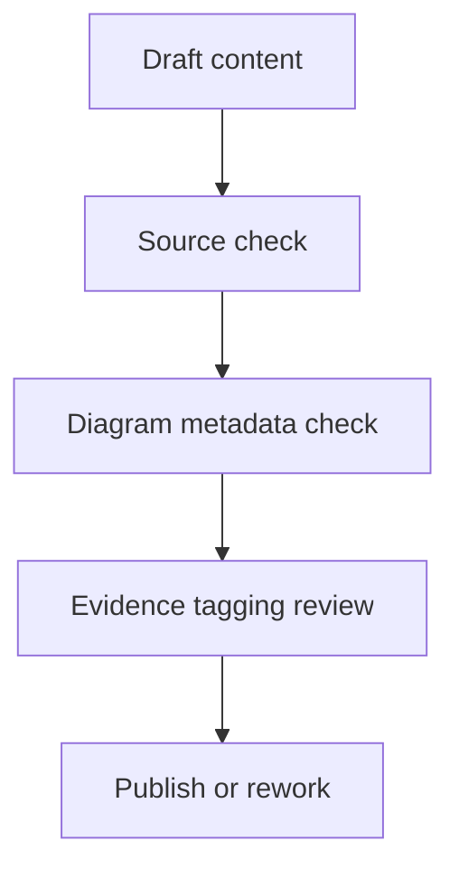

---
content_sources:
  diagrams:
    - id: content-validation-lifecycle
      type: flowchart
      source: self-generated
      justification: "Validation workflow synthesized from repository quality gates and Microsoft Learn-first documentation policy."
      based_on:
        - https://learn.microsoft.com/en-us/azure/architecture/
        - https://learn.microsoft.com/en-us/azure/well-architected/
---
# Content Validation Status

This page tracks whether major documentation areas have been reviewed for source integrity, diagram metadata, evidence quality, and internal consistency.

## Validation methodology

Each content area is checked for:

1. Microsoft Learn traceability. [Documented]
2. Mermaid diagram presence with `diagram-id` metadata. [Validated]
3. Evidence tags used where claims require strength labeling. [Validated]
4. Alignment with the repository information architecture. [Observed]

## Current status

| Section | Source coverage | Diagram metadata | Evidence tagging | Validation status |
|---|---|---|---|---|
| Start Here | Complete | Complete | In review | Ready for review |
| Platform | Complete | Complete | In review | Ready for review |
| WAF | Complete | Complete | In review | Ready for review |
| Patterns | Partial (13 pattern pages plus index) | Complete | In review | In review |
| Workload Guides | Partial (5 of 8 planned workload families published) | Complete for published guides | In review | In review |
| Operations | Complete | Complete | In review | Ready for review |
| Design Labs | Partial (3 of 8 planned labs published) | Complete for published labs | In review | In review |
| Reference | Complete | Complete | In review | Ready for review |

<!-- diagram-id: content-validation-lifecycle -->

## Interpretation notes

- **Complete** means the criterion is present and reviewable, not that every technical claim has production proof. [Correlated]
- **Ready for review** means the page can enter a stricter architecture or editorial review loop. [Observed]
- **In review** means content exists and is structurally reviewable, but the section is still incomplete or only partially populated against the intended scope. [Observed]
- **Pending** means content is absent or lacks enough structure to evaluate. [Unknown]

## Microsoft Learn references

- https://learn.microsoft.com/en-us/azure/architecture/
- https://learn.microsoft.com/en-us/azure/well-architected/
