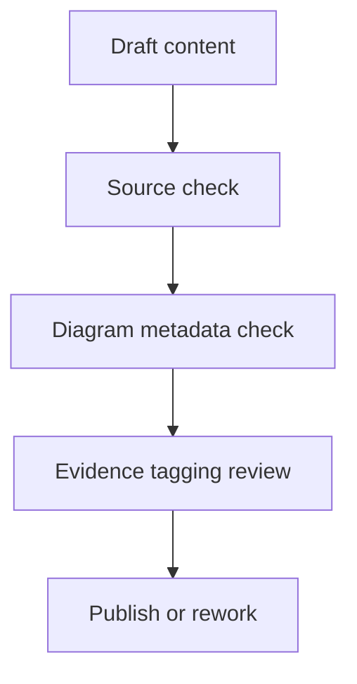

---
content_sources:
  diagrams:
    - id: content-validation-lifecycle
      type: flowchart
      source: self-generated
      justification: "Validation workflow synthesized from repository quality gates and Microsoft Learn-first documentation policy."
      based_on:
        - https://learn.microsoft.com/en-us/azure/architecture/
        - https://learn.microsoft.com/en-us/azure/well-architected/
---
# Content Validation Status

This page tracks whether major documentation areas have been reviewed for source integrity, diagram metadata, evidence quality, and internal consistency.

## Validation methodology

Each content area is checked for:

1. Microsoft Learn traceability — every `content_sources` URL is topically relevant and uses `en-us` locale. [Validated]
2. Mermaid diagram presence with `diagram-id` metadata matching `content_sources.diagrams[].id`. [Validated]
3. Tail sections — `## See Also` with meaningful internal cross-links and `## Sources` with external references. [Validated]
4. Alignment with the repository information architecture. [Observed]

This repository uses `content_sources` frontmatter plus `validate_content_sources.py` and `validate_mslearn_urls.py` for provenance enforcement. Per-file `content_validation` blocks (used by the container-apps sibling) are not used here.

## Current status

| Section | Pages | Source coverage | Diagram metadata | Tail sections | Validation status |
|---|---|---|---|---|---|
| Start Here | 7 | Complete | Complete | Complete | Verified |
| Platform | 12 | Complete | Complete | Complete | Verified |
| WAF | 9 | Complete | Complete | Complete | Verified |
| Patterns | 21 | Complete | Complete | Complete | Verified |
| Workload Guides | 33 (6 families) | Complete | Complete | Complete | Verified |
| Operations | 9 | Complete | Complete | Complete | Verified |
| Practical Journey | 10 (5 stages + hubs) | Complete | Complete | Complete | Verified |
| Design Labs | 5 (3 labs + index + methodology) | Complete | Complete | Complete | Verified |
| Architecture Reviews | 1 | Complete | Complete | Complete | Verified |
| Reference | 14 | Complete | Complete | Complete | Verified |
| Contributing | 4 (series contracts) | Complete | Complete | Complete | Verified |

<!-- diagram-id: content-validation-lifecycle -->

```mermaid
flowchart TD
    A[Draft content] --> B[Source check]
    B --> C[Diagram metadata check]
    C --> D[Evidence tagging review]
    D --> E[Publish or rework]
```

## Interpretation notes

- **Complete** means the criterion is present and reviewable across all published pages in the section. [Observed]
- **Verified** means the section passed automated validation (`validate_content_sources.py`, `mkdocs build --strict`) and manual audit of source relevance, diagram metadata, and tail sections. [Observed]

## See Also

- [WAF Pillar to Pattern Map](waf-pillar-to-pattern-map.md)
- [Validation Status](validation-status.md)
- [Source Index](source-index.md)

## Sources

- https://learn.microsoft.com/en-us/azure/architecture/
- https://learn.microsoft.com/en-us/azure/well-architected/

