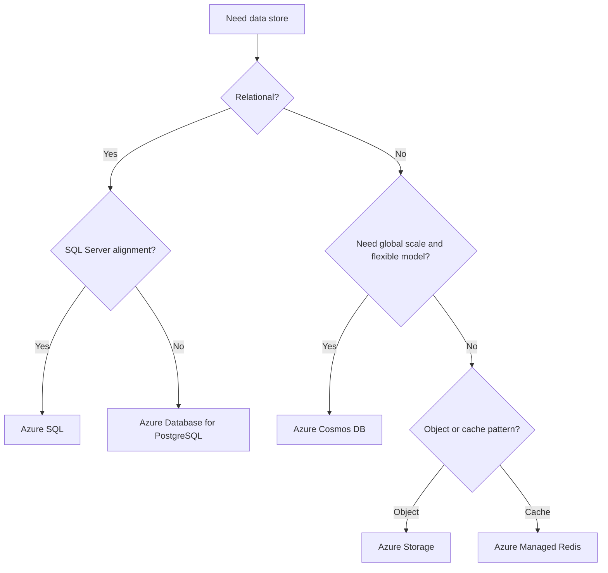

# Data Selection Cheatsheet

Use this page to narrow the primary Azure data store for a workload. Confirm final choice with workload-specific access, consistency, and analytics needs.

| Service | Data Model | Consistency | Max Scale | Cost Tier | Best For |
|---|---|---|---|---|---|
| Azure SQL Database | Relational | Strong transactional consistency | High for OLTP scale-up and managed scale patterns | Moderate | Transactional apps and structured reporting |
| Azure Cosmos DB | Document, key-value, graph, column-family APIs | Tunable depending on API and configuration | Very high global and partitioned scale | Moderate to high | Globally distributed and low-latency operational data |
| Azure Database for PostgreSQL | Relational with PostgreSQL ecosystem | Strong transactional consistency | High for app data and extensions-based workloads | Moderate | PostgreSQL-native apps and open-source alignment |
| Azure Storage | Object, file, queue, table primitives | Service-specific | Very high for durable object storage | Low | Files, blobs, backups, static content, archives |
| Azure Managed Redis (formerly Azure Cache for Redis) | In-memory key-value cache | Memory-based, application-dependent patterns | High for low-latency cache use cases | Moderate | Session state, caching, transient fast access |

## Selection notes

- Choose **Azure SQL** when transactions, familiar relational semantics, and managed PaaS are the priority. [Documented]
- Choose **Cosmos DB** when partitioned scale, flexible schemas, or global distribution dominate. [Documented]
- Choose **PostgreSQL** when application portability or PostgreSQL features matter. [Observed]
- Choose **Storage** for durable objects, not as a substitute for transactional databases. [Validated]
- Choose **Azure Managed Redis** as a cache or transient state accelerator, not the authoritative system of record. [Documented]

[Documented] Microsoft has announced the transition from Azure Cache for Redis to Azure Managed Redis. See [Azure Cache for Redis overview](https://learn.microsoft.com/en-us/azure/azure-cache-for-redis/cache-overview).

<!-- diagram-id: data-selection-map -->

## See Also

- [Architecture Decision Matrix](architecture-decision-matrix.md) — workload-to-service selection and sibling deep-guide entry points
- [Series Portal](series-portal.md) — route to a sibling deep-guide once the service is chosen
- [Compute Selection Cheatsheet](compute-selection-cheatsheet.md) — narrow compute options
- [Messaging Selection Cheatsheet](messaging-selection-cheatsheet.md) — narrow messaging primitives
- [Network Topology Cheatsheet](network-topology-cheatsheet.md) — narrow networking topology

## Sources

- https://learn.microsoft.com/en-us/azure/architecture/guide/technology-choices/data-store-overview
- https://learn.microsoft.com/en-us/azure/architecture/guide/technology-choices/
