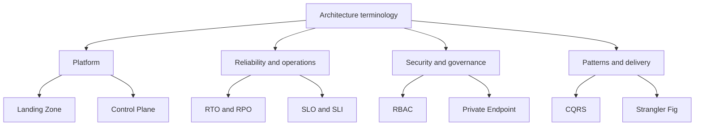

---
content_sources:
  diagrams:
    - id: glossary-term-categories
      type: flowchart
      source: self-generated
      justification: "Glossary category diagram synthesized from Azure architecture, Well-Architected, patterns, and operations terminology already used throughout the guide."
      based_on:
        - https://learn.microsoft.com/en-us/azure/architecture/
        - https://learn.microsoft.com/en-us/azure/well-architected/
        - https://learn.microsoft.com/en-us/azure/architecture/patterns/
        - https://learn.microsoft.com/en-us/azure/cloud-adoption-framework/ready/landing-zone/
        - https://learn.microsoft.com/en-us/azure/azure-resource-manager/management/control-plane-and-data-plane
---
# Glossary

Use this glossary to normalize the architecture vocabulary used across the guide so reviews, labs, and decision records use the same terms consistently. [Documented]

## Architecture terms

| Term | Definition |
|---|---|
| Landing Zone | A landing zone is a predesigned Azure environment that establishes subscription, identity, policy, network, and management foundations for workloads. |
| WAF Pillar | A WAF pillar is one of the Azure Well-Architected Framework quality dimensions used to assess architecture trade-offs. |
| Availability Zone | An Availability Zone is a physically separate location within an Azure region designed to improve fault isolation. |
| Region Pair | A region pair is Microsoft's preferred pairing of Azure regions for certain disaster recovery and platform update considerations. |
| RTO | Recovery Time Objective is the maximum acceptable time to restore a service after disruption. |
| RPO | Recovery Point Objective is the maximum acceptable amount of data loss measured by time. |
| SLA | A Service Level Agreement is the provider's contractual availability commitment for a service. |
| SLO | A Service Level Objective is the target reliability or performance level that a team commits to achieve. |
| SLI | A Service Level Indicator is a measured metric, such as success rate or latency, used to evaluate an SLO. |
| Hub-Spoke | Hub-spoke is a network topology that centralizes shared connectivity and security services in a hub connected to spoke VNets. |
| Virtual WAN | Virtual WAN is Azure's managed networking construct for large-scale branch, hybrid, and global connectivity. |
| Private Endpoint | A Private Endpoint is a private IP address in a VNet that maps to a supported Azure service over Private Link. |
| Private Link | Private Link is the Azure capability that delivers private connectivity to supported platform and customer services. |
| Managed Identity | A Managed Identity is an Entra-backed service identity that lets Azure resources authenticate without storing secrets in code. |
| RBAC | Role-Based Access Control is Azure's authorization model for assigning actions to identities at defined scopes. |
| PIM | Privileged Identity Management is the Entra feature that enables just-in-time and governed privileged role activation. |
| NSG | A Network Security Group is a rules-based packet filter used to allow or deny traffic to Azure subnets and NICs. |
| UDR | A User-Defined Route is a custom route that overrides default Azure routing behavior for selected traffic. |
| Zero Trust | Zero Trust is a security model that continuously verifies identity, device, network, and workload context instead of assuming trust. |
| CQRS | Command Query Responsibility Segregation separates write operations from read operations so each path can evolve independently. |
| Event Sourcing | Event Sourcing persists state as a sequence of domain events that can be replayed to reconstruct outcomes. |
| Saga | A Saga is a distributed transaction coordination pattern that uses compensating actions instead of a single global commit. |
| Circuit Breaker | A Circuit Breaker is a resilience pattern that stops repeated calls to an unhealthy dependency to limit cascading failure. |
| Bulkhead | A Bulkhead is a resilience pattern that isolates resources so one failing component cannot exhaust all shared capacity. |
| Retry | A Retry pattern re-attempts transiently failing operations with controlled delay and limits. |
| Strangler Fig | Strangler Fig is a migration pattern that incrementally replaces legacy functionality behind an existing system boundary. |
| Blue-Green Deployment | Blue-green deployment releases a new environment beside the current one and switches traffic only after validation. |
| Canary Deployment | Canary deployment exposes a new release to a small subset of users or traffic before wider rollout. |
| Stamp | A stamp is a repeatable deployment unit that packages app, data, and operational dependencies for scaled replication. |
| ADVR | ADVR is the repository's architecture decision and validation record structure for documenting options, evidence, risks, and tests. |
| Evidence Tag | An evidence tag is a bracketed label such as [Documented] or [Validated] that marks the strength of a claim. |
| Architecture Decision Record | An Architecture Decision Record is a concise document that captures a specific architecture choice, context, and rationale. |
| FinOps | FinOps is the operating model that aligns engineering, finance, and product teams around cloud cost visibility and optimization. |
| IaC | Infrastructure as Code is the practice of defining and managing infrastructure through versioned, reviewable code. |
| Bicep | Bicep is Microsoft's domain-specific language for declarative Azure resource deployments over ARM. |
| Control Plane | The control plane is the management interface used to create, configure, and govern Azure resources. |
| Data Plane | The data plane is the runtime interface through which applications read, write, and process workload data. |
| Policy as Code | Policy as Code is the practice of expressing governance rules in versioned policy definitions enforced automatically. |
| Observability | Observability is the ability to understand system state from telemetry such as logs, metrics, traces, and events. |
| Defender for Cloud | Defender for Cloud is Microsoft's cloud security posture and workload protection platform for Azure and multicloud estates. |
| Sentinel | Microsoft Sentinel is Microsoft's cloud-native SIEM and SOAR service for threat detection and response. |
| Platform Team | A platform team is the group that standardizes shared foundations, guardrails, and paved-road capabilities for application teams. |
| Workload | A workload is the application or business system being designed, deployed, operated, and reviewed on Azure. |

## Usage notes

- Definitions here are intentionally one-sentence working definitions optimized for design reviews rather than encyclopedia-style treatment. [Observed]
- When a term has both product-specific and pattern-specific meanings, the definition follows the repository's architecture-review usage. [Correlated]

<!-- diagram-id: glossary-term-categories -->

## Microsoft Learn references

- https://learn.microsoft.com/en-us/azure/architecture/
- https://learn.microsoft.com/en-us/azure/well-architected/
- https://learn.microsoft.com/en-us/azure/cloud-adoption-framework/ready/landing-zone/
- https://learn.microsoft.com/en-us/azure/azure-resource-manager/management/control-plane-and-data-plane
