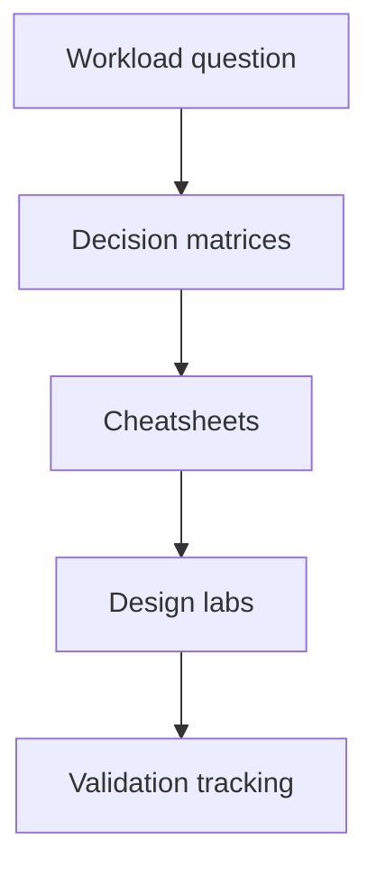

---
content_sources:
  diagrams:
    - id: reference-index-map
      type: flowchart
      source: self-generated
      justification: "Reference section navigation map synthesized from the repository information architecture and Azure Architecture Center guidance."
      based_on:
        - https://learn.microsoft.com/en-us/azure/architecture/
---
# Reference

Use this section for fast comparisons, selection aids, and validation tracking. The pages here are optimized for decision support rather than deep narrative.

## Quick links

| Page | Purpose |
|---|---|
| [Architecture Decision Matrix](architecture-decision-matrix.md) | Map workload types to service combinations. |
| [Compute Selection Cheatsheet](compute-selection-cheatsheet.md) | Compare Azure compute choices quickly. |
| [Data Selection Cheatsheet](data-selection-cheatsheet.md) | Choose data platforms by model and scale. |
| [Messaging Selection Cheatsheet](messaging-selection-cheatsheet.md) | Pick the right messaging primitive. |
| [Network Topology Cheatsheet](network-topology-cheatsheet.md) | Compare hub-spoke, Virtual WAN, and flat VNet models. |
| [Resilience Targets: RTO/RPO](resilience-targets-rto-rpo.md) | Align recovery targets to workload tier. |
| [WAF Pillar to Pattern Map](waf-pillar-to-pattern-map.md) | Connect Well-Architected priorities to patterns. |
| [Content Validation Status](content-validation-status.md) | Track content evidence and review state. |
| [Validation Status](validation-status.md) | Track tutorial and lab test status. |

## How to use the reference set

- Start with workload type and business risk. [Inferred]
- Use a cheatsheet to narrow options. [Observed]
- Confirm with the matching design lab and workload guide. [Validated]
- Record any uncertainty with an evidence tag before implementation. [Documented]

<!-- diagram-id: reference-index-map -->

## Microsoft Learn references

- https://learn.microsoft.com/en-us/azure/architecture/
- https://learn.microsoft.com/en-us/azure/well-architected/
