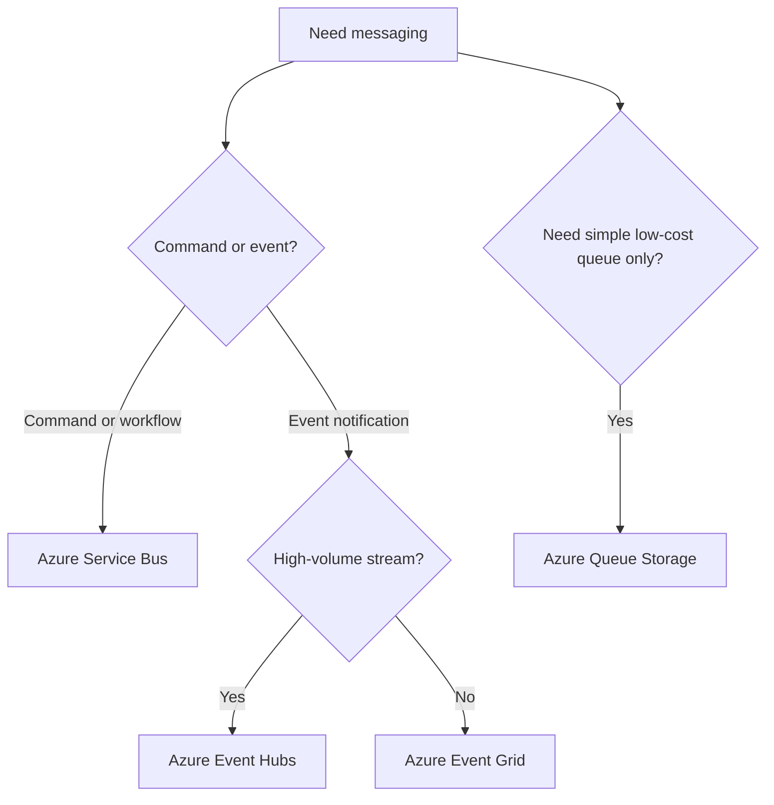

# Messaging Selection Cheatsheet

Use this page to decide which Azure messaging service best matches the interaction pattern.

| Service | Pattern | Ordering | Throughput | Delivery | Cost |
|---|---|---|---|---|---|
| Azure Service Bus | Enterprise queues and topics | Stronger support for ordered workflows within design limits | Medium to high | Durable messaging, retries, dead-lettering | Moderate |
| Azure Event Grid | Event routing and fan-out | Not designed for strict ordered streams | High for event distribution | Push-based event delivery and subscription model | Low to moderate |
| Azure Event Hubs | High-volume event ingestion and streaming | Partition-based ordering | Very high | Stream ingestion with consumer groups | Moderate |
| Azure Queue Storage | Simple application queues | Basic ordering expectations only | Moderate | Durable queueing with simpler feature set | Low |

## Quick guidance

- Use **Service Bus** for commands, workflows, and enterprise integration. [Documented]
- Use **Event Grid** for reactive event notifications and routing. [Documented]
- Use **Event Hubs** for telemetry, logs, and large-scale stream ingestion. [Documented]
- Use **Queue Storage** when you need simple, low-cost queueing without enterprise broker features. [Observed]

<!-- diagram-id: messaging-selection-map -->

## See Also

- [Architecture Decision Matrix](architecture-decision-matrix.md) — workload-to-service selection and sibling deep-guide entry points
- [Series Portal](series-portal.md) — route to a sibling deep-guide once the service is chosen
- [Compute Selection Cheatsheet](compute-selection-cheatsheet.md) — narrow compute options
- [Data Selection Cheatsheet](data-selection-cheatsheet.md) — narrow data platform options
- [Network Topology Cheatsheet](network-topology-cheatsheet.md) — narrow networking topology

## Sources

- https://learn.microsoft.com/en-us/azure/architecture/guide/technology-choices/messaging
- https://learn.microsoft.com/en-us/azure/architecture/guide/architecture-styles/event-driven
