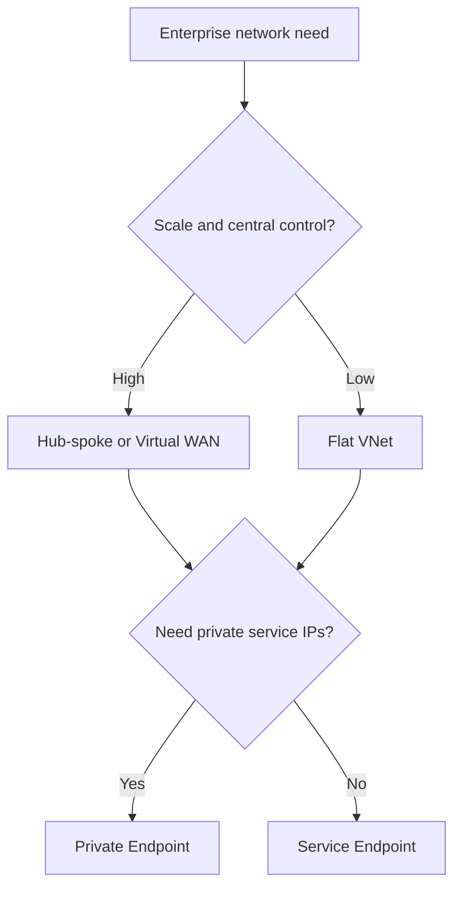

---
content_sources:
  diagrams:
    - id: network-topology-map
      type: flowchart
      source: mslearn-adapted
      mslearn_url: https://learn.microsoft.com/en-us/azure/architecture/networking/architecture/hub-spoke
---
# Network Topology Cheatsheet

This page compares common Azure network topologies and the quick choice between Private Endpoints and Service Endpoints.

## Topology decision table

| Topology | Best For | Strengths | Weaknesses | Evidence |
|---|---|---|---|---|
| Hub-spoke | Centralized enterprise control with shared connectivity services | Clear separation of shared and app VNets, reusable inspection and DNS | More routing and governance complexity | [Documented] |
| Virtual WAN | Large-scale branch, hybrid, and global connectivity | Simplifies distributed connectivity management | May be excessive for small estates | [Correlated] |
| Flat VNet | Small or early-stage environments | Simple to deploy and troubleshoot | Weak segmentation and poor long-term scale | [Observed] |

## Private Endpoint vs Service Endpoint

| Choice | Use when | Benefit | Limitation |
|---|---|---|---|
| Private Endpoint | Private IP reachability and strongest service isolation are required | Removes public exposure path for supported services | Adds DNS and endpoint lifecycle complexity |
| Service Endpoint | Simpler service access from selected VNets is sufficient | Easier than private endpoint patterns | Service still has public endpoint semantics |

<!-- diagram-id: network-topology-map -->

## Microsoft Learn references

- https://learn.microsoft.com/en-us/azure/architecture/networking/architecture/hub-spoke
- https://learn.microsoft.com/en-us/azure/architecture/guide/technology-choices/
