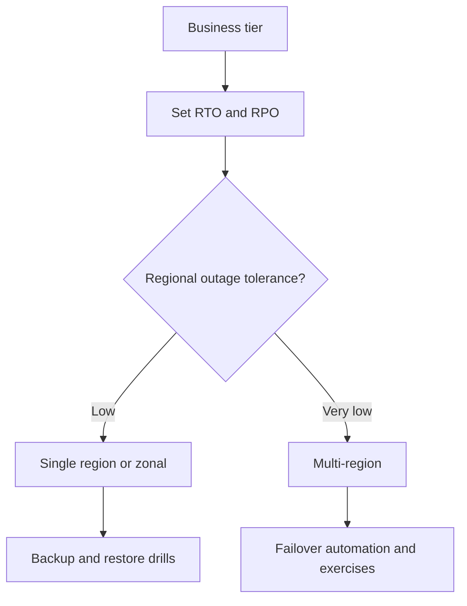

---
content_sources:
  diagrams:
    - id: resilience-rto-rpo-map
      type: flowchart
      source: mslearn-adapted
      mslearn_url: https://learn.microsoft.com/en-us/azure/reliability/overview
---
# Resilience Targets: RTO and RPO

Use this page to set recovery expectations before choosing topology, replication, and failover patterns.

## Suggested targets by workload tier

| Workload tier | Typical business meaning | Target RTO | Target RPO | Recommended posture |
|---|---|---|---|---|
| Critical | Revenue, safety, or highly regulated workflows | Minutes to less than 1 hour | Near-zero to minutes | Multi-region design, tested failover, strong automation |
| Important | Core internal or customer-facing capability | Less than 4 hours | Minutes to 1 hour | Zone redundancy plus defined recovery plan |
| Standard | Business-supporting but tolerable interruption | Same day | Hours | Single-region resilience with backup and restore drills |
| Dev/Test | Non-production experimentation | 1 to 2 days | 1 day or more | Minimal recovery investment |

## Azure service SLA orientation

| Service type | Reliability note |
|---|---|
| Zonal or zone-redundant PaaS | Better resilience to datacenter-level faults where supported. [Documented] |
| Regional PaaS without multi-region failover | Recovery is limited by regional outage posture and service capabilities. [Documented] |
| Multi-region active-passive | Lower complexity than active-active but slower failover. [Inferred] |
| Multi-region active-active | Best steady-state availability posture, highest design and ops complexity. [Correlated] |

## Single-region vs multi-region RTO comparison

| Pattern | Expected recovery profile |
|---|---|
| Single-region with backups | Longer RTO and higher data-loss risk under regional outage. [Inferred] |
| Single-region with zone redundancy | Better intra-region fault tolerance, little help for region loss. [Documented] |
| Multi-region active-passive | Faster recovery if failover is rehearsed and dependencies are paired. [Validated] |
| Multi-region active-active | Fastest customer recovery when data and routing patterns support it. [Assumed] |

<!-- diagram-id: resilience-rto-rpo-map -->

## Microsoft Learn references

- https://learn.microsoft.com/en-us/azure/reliability/overview
- https://learn.microsoft.com/en-us/azure/well-architected/reliability/
