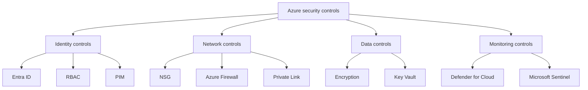

---
content_sources:
  diagrams:
    - id: security-control-mapping-categories
      type: flowchart
      source: self-generated
      justification: "Control-category diagram synthesized from Microsoft Learn guidance for Azure identity, network, data protection, and security operations controls."
      based_on:
        - https://learn.microsoft.com/en-us/azure/well-architected/security/
        - https://learn.microsoft.com/en-us/azure/role-based-access-control/overview
        - https://learn.microsoft.com/en-us/entra/id-governance/privileged-identity-management/pim-configure
        - https://learn.microsoft.com/en-us/azure/firewall/overview
        - https://learn.microsoft.com/en-us/azure/private-link/private-endpoint-overview
        - https://learn.microsoft.com/en-us/azure/key-vault/general/overview
        - https://learn.microsoft.com/en-us/azure/defender-for-cloud/defender-for-cloud-introduction
        - https://learn.microsoft.com/en-us/azure/sentinel/overview
---
# Security Control Mapping

Use this page to map core Azure security controls to the Azure Well-Architected Framework security pillar so design reviews can connect platform choices to explicit control objectives. [Documented]

## Control mapping table

| Control | Azure Service | WAF Pillar | Evidence Level | MS Learn URL |
|---|---|---|---|---|
| Central identity and authentication | Microsoft Entra ID | Security | [Documented] | https://learn.microsoft.com/en-us/azure/architecture/guide/multitenant/considerations/identity |
| Least-privilege authorization | Azure RBAC | Security | [Documented] | https://learn.microsoft.com/en-us/azure/role-based-access-control/overview |
| Just-in-time privileged access | Microsoft Entra PIM | Security | [Documented] | https://learn.microsoft.com/en-us/entra/id-governance/privileged-identity-management/pim-configure |
| Workload-to-resource secretless access | Managed Identities for Azure resources | Security | [Documented] | https://learn.microsoft.com/en-us/azure/active-directory/managed-identities-azure-resources/overview |
| Subnet traffic segmentation | Network Security Groups | Security | [Documented] | https://learn.microsoft.com/en-us/azure/virtual-network/network-security-groups-overview |
| Centralized L3-L7 traffic inspection | Azure Firewall | Security | [Documented] | https://learn.microsoft.com/en-us/azure/firewall/overview |
| Private service access path | Azure Private Link / Private Endpoint | Security | [Documented] | https://learn.microsoft.com/en-us/azure/private-link/private-endpoint-overview |
| Route enforcement through inspection points | User-defined routes | Security | [Observed] | https://learn.microsoft.com/en-us/azure/virtual-network/virtual-networks-udr-overview |
| DDoS protection for internet-facing workloads | Azure DDoS Protection | Security | [Documented] | https://learn.microsoft.com/en-us/azure/ddos-protection/ddos-protection-overview |
| Encryption for data at rest | Storage encryption and service-managed encryption | Security | [Documented] | https://learn.microsoft.com/en-us/azure/storage/common/storage-service-encryption |
| Customer-controlled key management | Azure Key Vault | Security | [Documented] | https://learn.microsoft.com/en-us/azure/key-vault/general/overview |
| Secrets, keys, and certificate lifecycle | Azure Key Vault | Security | [Documented] | https://learn.microsoft.com/en-us/azure/architecture/patterns/external-configuration-store |
| Database encryption posture | Azure SQL transparent data encryption | Security | [Documented] | https://learn.microsoft.com/en-us/azure/azure-sql/database/transparent-data-encryption-tde-overview |
| Threat protection and posture management | Microsoft Defender for Cloud | Security | [Documented] | https://learn.microsoft.com/en-us/azure/defender-for-cloud/defender-for-cloud-introduction |
| SIEM and SOAR correlation | Microsoft Sentinel | Security | [Documented] | https://learn.microsoft.com/en-us/azure/sentinel/overview |
| Platform and workload telemetry collection | Azure Monitor | Security | [Correlated] | https://learn.microsoft.com/en-us/azure/azure-monitor/overview |

## Control usage notes

- Identity-first controls usually provide the highest leverage because they reduce standing privilege and secret sprawl across workloads. [Inferred]
- Network controls are most effective when paired with identity and monitoring controls instead of used as a perimeter-only strategy. [Correlated]
- Data protection controls need both encryption and auditable key access to produce reviewable security evidence. [Validated]

<!-- diagram-id: security-control-mapping-categories -->

## Microsoft Learn references

- https://learn.microsoft.com/en-us/azure/well-architected/security/
- https://learn.microsoft.com/en-us/azure/role-based-access-control/overview
- https://learn.microsoft.com/en-us/azure/private-link/private-endpoint-overview
- https://learn.microsoft.com/en-us/azure/key-vault/general/overview
