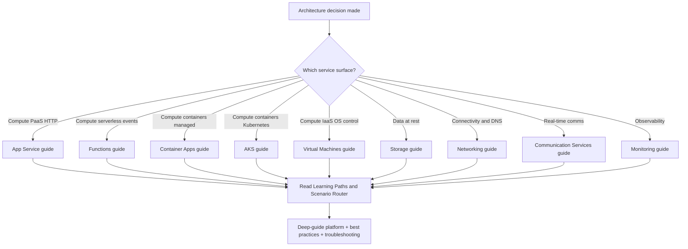

# Series Portal

Once an architecture decision has narrowed the workload to a specific Azure service, use this page to jump directly to the sibling deep-guide for that service. This is a router, not a selection matrix — for service-selection guidance, start with the [Architecture Decision Matrix](architecture-decision-matrix.md), one of the workload cheatsheets, or the [scenario router](../start-here/scenario-router.md) in Start Here.

Each entry links to a companion practical guide that follows the same core structure documented in the [Series Lab Contract](../contributing/series-lab-contract.md): Start Here → Platform → Best Practices → Operations → Troubleshooting → Reference.

## When to use this portal

- You already know which Azure service the workload will run on. [Documented]
- You need production-grade platform, best-practices, or troubleshooting depth beyond what a decision matrix or cheatsheet provides. [Inferred]
- You are cross-referencing a multi-service architecture (for example, App Service front + Functions back + Storage) and want each service's deep guide side by side. [Correlated]

## Sibling deep-guides

Each row links to the deployed deep-guide site plus its two canonical entry points: **Learning Paths** (role-based reading paths) and **Scenario Router** (symptom or workload-first routing). Both entry points follow the series-wide Start Here shape rolled out across the sibling repositories. [Documented]

| Repository | Focus area | When to use | Key entry points |
|---|---|---|---|
| [Azure Virtual Machines](https://yeongseon.github.io/azure-virtual-machine-practical-guide/) | Compute — IaaS, custom OS, lift-and-shift | Workload requires OS-level control, custom kernel, legacy binaries, or GPU workloads. [Documented] | [Learning Paths](https://yeongseon.github.io/azure-virtual-machine-practical-guide/start-here/learning-paths/) · [Scenario Router](https://yeongseon.github.io/azure-virtual-machine-practical-guide/start-here/scenario-router/) |
| [Azure Networking](https://yeongseon.github.io/azure-networking-practical-guide/) | Connectivity — VNet, Private Link, Front Door, DNS | Designing hub-spoke or Virtual WAN topology, or troubleshooting hybrid connectivity. [Documented] | [Learning Paths](https://yeongseon.github.io/azure-networking-practical-guide/start-here/learning-paths/) · [Scenario Router](https://yeongseon.github.io/azure-networking-practical-guide/start-here/scenario-router/) |
| [Azure Storage](https://yeongseon.github.io/azure-storage-practical-guide/) | Data at rest — Blob, Files, Tables, Queues | Selecting storage tier, replicating across regions, or securing with Private Endpoints. [Documented] | [Learning Paths](https://yeongseon.github.io/azure-storage-practical-guide/start-here/learning-paths/) · [Scenario Router](https://yeongseon.github.io/azure-storage-practical-guide/start-here/scenario-router/) |
| [Azure App Service](https://yeongseon.github.io/azure-app-service-practical-guide/) | Compute — managed PaaS for HTTP workloads | Hosting web apps, APIs, or Windows/Linux runtimes with managed platform. [Documented] | [Learning Paths](https://yeongseon.github.io/azure-app-service-practical-guide/start-here/learning-paths/) · [Scenario Router](https://yeongseon.github.io/azure-app-service-practical-guide/start-here/scenario-router/) |
| [Azure Functions](https://yeongseon.github.io/azure-functions-practical-guide/) | Compute — event-driven serverless | Bursty event processing, timers, webhooks, or lightweight integration glue. [Documented] | [Learning Paths](https://yeongseon.github.io/azure-functions-practical-guide/start-here/learning-paths/) · Scenario Router pending — check [Start Here](https://yeongseon.github.io/azure-functions-practical-guide/start-here/) |
| [Azure Communication Services](https://yeongseon.github.io/azure-communication-services-practical-guide/) | Communications — chat, voice, video, SMS | Embedding real-time communications into apps or building contact-center flows. [Documented] | [Learning Paths](https://yeongseon.github.io/azure-communication-services-practical-guide/start-here/learning-paths/) · [Scenario Router](https://yeongseon.github.io/azure-communication-services-practical-guide/start-here/scenario-router/) |
| [Azure Container Apps](https://yeongseon.github.io/azure-container-apps-practical-guide/) | Compute — managed container runtime | Running containers without operating a full Kubernetes cluster; KEDA-driven scale to zero. [Documented] | [Learning Paths](https://yeongseon.github.io/azure-container-apps-practical-guide/start-here/learning-paths/) · [Scenario Router](https://yeongseon.github.io/azure-container-apps-practical-guide/start-here/scenario-router/) |
| [Azure Kubernetes Service (AKS)](https://yeongseon.github.io/azure-kubernetes-service-practical-guide/) | Compute — managed Kubernetes | Full Kubernetes control, service mesh, operators, or platform-team-owned clusters. [Documented] | [Learning Paths](https://yeongseon.github.io/azure-kubernetes-service-practical-guide/start-here/learning-paths/) · [Scenario Router](https://yeongseon.github.io/azure-kubernetes-service-practical-guide/start-here/scenario-router/) |
| [Azure Monitoring](https://yeongseon.github.io/azure-monitoring-practical-guide/) | Observability — Log Analytics, Metrics, alerts | Setting up diagnostics, KQL queries, or cross-service telemetry pipelines. [Documented] | [Learning Paths](https://yeongseon.github.io/azure-monitoring-practical-guide/start-here/learning-paths/) · [Scenario Router](https://yeongseon.github.io/azure-monitoring-practical-guide/start-here/scenario-router/) |
| [Azure Architecture](https://yeongseon.github.io/azure-architecture-practical-guide/) | This guide — architecture design, reviews, patterns | Architecture-level decisions, workload blueprints, Well-Architected reviews, design labs. [Documented] | [Learning Paths](../start-here/learning-paths.md) · [Scenario Router](../start-here/scenario-router.md) |

## Route from architecture decisions to service depth

Use this pattern when moving from an architecture cheatsheet or decision matrix into a service-specific deep guide.

<!-- diagram-id: series-portal-router -->

## Selection notes

- The Container Apps and AKS guides both cover container workloads but target different ownership models. Choose Container Apps when the workload does not need cluster-level customization; choose AKS when the platform team owns operator-grade control. [Correlated]
- The App Service and Functions guides frequently pair for HTTP + background patterns. Their Learning Paths cross-reference each other's runtime and hosting concepts. [Observed]
- The Networking and Storage guides are prerequisites for most workload deep-guides because Private Endpoints, DNS, and managed identities are pervasive. [Inferred]
- The Monitoring guide is horizontally applicable to every workload; its KQL query packs are the fastest way to build diagnostic dashboards for a running service. [Documented]
- Every sibling deep-guide follows the same top-level information architecture (Start Here → Platform → Best Practices → Operations → Troubleshooting → Reference), so once you learn one guide's navigation, the others feel familiar. [Documented]

## Notes on entry-point stability

- **Learning Paths** and **Scenario Router** pages exist under every sibling repository's `docs/start-here/` and are rendered on the deployed MkDocs Material site at `/start-here/learning-paths/` and `/start-here/scenario-router/` respectively. [Documented]
- The Azure Functions guide's Scenario Router is intentionally deferred — see [Series Lab Contract](../contributing/series-lab-contract.md) for scope details. Its Learning Paths page is live. [Documented]
- If any linked entry-point URL returns a 404, browse to the deep-guide home in that row's first column and use the site navigation to locate Learning Paths or Scenario Router. [Documented]

## See Also

- [Architecture Decision Matrix](architecture-decision-matrix.md) — service selection before routing here
- [Compute Selection Cheatsheet](compute-selection-cheatsheet.md) — narrow compute options
- [Data Selection Cheatsheet](data-selection-cheatsheet.md) — narrow data platform options
- [Messaging Selection Cheatsheet](messaging-selection-cheatsheet.md) — narrow messaging primitives
- [Network Topology Cheatsheet](network-topology-cheatsheet.md) — narrow networking topology
- [Series Lab Contract](../contributing/series-lab-contract.md) — the shape every sibling repo follows

## Sources

- https://learn.microsoft.com/en-us/azure/architecture/
- https://learn.microsoft.com/en-us/azure/architecture/guide/technology-choices/
