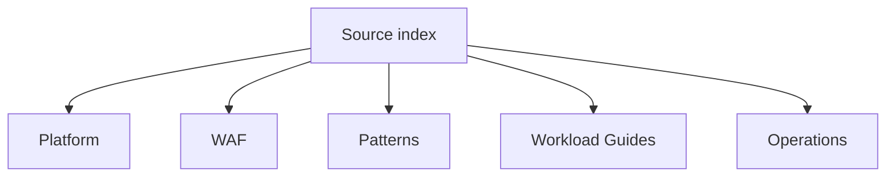

---
content_sources:
  diagrams:
    - id: source-index-sections
      type: flowchart
      source: self-generated
      justification: "Source-index diagram synthesized from the repository information architecture and the major Microsoft Learn references already used across the guide."
      based_on:
        - https://learn.microsoft.com/en-us/azure/architecture/
        - https://learn.microsoft.com/en-us/azure/well-architected/
        - https://learn.microsoft.com/en-us/azure/architecture/patterns/
        - https://learn.microsoft.com/en-us/azure/cloud-adoption-framework/ready/landing-zone/
        - https://learn.microsoft.com/en-us/azure/azure-monitor/overview
---
# Source Index

This index catalogs the major Microsoft Learn sources already reused across the guide so reviewers can trace the most important architecture claims back to canonical documentation. [Observed]

## Major Microsoft Learn URLs

| Section | Topic | MS Learn URL |
|---|---|---|
| Platform | Azure Architecture Center | https://learn.microsoft.com/en-us/azure/architecture/ |
| Platform | Azure Architecture Guide | https://learn.microsoft.com/en-us/azure/architecture/guide/ |
| Platform | Technology choices overview | https://learn.microsoft.com/en-us/azure/architecture/guide/technology-choices/ |
| Platform | Compute decision tree | https://learn.microsoft.com/en-us/azure/architecture/guide/technology-choices/compute-decision-tree |
| Platform | Compute overview | https://learn.microsoft.com/en-us/azure/architecture/guide/technology-choices/compute-overview |
| Platform | Data store overview | https://learn.microsoft.com/en-us/azure/architecture/guide/technology-choices/data-store-overview |
| Platform | Data store decision tree | https://learn.microsoft.com/en-us/azure/architecture/guide/technology-choices/data-store-decision-tree |
| Platform | Messaging technology choices | https://learn.microsoft.com/en-us/azure/architecture/guide/technology-choices/messaging |
| Platform | Hub-spoke architecture | https://learn.microsoft.com/en-us/azure/architecture/networking/architecture/hub-spoke |
| Platform | Private Link in hub-spoke networks | https://learn.microsoft.com/en-us/azure/architecture/networking/guide/private-link-hub-spoke-network |
| WAF | Azure Well-Architected Framework | https://learn.microsoft.com/en-us/azure/well-architected/ |
| WAF | Well-Architected pillars | https://learn.microsoft.com/en-us/azure/well-architected/pillars |
| WAF | Security pillar | https://learn.microsoft.com/en-us/azure/well-architected/security/ |
| WAF | Reliability pillar | https://learn.microsoft.com/en-us/azure/well-architected/reliability/ |
| WAF | Performance Efficiency pillar | https://learn.microsoft.com/en-us/azure/well-architected/performance-efficiency/ |
| WAF | Operational Excellence pillar | https://learn.microsoft.com/en-us/azure/well-architected/operational-excellence/ |
| WAF | Cost Optimization pillar | https://learn.microsoft.com/en-us/azure/well-architected/cost-optimization/ |
| WAF | Disaster recovery guidance | https://learn.microsoft.com/en-us/azure/well-architected/reliability/disaster-recovery |
| Patterns | Azure architecture patterns index | https://learn.microsoft.com/en-us/azure/architecture/patterns/ |
| Patterns | Async Request-Reply pattern | https://learn.microsoft.com/en-us/azure/architecture/patterns/async-request-reply |
| Patterns | Queue-Based Load Leveling pattern | https://learn.microsoft.com/en-us/azure/architecture/patterns/queue-based-load-leveling |
| Patterns | Retry pattern | https://learn.microsoft.com/en-us/azure/architecture/patterns/retry |
| Patterns | Circuit Breaker pattern | https://learn.microsoft.com/en-us/azure/architecture/patterns/circuit-breaker |
| Patterns | Health Endpoint Monitoring pattern | https://learn.microsoft.com/en-us/azure/architecture/patterns/health-endpoint-monitoring |
| Patterns | Strangler Fig pattern | https://learn.microsoft.com/en-us/azure/architecture/patterns/strangler-fig |
| Patterns | Saga pattern | https://learn.microsoft.com/en-us/azure/architecture/patterns/saga |
| Patterns | Cache-Aside pattern | https://learn.microsoft.com/en-us/azure/architecture/patterns/cache-aside |
| Patterns | Gateway Routing pattern | https://learn.microsoft.com/en-us/azure/architecture/patterns/gateway-routing |
| Workload Guides | Baseline zone-redundant web app | https://learn.microsoft.com/en-us/azure/architecture/web-apps/app-service/architectures/baseline-zone-redundant |
| Workload Guides | Event-driven architecture style | https://learn.microsoft.com/en-us/azure/architecture/guide/architecture-styles/event-driven |
| Workload Guides | Microservices on Azure | https://learn.microsoft.com/en-us/azure/architecture/microservices/ |
| Workload Guides | Interservice communication | https://learn.microsoft.com/en-us/azure/architecture/microservices/design/interservice-communication |
| Workload Guides | Data considerations for microservices | https://learn.microsoft.com/en-us/azure/architecture/microservices/design/data-considerations |
| Workload Guides | Cloud Adoption Framework landing zones | https://learn.microsoft.com/en-us/azure/cloud-adoption-framework/ready/landing-zone/ |
| Workload Guides | Landing zone design areas | https://learn.microsoft.com/en-us/azure/cloud-adoption-framework/ready/landing-zone/design-areas |
| Workload Guides | Network topology and connectivity design area | https://learn.microsoft.com/en-us/azure/cloud-adoption-framework/ready/landing-zone/design-area/network-topology-and-connectivity |
| Workload Guides | Azure best practices and recommendations | https://learn.microsoft.com/en-us/azure/cloud-adoption-framework/ready/azure-best-practices/ |
| Workload Guides | Manage cloud adoption at scale | https://learn.microsoft.com/en-us/azure/cloud-adoption-framework/manage/ |
| Operations | Azure Monitor overview | https://learn.microsoft.com/en-us/azure/azure-monitor/overview |
| Operations | Azure reliability overview | https://learn.microsoft.com/en-us/azure/reliability/overview |
| Operations | Resiliency framework overview | https://learn.microsoft.com/en-us/azure/architecture/framework/resiliency/overview |
| Operations | Cost framework overview | https://learn.microsoft.com/en-us/azure/architecture/framework/cost/overview |

## Index notes

- These URLs represent the highest-frequency architectural references, not every Microsoft Learn link in the repository. [Correlated]
- The grouping mirrors the guide navigation so source checks can be done section by section. [Validated]

<!-- diagram-id: source-index-sections -->

## Microsoft Learn references

- https://learn.microsoft.com/en-us/azure/architecture/
- https://learn.microsoft.com/en-us/azure/well-architected/
- https://learn.microsoft.com/en-us/azure/architecture/patterns/
- https://learn.microsoft.com/en-us/azure/azure-monitor/overview
