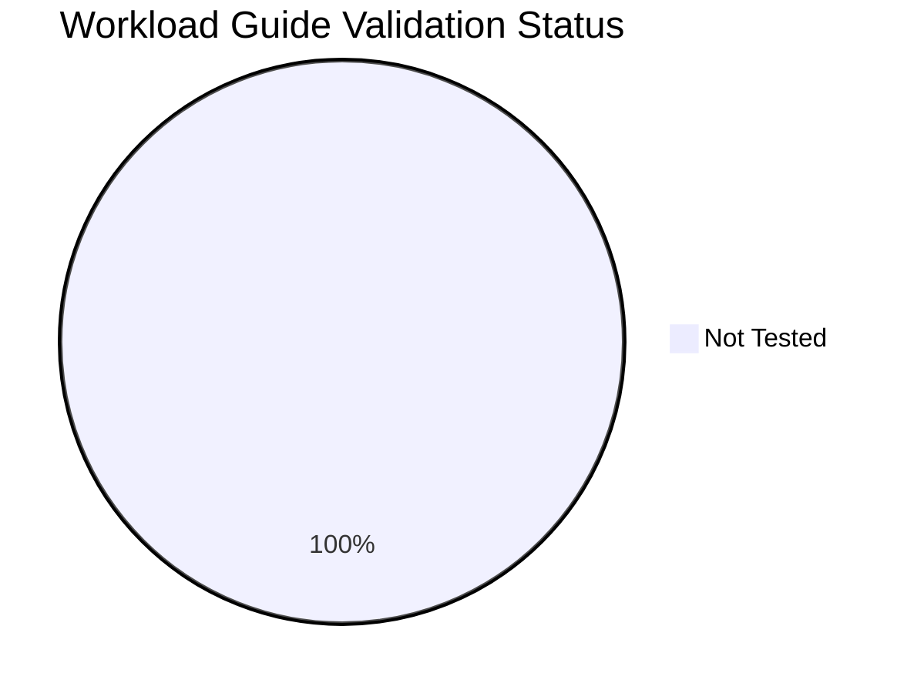

---
content_sources:
  diagrams:
  - id: validation-status-pie
    type: pie
    source: self-generated
    justification: Auto-generated pie chart from validation frontmatter across workload
      guides.
    based_on:
    - https://learn.microsoft.com/en-us/azure/well-architected/
  - id: tutorial-validation-status-pie
    type: pie
    source: self-generated
    justification: Auto-generated dashboard chart from repository validation metadata.
    based_on:
    - https://learn.microsoft.com/en-us/azure/well-architected/
  sources:
  - type: mslearn-adapted
    url: https://learn.microsoft.com/en-us/azure/well-architected/
content_validation:
  status: verified
  last_reviewed: '2026-05-23'
  reviewer: agent
  core_claims:
  - claim: This generated dashboard summarizes repository validation metadata and
      links back to Microsoft Learn as the source basis for Azure content checks.
    source: https://learn.microsoft.com/en-us/azure/well-architected/
    verified: true
---
# Workload Guide Validation Status

This page tracks which workload guides and design labs have been validated against real Azure deployments. Each guide can be validated via **architecture review**, **Bicep deployment**, or **load test**. Guides not validated within 90 days are marked as stale.

## Summary

*Generated: 2026-05-23*

| Metric | Count |
|---|---:|
| Total guides | 29 |
| ✅ Validated | 0 |
| ⚠️ Stale (>90 days) | 0 |
| ❌ Failed | 0 |
| ➖ Not tested | 29 |

<!-- diagram-id: validation-status-pie -->


## Validation Matrix

### Serverless Processing

| Guide | Architecture Review | Bicep Deployment | Load Test | Last Validated | Status |
|---|---|---|---|---|---|
| [Baseline](../workload-guides/serverless-processing/baseline.md) | ➖ No Data | ➖ No Data | ➖ No Data | — | ➖ Not Tested |
| [Cost And Anti Patterns](../workload-guides/serverless-processing/cost-and-anti-patterns.md) | ➖ No Data | ➖ No Data | ➖ No Data | — | ➖ Not Tested |
| [Operations And Reliability](../workload-guides/serverless-processing/operations-and-reliability.md) | ➖ No Data | ➖ No Data | ➖ No Data | — | ➖ Not Tested |
| [Triggers State And Storage](../workload-guides/serverless-processing/triggers-state-and-storage.md) | ➖ No Data | ➖ No Data | ➖ No Data | — | ➖ Not Tested |

### Design Labs

| Guide | Architecture Review | Bicep Deployment | Load Test | Last Validated | Status |
|---|---|---|---|---|---|
| [Lab 01 Public Web Baseline](../design-labs/lab-01-public-web-baseline.md) | ➖ No Data | ➖ No Data | ➖ No Data | — | ➖ Not Tested |
| [Lab 02 Private Internal App](../design-labs/lab-02-private-internal-app.md) | ➖ No Data | ➖ No Data | ➖ No Data | — | ➖ Not Tested |
| [Lab 03 Event Driven Orders](../design-labs/lab-03-event-driven-orders.md) | ➖ No Data | ➖ No Data | ➖ No Data | — | ➖ Not Tested |

### Event Driven Integration

| Guide | Architecture Review | Bicep Deployment | Load Test | Last Validated | Status |
|---|---|---|---|---|---|
| [Baseline](../workload-guides/event-driven-integration/baseline.md) | ➖ No Data | ➖ No Data | ➖ No Data | — | ➖ Not Tested |
| [Cost And Anti Patterns](../workload-guides/event-driven-integration/cost-and-anti-patterns.md) | ➖ No Data | ➖ No Data | ➖ No Data | — | ➖ Not Tested |
| [Messaging And Consistency](../workload-guides/event-driven-integration/messaging-and-consistency.md) | ➖ No Data | ➖ No Data | ➖ No Data | — | ➖ Not Tested |
| [Operations And Reliability](../workload-guides/event-driven-integration/operations-and-reliability.md) | ➖ No Data | ➖ No Data | ➖ No Data | — | ➖ Not Tested |

### Landing Zone Shared Services

| Guide | Architecture Review | Bicep Deployment | Load Test | Last Validated | Status |
|---|---|---|---|---|---|
| [Baseline](../workload-guides/landing-zone-shared-services/baseline.md) | ➖ No Data | ➖ No Data | ➖ No Data | — | ➖ Not Tested |
| [Cost And Anti Patterns](../workload-guides/landing-zone-shared-services/cost-and-anti-patterns.md) | ➖ No Data | ➖ No Data | ➖ No Data | — | ➖ Not Tested |
| [Governance And Network Topology](../workload-guides/landing-zone-shared-services/governance-and-network-topology.md) | ➖ No Data | ➖ No Data | ➖ No Data | — | ➖ Not Tested |
| [Platform Operations](../workload-guides/landing-zone-shared-services/platform-operations.md) | ➖ No Data | ➖ No Data | ➖ No Data | — | ➖ Not Tested |

### Microservices Platform

| Guide | Architecture Review | Bicep Deployment | Load Test | Last Validated | Status |
|---|---|---|---|---|---|
| [Baseline](../workload-guides/microservices-platform/baseline.md) | ➖ No Data | ➖ No Data | ➖ No Data | — | ➖ Not Tested |
| [Cost And Anti Patterns](../workload-guides/microservices-platform/cost-and-anti-patterns.md) | ➖ No Data | ➖ No Data | ➖ No Data | — | ➖ Not Tested |
| [Data Observability And Reliability](../workload-guides/microservices-platform/data-observability-and-reliability.md) | ➖ No Data | ➖ No Data | ➖ No Data | — | ➖ Not Tested |
| [Networking Identity And Service Communication](../workload-guides/microservices-platform/networking-identity-and-service-communication.md) | ➖ No Data | ➖ No Data | ➖ No Data | — | ➖ Not Tested |

### Private Internal App

| Guide | Architecture Review | Bicep Deployment | Load Test | Last Validated | Status |
|---|---|---|---|---|---|
| [Baseline](../workload-guides/private-internal-app/baseline.md) | ➖ No Data | ➖ No Data | ➖ No Data | — | ➖ Not Tested |
| [Cost And Anti Patterns](../workload-guides/private-internal-app/cost-and-anti-patterns.md) | ➖ No Data | ➖ No Data | ➖ No Data | — | ➖ Not Tested |
| [Data And Integration](../workload-guides/private-internal-app/data-and-integration.md) | ➖ No Data | ➖ No Data | ➖ No Data | — | ➖ Not Tested |
| [Network And Access](../workload-guides/private-internal-app/network-and-access.md) | ➖ No Data | ➖ No Data | ➖ No Data | — | ➖ Not Tested |
| [Operations And Reliability](../workload-guides/private-internal-app/operations-and-reliability.md) | ➖ No Data | ➖ No Data | ➖ No Data | — | ➖ Not Tested |

### Public Web Api

| Guide | Architecture Review | Bicep Deployment | Load Test | Last Validated | Status |
|---|---|---|---|---|---|
| [Baseline](../workload-guides/public-web-api/baseline.md) | ➖ No Data | ➖ No Data | ➖ No Data | — | ➖ Not Tested |
| [Cost And Anti Patterns](../workload-guides/public-web-api/cost-and-anti-patterns.md) | ➖ No Data | ➖ No Data | ➖ No Data | — | ➖ Not Tested |
| [Data And State](../workload-guides/public-web-api/data-and-state.md) | ➖ No Data | ➖ No Data | ➖ No Data | — | ➖ Not Tested |
| [Network Edge And Identity](../workload-guides/public-web-api/network-edge-and-identity.md) | ➖ No Data | ➖ No Data | ➖ No Data | — | ➖ Not Tested |
| [Operations And Reliability](../workload-guides/public-web-api/operations-and-reliability.md) | ➖ No Data | ➖ No Data | ➖ No Data | — | ➖ Not Tested |

## How to Update

To mark a guide as validated, add a `validation` block to its YAML frontmatter:

```yaml
---
hide:
  - toc
validation:
  architecture_review:
    last_tested: 2026-04-10
    reviewer: "team-lead"
    result: pass
  bicep_deployment:
    last_tested: null
    result: not_tested
  load_test:
    last_tested: null
    result: not_tested
---
```

Then regenerate this page:

```bash
python3 scripts/generate_validation_status.py
```

!!! info "Validation fields"
    - `result`: `pass`, `fail`, or `not_tested`
    - `last_tested`: ISO date (YYYY-MM-DD) or `null`
    - `reviewer`: Name or alias of the reviewer (for `architecture_review`)
    - Guides older than 90 days are flagged as **stale**

## See Also

- [Workload Guides](../workload-guides/index.md)
- [Design Labs](../design-labs/index.md)
- [Architecture Decision Matrix](architecture-decision-matrix.md)

## Sources

- [Azure Well-Architected Framework](https://learn.microsoft.com/en-us/azure/well-architected/)
- [Azure Architecture Center](https://learn.microsoft.com/en-us/azure/architecture/)
