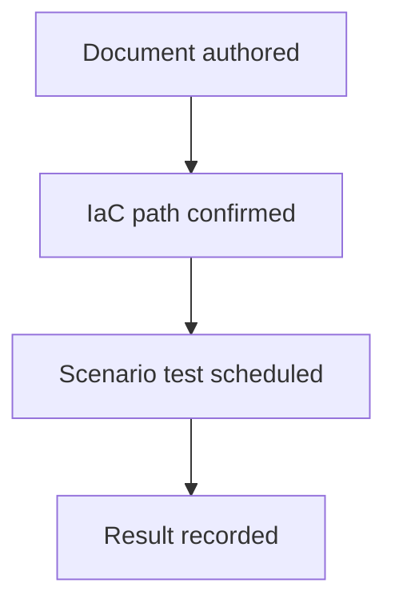

---
content_sources:
  diagrams:
    - id: validation-status-flow
      type: flowchart
      source: self-generated
      justification: "Tutorial and lab validation workflow synthesized from repository testing expectations and Azure architecture validation practices."
      based_on:
        - https://learn.microsoft.com/en-us/azure/architecture/
        - https://learn.microsoft.com/en-us/azure/reliability/overview
---
# Validation Status

This page tracks whether labs and tutorial-style content have been tested, when they were last checked, and whether the result is sufficient for reuse.

## Validation categories

- **Documentation reviewed**: structure, sources, and diagram metadata checked. [Validated]
- **Deployment reviewed**: referenced IaC path exists and is inspectable. [Observed]
- **Scenario tested**: functional or architecture validation carried out. [Unknown]

## Current status

| Item | Last tested date | Status | Notes |
|---|---|---|---|
| Design Lab 01: Public Web Baseline | 2026-04-10 | Documentation reviewed | `infra/bicep/lab-01/` present; scenario test pending. [Observed] |
| Design Lab 02: Private Internal App | 2026-04-10 | Documentation reviewed | `infra/bicep/lab-02/` present; network validation pending. [Observed] |
| Design Lab 03: Event-Driven Orders | 2026-04-10 | Documentation reviewed | `infra/bicep/lab-03/` present; workload simulation pending. [Observed] |
| Design Labs 04-08 | Not tested | Pending | Content not yet authored. [Unknown] |
| Reference pages | 2026-04-10 | Documentation reviewed | Decision support content does not imply runtime validation. [Documented] |

<!-- diagram-id: validation-status-flow -->

## Usage guidance

- Do not interpret documentation review as production readiness. [Documented]
- Promote a lab to reusable baseline only after architecture, cost, and failure testing complete. [Validated]
- Re-test after major service, policy, or workload assumption changes. [Inferred]

## Microsoft Learn references

- https://learn.microsoft.com/en-us/azure/architecture/
- https://learn.microsoft.com/en-us/azure/reliability/overview
