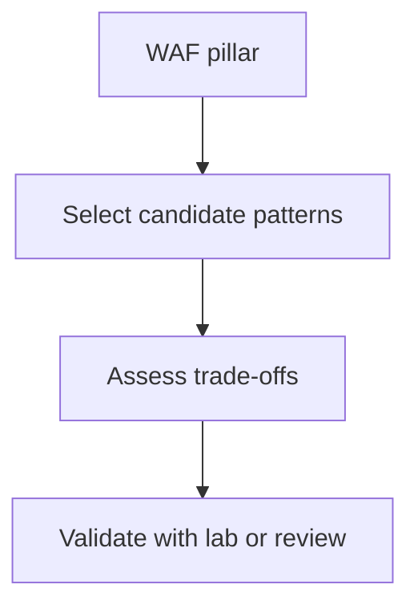

---
content_sources:
  diagrams:
    - id: waf-pattern-map
      type: flowchart
      source: mslearn-adapted
      mslearn_url: https://learn.microsoft.com/en-us/azure/well-architected/
---
# WAF Pillar to Pattern Map

This matrix connects Well-Architected Framework concerns to common architecture patterns so teams can pick patterns intentionally instead of copying service combinations blindly.

| WAF pillar | Patterns that commonly help | Why |
|---|---|---|
| Reliability | Queue-based load leveling, active-passive failover, health-probed edge routing | Improves fault isolation and recovery behavior. [Documented] |
| Security | Zero Trust at workload level, identity-first secret flow, private connectivity patterns | Reduces trust assumptions and secret sprawl. [Documented] |
| Cost Optimization | Serverless burst handling, right-sized PaaS baselines, cache where it reduces expensive recomputation | Avoids overbuilding. [Correlated] |
| Performance Efficiency | Caching, CQRS read optimization, asynchronous processing | Matches scaling strategy to hot paths. [Observed] |
| Operational Excellence | ADR and ADVR discipline, environment promotion guardrails, observability with SLOs | Makes operations repeatable and reviewable. [Validated] |

## Pattern usage notes

- No single pattern satisfies every pillar equally well. [Inferred]
- Improving one pillar can worsen another; for example, private connectivity improves security but can add cost and operational complexity. [Correlated]
- Use this matrix alongside design labs when a team needs an explicit trade-off conversation. [Validated]

<!-- diagram-id: waf-pattern-map -->

## Microsoft Learn references

- https://learn.microsoft.com/en-us/azure/well-architected/
- https://learn.microsoft.com/en-us/azure/architecture/patterns/
