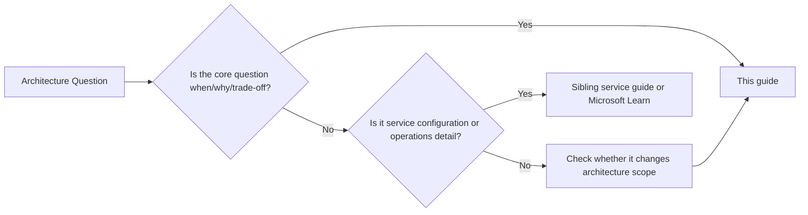

---
content_sources:
  diagrams:
    - id: start-here-architecture-vs-service-guides-diagram-1
      type: flowchart
      source: self-generated
      justification: "Synthesized boundary diagram showing when architecture guidance should hand off to service-specific guidance."
      based_on:
        - https://learn.microsoft.com/en-us/azure/architecture/
        - https://learn.microsoft.com/en-us/azure/architecture/guide/
---
# Architecture vs Service Guides

This guide explains when and why to choose a topology, control boundary, or service family.

Sibling service guides and Microsoft Learn explain how to configure the chosen service.

## The boundary in one sentence

[Inferred] If the question is about decision context, trade-offs, topology, ownership, resilience targets, or validation, it belongs here.

[Documented] If the question is primarily about setup steps, service features, deployment commands, or platform knobs, it belongs in Microsoft Learn or a service-specific guide.

## Decision handoff model

<!-- diagram-id: start-here-architecture-vs-service-guides-diagram-1 -->

## Comparison table

| Question type | This guide | Service guide or Microsoft Learn |
|---|---|---|
| When should we use hub-spoke versus Virtual WAN? | Yes | No |
| Which App Service plan setting should we change? | No | Yes |
| Should this workload use Functions or Container Apps? | Yes | No |
| How do we configure private endpoints for Storage? | Usually no | Yes |
| What ownership model is required for AKS at scale? | Yes | Sometimes |
| Which diagnostic settings destinations should be standardized? | Yes | Service docs for exact steps |

## 30% rule

!!! warning
    If more than about 30% of a page explains how to enable, configure, or tune a service feature, move that content into a sibling guide.

Why this matters:

- [Observed] architecture pages become stale quickly when they absorb service walkthroughs
- [Observed] decision pages lose clarity when they try to be tutorials
- [Inferred] separating decision guidance from implementation guidance makes maintenance cheaper

## Sibling guide map

| Domain | Preferred implementation source | Link |
|---|---|---|
| App Service | Microsoft Learn until a sibling repo exists | [App Service documentation](https://learn.microsoft.com/en-us/azure/app-service/) |
| Virtual Machines | Sibling guide | [azure-virtual-machine-practical-guide](https://github.com/yeongseon/azure-virtual-machine-practical-guide) |
| Networking | Sibling guide | [azure-networking-practical-guide](https://github.com/yeongseon/azure-networking-practical-guide) |
| Storage | Sibling guide | [azure-storage-practical-guide](https://github.com/yeongseon/azure-storage-practical-guide) |
| Functions | Sibling guide | [azure-functions-practical-guide](https://github.com/yeongseon/azure-functions-practical-guide) |
| Container Apps | Sibling guide | [azure-container-apps-practical-guide](https://github.com/yeongseon/azure-container-apps-practical-guide) |
| AKS | Sibling guide | [azure-kubernetes-service-practical-guide](https://github.com/yeongseon/azure-kubernetes-service-practical-guide) |
| Monitoring | Sibling guide | [azure-monitoring-practical-guide](https://github.com/yeongseon/azure-monitoring-practical-guide) |

## Ownership heuristic

Use this guide when the answer affects more than one team or more than one service boundary.

Examples:

- [Validated] choosing subscription boundaries affects platform teams, security teams, and application teams
- [Validated] choosing multi-region posture affects networking, data, operations, and business continuity
- [Observed] choosing AKS versus a managed PaaS option changes staffing and ownership more than deployment syntax

## Failure modes when the boundary is ignored

- [Observed] architecture reviews become arguments about CLI syntax instead of risk and trade-offs
- [Observed] service guides start making architecture claims without workload context
- [Correlated] teams overfit to one service because the implementation documentation was easier to find

## Microsoft Learn anchors

- [Azure Architecture Center](https://learn.microsoft.com/en-us/azure/architecture/)
- [Architecture guide](https://learn.microsoft.com/en-us/azure/architecture/guide/)
- [App Service documentation](https://learn.microsoft.com/en-us/azure/app-service/)

## Takeaway

[Inferred] This guide should answer architecture questions that remain valid even if Microsoft changes a portal workflow or CLI parameter.

If the page starts teaching service setup, it is in the wrong place.
