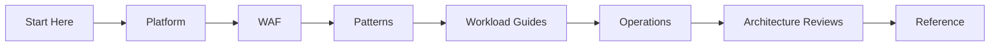

---
content_sources:
  diagrams:
    - id: start-here-how-to-use-diagram-1
      type: flowchart
      source: self-generated
      justification: "Synthesized section relationship map based on Azure Architecture Center structure and this repository navigation."
      based_on:
        - https://learn.microsoft.com/en-us/azure/architecture/
        - https://learn.microsoft.com/en-us/azure/architecture/guide/
---
# How to Use This Guide

Use this repository like a layered architecture workbook rather than a book that must be read cover to cover.

## Recommended reading order

### If you are starting a new platform or workload

1. [Overview](overview.md)
2. [Platform](../platform/index.md)
3. [Well-Architected Framework](../waf/index.md)
4. [Architecture Patterns](../patterns/index.md)
5. Relevant [Workload Guide](../workload-guides/index.md)
6. [Operations](../operations/index.md)
7. Architecture Reviews

### If you are reviewing an existing architecture

1. [Overview](overview.md)
2. [Platform](../platform/index.md)
3. Architecture Reviews
4. Targeted pattern or workload pages that match the system under review

### If you are migrating from ad hoc Azure usage to a managed platform

1. [Repository Map](repository-map.md)
2. [Platform](../platform/landing-zones-basics.md)
3. [Platform](../platform/identity-and-governance-foundations.md)
4. [Operations](../operations/policy-and-governance-guardrails.md)

## How sections connect

<!-- diagram-id: start-here-how-to-use-diagram-1 -->

Interpret the connections this way:

- [Documented] Platform describes Azure control boundaries and shared services.
- [Documented] WAF describes the pillars used to evaluate architecture quality.
- [Inferred] Patterns translate those principles into reusable decision shapes.
- [Validated] Workload guides give a practical starting topology for common scenarios.
- [Validated] Operations turns architecture into durable runtime ownership.
- [Validated] Reviews test whether the architecture still holds against evidence.

## How to use this guide with Microsoft documentation

This guide is not a replacement for Microsoft Learn.

Use both together:

| Need | Start here | Then confirm in Microsoft Learn |
|---|---|---|
| Decide between two topology options | This guide | Architecture Center and service docs |
| Verify official service behavior | Microsoft Learn | Return here for trade-off context |
| Build or configure a service | Microsoft Learn or sibling service guide | Return here only if the configuration changes architecture |
| Prepare for a review | This guide | Use Microsoft Learn to validate disputed assumptions |

## Reading patterns that work well

!!! note
    Read horizontally when making a single decision, and vertically when building a full baseline.

Horizontal reading example:

- start in `platform/network-topology-basics.md`
- compare with `patterns/networking/hub-spoke-vs-virtual-wan.md`
- validate against `waf/reliability.md`

Vertical reading example:

- start at `platform/index.md`
- continue to one workload baseline
- finish with an architecture review playbook

## When to stop reading a page

Stop and switch sources when you hit one of these conditions:

- [Inferred] you now know the decision, but need implementation detail
- [Unknown] the claim depends on current service limits or SKU behavior
- [Assumed] your organization has policy or compliance constraints not covered here

At that point, use Microsoft Learn for the product facts, then return to this guide if the new information changes the architecture trade-off.

## Common misuse patterns

- [Observed] treating workload guides as mandatory reference architectures instead of starting points
- [Observed] using one WAF pillar in isolation and missing cross-pillar trade-offs
- [Observed] copying service patterns without checking ownership and operational maturity

## Microsoft Learn anchors

- [Azure Architecture Center overview](https://learn.microsoft.com/en-us/azure/architecture/)
- [Architecture guide](https://learn.microsoft.com/en-us/azure/architecture/guide/)
- [Azure Well-Architected Framework](https://learn.microsoft.com/en-us/azure/well-architected/)

## Takeaway

[Inferred] The best use of this guide is iterative.

Use it to frame a decision, move to Microsoft Learn for authoritative detail, then come back to assess trade-offs, ownership, and validation.
