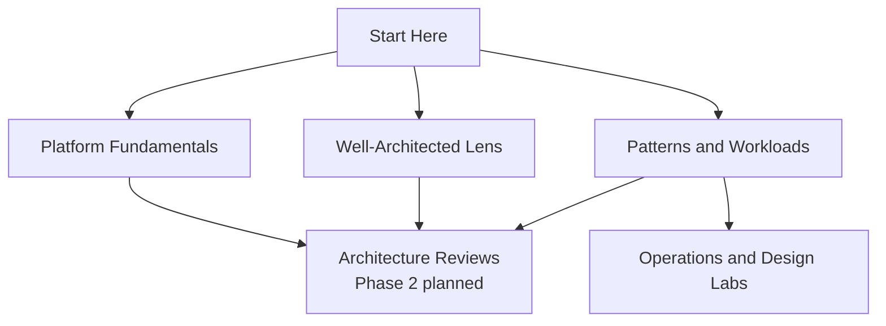

---
content_sources:
  diagrams:
    - id: start-here-index-diagram-1
      type: flowchart
      source: self-generated
      justification: "Synthesized orientation map based on the Azure Architecture Center and Azure Well-Architected Framework entry pages."
      based_on:
        - https://learn.microsoft.com/en-us/azure/architecture/
        - https://learn.microsoft.com/en-us/azure/well-architected/
---
# Start Here

Use this section to understand what the guide covers, how it is organized, and where to begin based on your role and current Azure experience.

[Documented] Microsoft positions the Azure Architecture Center as the entry point for architecture guidance and the Azure Well-Architected Framework as the lens for evaluating trade-offs.

This guide adds an opinionated operating layer on top of those sources:

- [Inferred] start from platform boundaries before discussing workload patterns
- [Inferred] make trade-offs explicit instead of listing services in isolation
- [Inferred] keep each page scoped to decisions, failure modes, and ownership
- [Assumed] route deep configuration steps to sibling service guides or Microsoft Learn

## What you will find here

| Page | Purpose | Best for |
|---|---|---|
| [Overview](overview.md) | Explains the guide's scope, audience, and evidence model. | Everyone new to the repository |
| [Learning Paths](learning-paths.md) | Suggests study order for beginner, intermediate, and advanced readers. | Self-study and team onboarding |
| [How to Use This Guide](how-to-use-this-guide.md) | Shows how the sections connect and how to pair this guide with Microsoft Learn. | Architects and tech leads |
| [Architecture vs Service Guides](architecture-vs-service-guides.md) | Defines what belongs here versus in a service-specific guide. | Contributors and reviewers |
| [Repository Map](repository-map.md) | Visual map of the current documentation structure. | Maintainers and frequent readers |
| [About](../about.md) | Project background, rationale, and related repositories. | Contributors and sponsors |

## Recommended entry points

!!! tip
    If you are deciding platform shape, start with [Platform](../platform/index.md) immediately after this section.

- Cloud architect: read [Overview](overview.md), [Learning Paths](learning-paths.md), then [Platform](../platform/index.md).
- Platform engineer: read [How to Use This Guide](how-to-use-this-guide.md), then [Platform](../platform/landing-zones-basics.md) and [Operations](../operations/index.md).
- Senior developer: read [Overview](overview.md), then [Platform](../platform/compute-selection-basics.md) and one workload guide.
- Reviewer: start with [Overview](overview.md), one relevant workload guide, and [Design Labs](../design-labs/index.md); use Architecture Reviews when that section is published in Phase 2.

## Orientation map

<!-- diagram-id: start-here-index-diagram-1 -->

## Decision boundary for this section

[Documented] The guide should stay architecture-first and MSLearn-first.

This means Start Here should answer:

- what problem each section solves
- when a reader should move to another section
- which evidence standard applies to claims
- which source to consult first when ambiguity remains

This section should not spend most of its space on:

- service enablement tutorials
- SDK usage patterns
- long Azure CLI walkthroughs
- feature-by-feature product comparisons without decision context

## References

- [Azure Architecture Center](https://learn.microsoft.com/en-us/azure/architecture/)
- [Azure Well-Architected Framework](https://learn.microsoft.com/en-us/azure/well-architected/)
- [Azure Architecture Guide](https://learn.microsoft.com/en-us/azure/architecture/guide/)

## Takeaway

[Inferred] Treat Start Here as the map, not the destination.

Read this section to establish scope and vocabulary, then move into [Platform](../platform/index.md) for foundational Azure architecture decisions.
