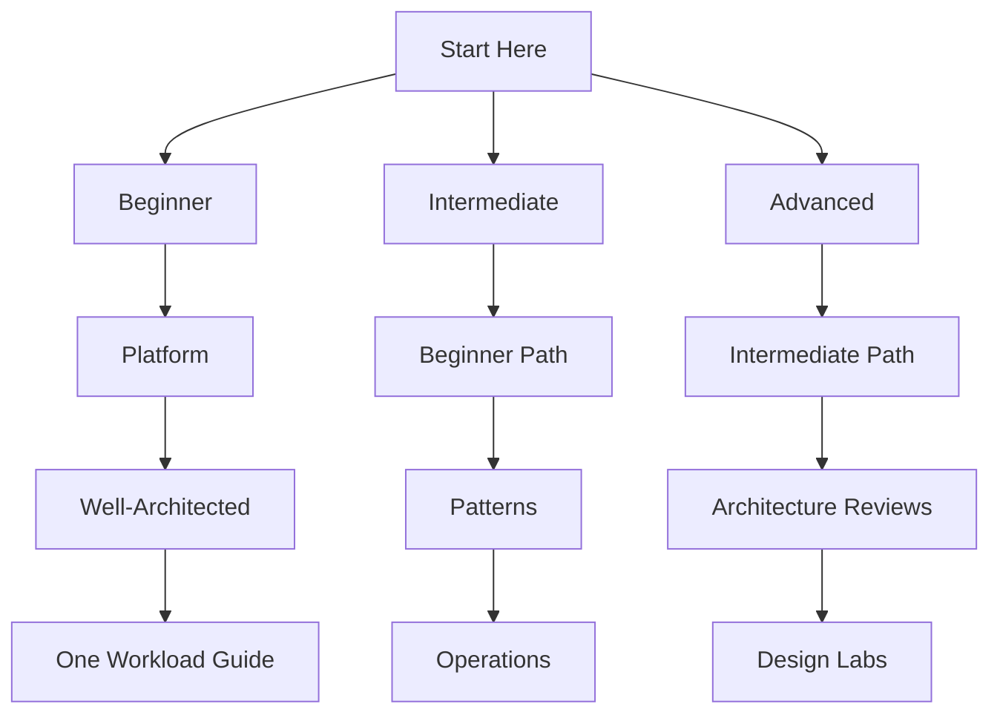

---
content_sources:
  diagrams:
    - id: start-here-learning-paths-diagram-1
      type: flowchart
      source: self-generated
      justification: "Synthesized study paths based on Azure Well-Architected and Architecture Center entry guidance."
      based_on:
        - https://learn.microsoft.com/en-us/azure/well-architected/
        - https://learn.microsoft.com/en-us/training/azure/
        - https://learn.microsoft.com/en-us/azure/architecture/
---
# Learning Paths

Choose a path based on the kinds of architecture decisions you need to make this quarter, not based on title alone.

## Path selection principle

[Inferred] Teams learn faster when they move from shared platform concepts to workload-specific trade-offs.

[Documented] Microsoft Learn already organizes Azure learning by role and scenario; this guide narrows that into architecture decision paths.

## Beginner path

Best for readers who know Azure services at a high level but do not yet have a stable architecture mental model.

Recommended order:

1. [Platform](../platform/index.md)
2. [Well-Architected Framework](../waf/index.md)
3. One [Workload Guide](../workload-guides/index.md) that matches your domain

What to focus on:

- [Documented] platform boundaries such as subscriptions, identity, and networking
- [Inferred] service family choices before product-specific detail
- [Assumed] one workload baseline to connect abstract concepts to a real system

## Intermediate path

Best for readers who already design Azure solutions and now need better trade-off judgment.

Recommended order:

1. Beginner path
2. [Architecture Patterns](../patterns/index.md)
3. [Operations](../operations/index.md)

What to focus on:

- [Inferred] pattern selection for decomposition, messaging, data, and resilience
- [Inferred] operational ownership as an architecture constraint, not a post-design detail
- [Observed] common anti-patterns that appear when teams scale without shared guardrails

## Advanced path

Best for principal engineers, review boards, platform owners, and architects supporting multiple delivery teams.

Recommended order:

1. Intermediate path
2. Architecture Reviews
3. [Design Labs](../design-labs/index.md)

What to focus on:

- [Inferred] falsification criteria and review prompts
- [Inferred] architecture decisions tied to explicit RTO, RPO, cost, and performance targets
- [Correlated] how platform constraints influence workload outcomes across portfolios

## Path map

<!-- diagram-id: start-here-learning-paths-diagram-1 -->

## Which path fits your situation

| Situation | Start with | Why |
|---|---|---|
| New cloud adoption program | Beginner | Establish shared vocabulary and landing-zone thinking first |
| Existing Azure estate with inconsistent decisions | Intermediate | Normalize decision criteria and operating model choices |
| Architecture board or center of excellence | Advanced | Drive review quality, evidence discipline, and portfolio consistency |
| Senior developer moving into architecture | Beginner, then Intermediate | Build platform context before deep pattern comparisons |

## How to combine with Microsoft Learn

!!! tip
    Use this guide to pick the next question, then use Microsoft Learn to confirm product-specific facts.

- Read a page here to understand the decision boundary.
- Open the linked Microsoft Learn article for authoritative platform behavior.
- Return here to compare trade-offs and ownership implications.

## Microsoft Learn anchors

- [Azure Well-Architected Framework](https://learn.microsoft.com/en-us/azure/well-architected/)
- [Browse Azure learning paths and modules](https://learn.microsoft.com/en-us/training/azure/)
- [Azure Architecture Center](https://learn.microsoft.com/en-us/azure/architecture/)

## Failure modes when choosing a path

- [Observed] jumping straight to workload blueprints without platform fundamentals leads to weak identity and governance choices
- [Observed] learning services one by one without patterns produces fragmented architectures
- [Inferred] starting with design labs before establishing evidence tags makes reviews subjective

## Takeaway

[Inferred] The correct learning path is the one that reduces your next architecture mistake.

For most readers, that means: Platform first, Well-Architected second, workload context third.
