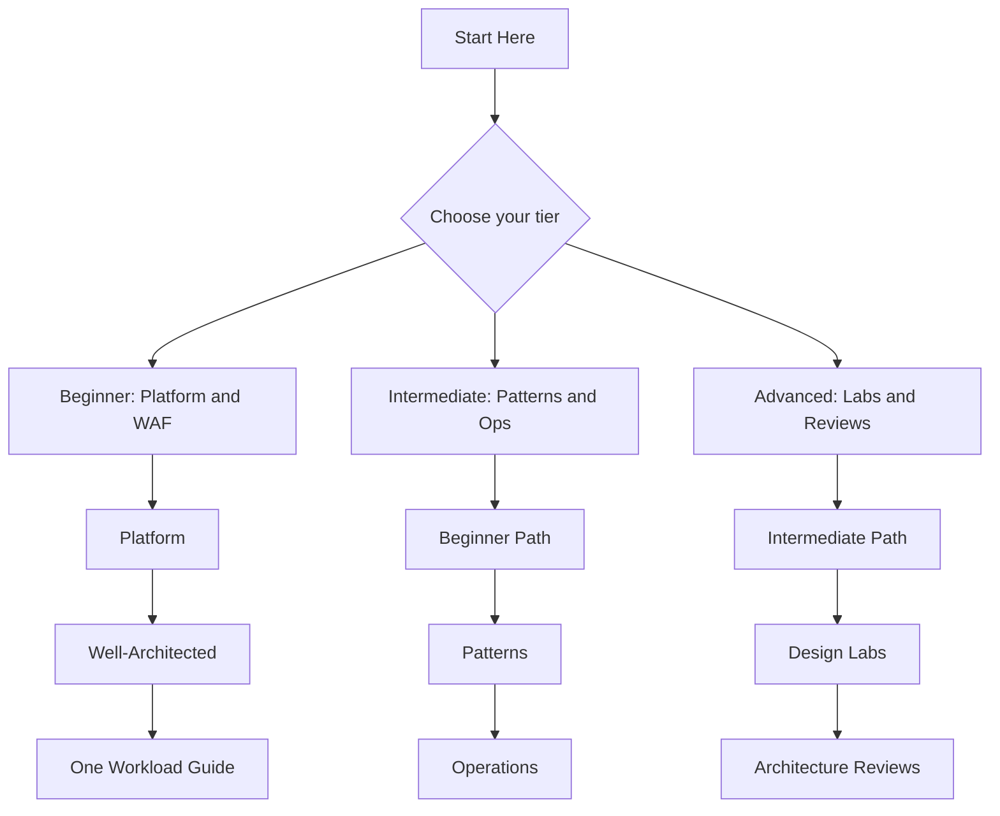
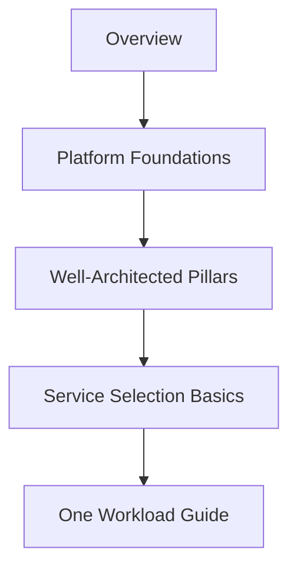
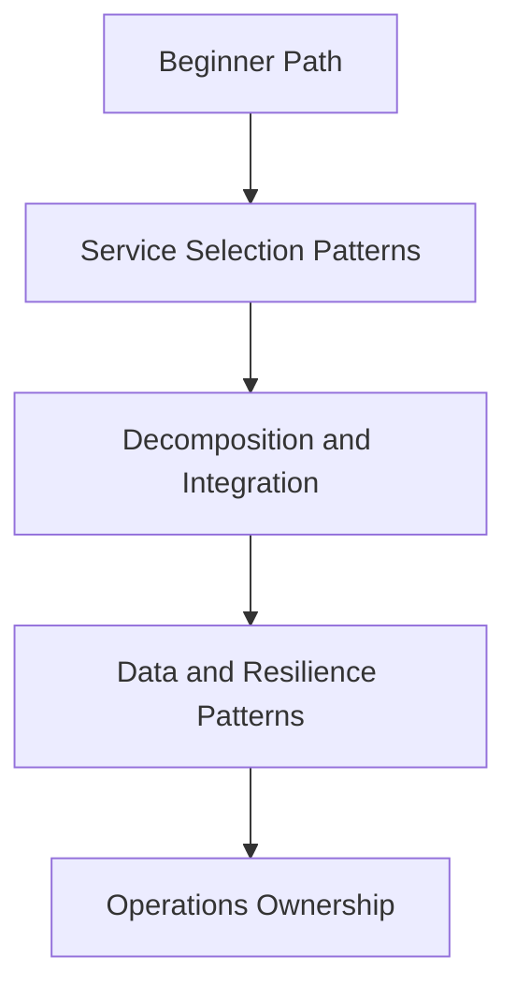
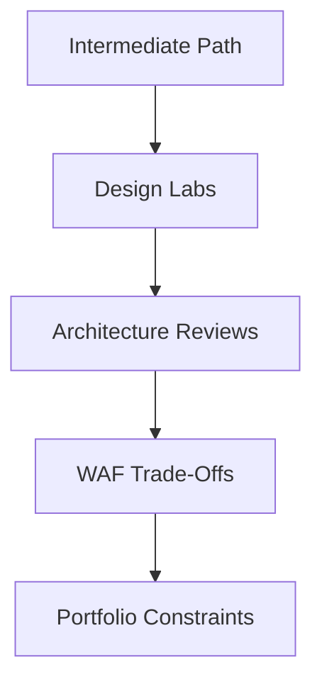

# Learning Paths

Use this page to choose a reading path based on your current architecture expertise, not on your title. Each path is numbered, so read the pages in order for the best result. Every path ends with a checklist of concrete outcomes you should be able to demonstrate.

!!! tip "Pick one primary tier first"
    If you fit multiple tiers, pick the one that matches your current gap and complete it before moving up. Trying to jump straight to Advanced without Intermediate patterns produces subjective reviews.

## Path selection principle

[Inferred] Teams learn faster when they move from shared platform concepts to workload-specific trade-offs.

[Documented] Microsoft Learn already organizes Azure learning by role and scenario; this guide narrows that into architecture decision paths tiered by expertise.

## Choose Your Path

| Level | Goal | Time Budget | Start With |
|---|---|---|---|
| **Beginner Architect** | Build a stable architecture mental model on Azure | 4-6 hours | [Overview](overview.md), [Platform Hub](../platform/index.md) |
| **Intermediate Architect** | Improve trade-off judgment across patterns and operations | 6-10 hours | Beginner path, then [Patterns Hub](../patterns/index.md) |
| **Advanced Architect** | Lead reviews, design labs, and portfolio-wide standards | 10-15 hours + ongoing | Intermediate path, then [Design Labs](../design-labs/index.md) |

!!! tip "Want a hands-on companion?"
    Follow the [Practical Journey](../practical-journey/index.md) for a staged deploy → verify → destroy path that turns the architecture concepts into concrete Azure baselines.

## Recommended Sequence

<!-- diagram-id: arch-learning-paths-overview -->

## Beginner Architect Path

Best for readers who know Azure services at a high level but do not yet have a stable architecture mental model.

**Time**: 4-6 hours

<!-- diagram-id: arch-learning-paths-beginner -->

Read in order:

1. [Overview](overview.md)
2. [Architecture vs Service Guides](architecture-vs-service-guides.md)
3. Platform sequence:
    - [Platform Hub](../platform/index.md)
    - [Azure Architecture on Azure](../platform/azure-architecture-on-azure.md)
    - [Compute Selection Basics](../platform/compute-selection-basics.md)
    - [Data Selection Basics](../platform/data-selection-basics.md)
    - [Network Topology Basics](../platform/network-topology-basics.md)
    - [Identity and Governance Foundations](../platform/identity-and-governance-foundations.md)
4. [Well-Architected Framework Hub](../waf/index.md) — read `using-waf-in-this-guide.md` first
5. Pick one [Workload Guide](../workload-guides/index.md) that matches your current domain

### Outcomes

- You can describe platform boundaries such as subscriptions, identity, and networking without ambiguity.
- You can pick a service family (compute, data, integration) before locking a product-specific choice.
- You can map a workload to one Well-Architected pillar tension it exposes.
- You can read a workload guide and identify which decisions are compliance decisions vs cost decisions.

What to focus on:

- [Documented] platform boundaries such as subscriptions, identity, and networking
- [Inferred] service family choices before product-specific detail
- [Assumed] one workload baseline to connect abstract concepts to a real system

### Microsoft Learn anchors

- [Azure Well-Architected Framework](https://learn.microsoft.com/en-us/azure/well-architected/)
- [Azure Architecture Center](https://learn.microsoft.com/en-us/azure/architecture/)
- [Browse Azure learning paths and modules](https://learn.microsoft.com/en-us/training/azure/)

## Intermediate Architect Path

Best for readers who already design Azure solutions and now need better trade-off judgment across patterns, data, integration, and operations.

**Time**: 6-10 hours

<!-- diagram-id: arch-learning-paths-intermediate -->

Read in order:

1. Complete the Beginner Architect Path first
2. [Patterns Hub](../patterns/index.md)
3. [Service Selection Patterns](../patterns/service-selection-patterns.md)
4. Pattern deep-dive by concern:
    - [Decomposition Patterns](../patterns/decomposition/modular-monolith-vs-microservices.md)
    - [Integration Patterns](../patterns/integration/synchronous-vs-asynchronous.md)
    - [Data Patterns](../patterns/data/consistency-partitioning-and-replication.md)
    - [Resilience Patterns](../patterns/resilience/retry-circuit-breaker-and-bulkhead.md)
    - [Deployment Patterns](../patterns/deployment/blue-green-canary-and-stamp-patterns.md)
    - [Security Patterns](../patterns/security/identity-first-and-secrets-flow.md)
5. [Operations Hub](../operations/index.md)
6. Reference cheatsheets:
    - [Architecture Decision Matrix](../reference/architecture-decision-matrix.md)
    - [WAF Pillar to Pattern Map](../reference/waf-pillar-to-pattern-map.md)
    - [Compute Selection Cheatsheet](../reference/compute-selection-cheatsheet.md)

### Outcomes

- You can select a decomposition style (modular monolith, microservices, stamp) with explicit trade-off rationale.
- You can pick an integration model (sync vs async, saga vs choreography) tied to consistency and cost targets.
- You can define an operational ownership model as an architecture constraint, not a post-design detail.
- You can read the Architecture Decision Matrix and defend a specific product choice with 3-5 criteria.

What to focus on:

- [Inferred] pattern selection for decomposition, messaging, data, and resilience
- [Inferred] operational ownership as an architecture constraint, not a post-design detail
- [Observed] common anti-patterns that appear when teams scale without shared guardrails

### Microsoft Learn anchors

- [Cloud Design Patterns](https://learn.microsoft.com/en-us/azure/architecture/patterns/)
- [WAF Operational Excellence pillar](https://learn.microsoft.com/en-us/azure/well-architected/operational-excellence/)
- [WAF Reliability pillar](https://learn.microsoft.com/en-us/azure/well-architected/reliability/)

## Advanced Architect Path

Best for principal engineers, review boards, platform owners, and architects supporting multiple delivery teams.

**Time**: 10-15 hours + ongoing reference

<!-- diagram-id: arch-learning-paths-advanced -->

Read in order:

1. Complete the Intermediate Architect Path first
2. [Design Labs Hub](../design-labs/index.md)
3. Individual design labs:
    - [Lab 01: Public Web Baseline](../design-labs/lab-01-public-web-baseline.md)
    - [Lab 02: Private Internal App](../design-labs/lab-02-private-internal-app.md)
    - [Lab 03: Event-Driven Orders](../design-labs/lab-03-event-driven-orders.md)
    - [Design Labs Methodology](../design-labs/methodology.md)
4. [Architecture Reviews Hub](../architecture-reviews/index.md) — expanding in Phase 2
5. [WAF Pillar Trade-offs](../waf/pillar-trade-offs.md) and [Architecture Assessment Checklist](../waf/architecture-assessment-checklist.md)
6. Operations at scale:
    - [ADR Process](../operations/adr-process.md)
    - [Architecture Lifecycle](../operations/architecture-lifecycle.md)
    - [Policy and Governance Guardrails](../operations/policy-and-governance-guardrails.md)
    - [Platform Team vs App Team Responsibilities](../operations/platform-team-vs-app-team-responsibilities.md)

### Outcomes

- You can run a design lab, capture evidence tags, and defend the resulting architecture at a review.
- You can score a workload against WAF pillars with explicit RTO, RPO, cost, and performance targets.
- You can write and defend an Architecture Decision Record (ADR) using the guide's ADR process.
- You can identify a portfolio-wide constraint that changes multiple workload architectures at once.

What to focus on:

- [Inferred] falsification criteria and review prompts, especially after the Phase 2 Architecture Reviews section is published
- [Inferred] architecture decisions tied to explicit RTO, RPO, cost, and performance targets
- [Correlated] how platform constraints influence workload outcomes across portfolios

### Microsoft Learn anchors

- [Azure Architecture Center](https://learn.microsoft.com/en-us/azure/architecture/)
- [Azure Well-Architected Framework pillars](https://learn.microsoft.com/en-us/azure/well-architected/pillars)
- [Design principles and best practices](https://learn.microsoft.com/en-us/azure/architecture/guide/)

## Track Selection Matrix

| Situation | Start with | Why |
|---|---|---|
| New cloud adoption program | Beginner Architect | Establish shared vocabulary and landing-zone thinking first |
| Existing Azure estate with inconsistent decisions | Intermediate Architect | Normalize decision criteria and operating model choices |
| Architecture board or center of excellence | Advanced Architect | Drive review quality, evidence discipline, and portfolio consistency |
| Senior developer moving into architecture | Beginner, then Intermediate | Build platform context before deep pattern comparisons |

## How to combine with Microsoft Learn

!!! tip
    Use this guide to pick the next question, then use Microsoft Learn to confirm product-specific facts.

- Read a page here to understand the decision boundary.
- Open the linked Microsoft Learn article for authoritative platform behavior.
- Return here to compare trade-offs and ownership implications.

## Failure modes when choosing a path

- [Observed] jumping straight to workload blueprints without platform fundamentals leads to weak identity and governance choices
- [Observed] learning services one by one without patterns produces fragmented architectures
- [Inferred] starting with design labs before establishing evidence tags makes reviews subjective

## See Also

- [Overview](overview.md)
- [Scenario Router](scenario-router.md) — situation-to-destination index across Design, Build, Operate, and Review
- [How to Use This Guide](how-to-use-this-guide.md)
- [Architecture vs Service Guides](architecture-vs-service-guides.md)
- [Repository Map](repository-map.md)
- [Platform Hub](../platform/index.md)
- [Well-Architected Framework Hub](../waf/index.md)
- [Patterns Hub](../patterns/index.md)
- [Workload Guides Hub](../workload-guides/index.md)
- [Design Labs Hub](../design-labs/index.md)

## Sources

- [Azure Well-Architected Framework](https://learn.microsoft.com/en-us/azure/well-architected/)
- [Azure Architecture Center](https://learn.microsoft.com/en-us/azure/architecture/)
- [Cloud Design Patterns](https://learn.microsoft.com/en-us/azure/architecture/patterns/)
- [Browse Azure learning paths and modules](https://learn.microsoft.com/en-us/training/azure/)
- [WAF pillars](https://learn.microsoft.com/en-us/azure/well-architected/pillars)
