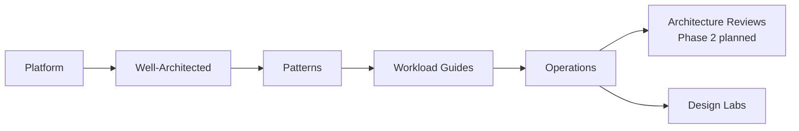

---
content_sources:
  diagrams:
    - id: start-here-overview-diagram-1
      type: flowchart
      source: self-generated
      justification: "Synthesized from Azure Well-Architected and Azure Architecture Center overview content."
      based_on:
        - https://learn.microsoft.com/en-us/azure/well-architected/
        - https://learn.microsoft.com/en-us/azure/architecture/
---
# Overview

This guide combines Azure Well-Architected Framework principles, Azure Architecture Center patterns, and practical delivery concerns into a single architecture-first reading path.

## What this guide covers

[Documented] Microsoft Learn publishes foundational guidance through the [Azure Well-Architected Framework](https://learn.microsoft.com/en-us/azure/well-architected/) and the [Azure Architecture Center](https://learn.microsoft.com/en-us/azure/architecture/).

This repository builds on those sources by focusing on:

- decision criteria for selecting topology, service families, and operating models
- trade-offs across cost, reliability, security, performance, and team ownership
- common failure modes that repeatedly appear in Azure delivery programs
- validation patterns for proving architecture assumptions before production scale
- practical links between platform choices, workload patterns, and review practices

## Who this guide is for

| Audience | Typical question | How this guide helps |
|---|---|---|
| Cloud architects | Which target topology best fits the workload and org model? | Frames options, trade-offs, and validation criteria |
| Platform engineers | Which controls belong in the platform versus application space? | Clarifies ownership boundaries and landing zone patterns |
| Senior developers | Which Azure service family matches the workload constraints? | Provides service selection baselines without turning into a tutorial |
| Reviewers and leads | How do we challenge assumptions quickly and consistently? | Supplies evidence tags, review prompts, and failure-mode thinking |

## What makes this different from Microsoft Learn

[Documented] Microsoft Learn is authoritative for service behavior and official guidance.

[Inferred] This guide is intentionally narrower and more opinionated.

| Microsoft Learn | This guide |
|---|---|
| Explains Azure capabilities and official recommendations | Explains how to choose among valid options in real delivery contexts |
| Covers broad product and scenario documentation | Focuses on recurring architecture decisions and trade-offs |
| Includes tutorials and implementation steps | Stays mostly out of enablement and configuration detail |
| Optimized for completeness | Optimized for practical decision velocity |

## Evidence model used throughout the repository

Every non-trivial claim should be tagged with an evidence level:

- [Documented] official Microsoft Learn or approved design records say it directly
- [Observed] teams have directly seen the behavior in delivery or operations
- [Measured] data such as latency, cost, throughput, or recovery metrics support it
- [Validated] a test, drill, or proof of concept confirmed it
- [Correlated] multiple signals point in the same direction without proving causation
- [Inferred] the conclusion follows from several documented facts
- [Assumed] the team is using a working assumption pending validation
- [Unknown] the evidence is missing or contradictory

## Scope boundary

!!! note
    If more than about 30% of a page becomes feature enablement or service configuration guidance, that content belongs in a sibling service guide instead.

In scope:

- architecture decision boundaries
- topology selection
- ownership models
- trade-off analysis
- failure modes and validation plans

Out of scope:

- long SDK walkthroughs
- portal click paths
- exhaustive runtime tuning instructions
- service-specific operational runbooks that do not change architecture choice

## How the sections fit together

<!-- diagram-id: start-here-overview-diagram-1 -->

- [Documented] Platform establishes Azure building blocks and governance context.
- [Inferred] Well-Architected gives the evaluation lens for later trade-offs.
- [Inferred] Patterns turn service knowledge into reusable decision shapes.
- [Inferred] Workload guides package those shapes into practical blueprints.
- [Inferred] Design labs test whether the design still holds under pressure in the published Phase 1 scope.
- [Assumed] Architecture Reviews will extend that validation path when the Phase 2 section is published.

## How to read it efficiently

1. Read the platform fundamentals before debating advanced patterns.
2. Use the Well-Architected pages when trade-offs are unclear.
3. Use workload guides when a team needs a concrete starting baseline.
4. Use design labs now for guided validation, and use Architecture Reviews once that Phase 2 section is published.

## Microsoft Learn anchors

- [Azure Well-Architected Framework](https://learn.microsoft.com/en-us/azure/well-architected/)
- [Azure Architecture Center](https://learn.microsoft.com/en-us/azure/architecture/)
- [Architecture Center guides](https://learn.microsoft.com/en-us/azure/architecture/guide/)

## Takeaway

[Inferred] Read this repository as a decision system.

Use Microsoft Learn for authoritative product detail, and use this guide for the practical question that teams usually ask first: "which Azure architecture choice should we make, and how will we know it was the right one?"
